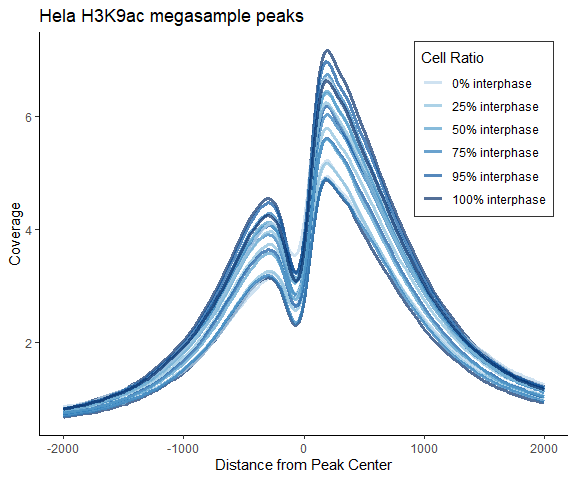
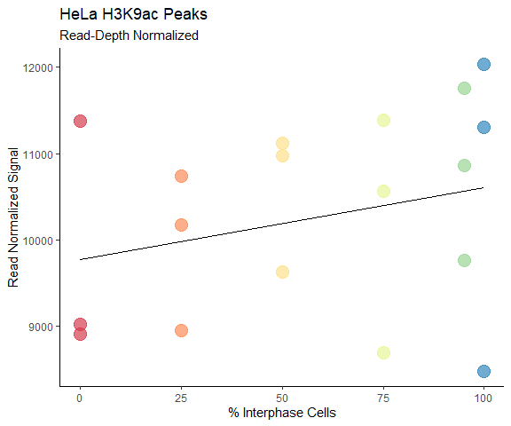
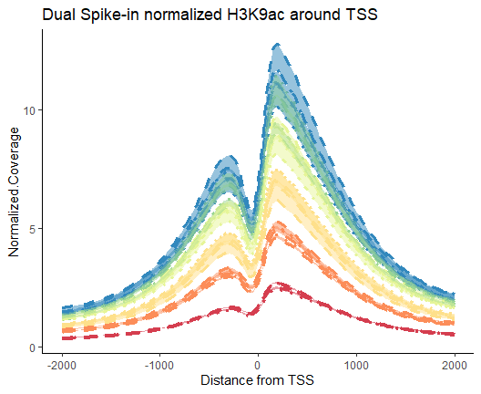
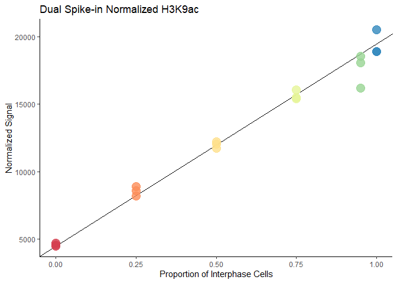
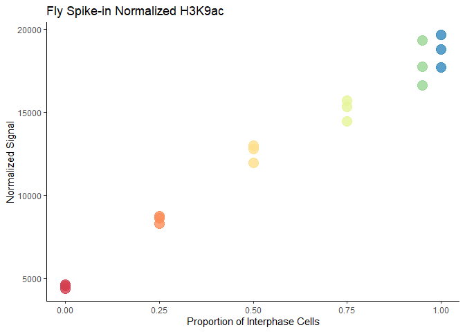
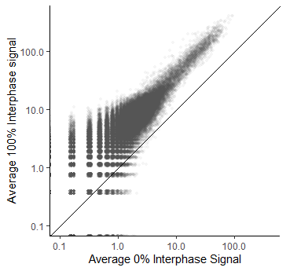
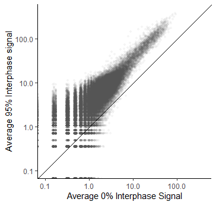
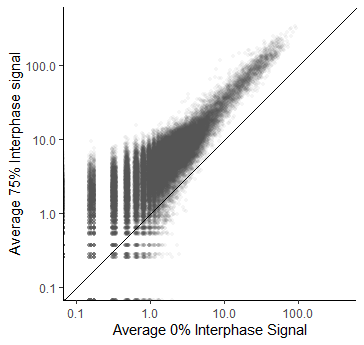
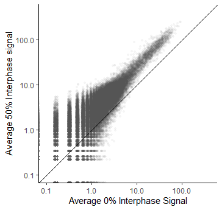
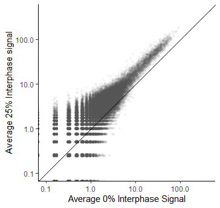

Fig1_LP78_data
================

- <a href="#histogram-at-megasample-peaks"
  id="toc-histogram-at-megasample-peaks">Histogram at megasample peaks</a>
  - <a href="#auc" id="toc-auc">AUC</a>
- <a href="#spike-in-norm" id="toc-spike-in-norm">spike-in norm</a>
  - <a href="#normalize-to-fly-ipinput"
    id="toc-normalize-to-fly-ipinput">normalize to fly IP/input</a>
  - <a href="#normalize-to-yeast-ipinput"
    id="toc-normalize-to-yeast-ipinput">normalize to yeast IP/input</a>
  - <a href="#dual-norm" id="toc-dual-norm">dual norm</a>
- <a href="#scatterplot" id="toc-scatterplot">Scatterplot</a>

``` r
library(tidyverse)
```

    Warning: package 'ggplot2' was built under R version 4.3.3

    Warning: package 'lubridate' was built under R version 4.3.2

    ── Attaching core tidyverse packages ──────────────────────── tidyverse 2.0.0 ──
    ✔ dplyr     1.1.3     ✔ readr     2.1.4
    ✔ forcats   1.0.0     ✔ stringr   1.5.1
    ✔ ggplot2   3.5.1     ✔ tibble    3.2.1
    ✔ lubridate 1.9.3     ✔ tidyr     1.3.0
    ✔ purrr     1.0.2     
    ── Conflicts ────────────────────────────────────────── tidyverse_conflicts() ──
    ✖ dplyr::filter() masks stats::filter()
    ✖ dplyr::lag()    masks stats::lag()
    ℹ Use the conflicted package (<http://conflicted.r-lib.org/>) to force all conflicts to become errors

``` r
library(RColorBrewer)
theme_set(theme_classic())
library(DescTools)
```

    Warning: package 'DescTools' was built under R version 4.3.3

``` r
library(viridis)
```

    Warning: package 'viridis' was built under R version 4.3.3

    Loading required package: viridisLite

``` r
process_counts_annotpeaks <- function(counts_annotpeaks, .x) {
  colnames(counts_annotpeaks)[1] <- "PeakID"
  counts_annotpeaks <- counts_annotpeaks %>% 
    rename_with(~ gsub(".hg38.tagdir", "", .x), contains("tagdir")) %>% 
  #  rename_with(~ gsub(".+Hela", "Hela", .x), contains("Tag")) %>%
    rename_with(~ gsub("_ratio1", "_0", .x), contains("ratio")) %>% 
    rename_with(~ gsub("_ratio2", "_0.25", .x), contains("ratio")) %>% 
    rename_with(~ gsub("_ratio3", "_0.5", .x), contains("ratio")) %>% 
    rename_with(~ gsub("_ratio4", "_0.75", .x), contains("ratio")) %>% 
    rename_with(~ gsub("_ratio5", "_0.95", .x), contains("ratio")) %>% 
    rename_with(~ gsub("_ratio6", "_1", .x), contains("ratio")) %>% 
    rename_with(~ gsub("\\.[[:digit:]]$", "_minus", .x), contains("Tag")) %>% 
    rename_with(~ gsub("\\.Count.+", "", .x), contains("Tag"))
} 
```

``` r
clean_annotation_peakfile <- function(process_counts_annotpeaks, .x) {
  process_counts_annotpeaks$Annotation <- 
    gsub("\\(.*", "", as.character(process_counts_annotpeaks$Annotation))
  process_counts_annotpeaks$Annotation <- 
    gsub(" ", "", as.character(process_counts_annotpeaks$Annotation))
  
  # count annotations per class
  # table(process_counts_annotpeaks$Annotation)
}
```

``` r
process_histograms <- function(x, .x) {
    colnames(x)[1] <- "Distance_from_center"
    x <- x %>% 
    rename_with(~ gsub(".hg38.tagdir", "", .x), contains("tagdir")) %>% 
    rename_with(~ gsub("_ratio1", "_0", .x), contains("ratio")) %>% 
    rename_with(~ gsub("_ratio2", "_0.25", .x), contains("ratio")) %>% 
    rename_with(~ gsub("_ratio3", "_0.5", .x), contains("ratio")) %>% 
    rename_with(~ gsub("_ratio4", "_0.75", .x), contains("ratio")) %>% 
    rename_with(~ gsub("_ratio5", "_0.95", .x), contains("ratio")) %>% 
    rename_with(~ gsub("_ratio6", "_1", .x), contains("ratio")) %>% 
    #rename_with(~ gsub(".+\\_Hela_", "Hela_", .x), contains("Hela")) %>%
    rename_with(~ gsub("\\.[[:digit:]]$", "_minus", .x), contains("Tags")) %>% 
    rename_with(~ gsub("\\.\\.\\.", "_", .x), contains("Tags"))
    
    xcov <- x %>% select(contains("Coverage"))
    xcov$Distance_from_center <- x$Distance_from_center
    
    xcovlong <- 
    xcov %>% pivot_longer(
      cols = -"Distance_from_center", 
      names_to = "Sample", 
      values_to = "Coverage")
  }
```

# Histogram at megasample peaks

``` r
hist_tss_LP78 <- read.delim("~/Research/LP_78/hist_tss_hg38_LP78.txt")
```

``` r
hist_tss_LP78_tidy <- process_histograms(hist_tss_LP78)
```

``` r
hist_tss_LP78_sepIP <- hist_tss_LP78_tidy[grep("K9ac", hist_tss_LP78_tidy$Sample), ] %>% separate_wider_regex(cols = Sample, patterns = c(
  "X", 
  id = "78[:lower:]",
  "\\_",
  cell = "[:alpha:]+", 
  "\\_", 
  ratio = ".+", 
  "\\_", 
  antibody = ".+", 
  "\\_", 
  replicate = ".+", 
  ".Coverage"))
```

``` r
ggplot(data = hist_tss_LP78_sepIP) + 
  aes(x = Distance_from_center, y = Coverage, group=interaction(ratio, antibody, replicate), color = ratio) + 
  geom_line(alpha = 0.7, linewidth = 1.1) + 
  labs(title = "Hela H3K9ac megasample peaks", 
       x = "Distance from Peak Center") +
  scale_color_manual(
    values = colorRampPalette(brewer.pal(9, "Blues"))(8)[3:8],
    name = "Cell Ratio", 
    labels = c("0% interphase", "25% interphase", "50% interphase", "75% interphase", "95% interphase", "100% interphase")) + 
  theme_classic() + 
  theme(legend.position = c(0.84, 0.76), 
                          legend.background = element_rect(
                                  size=0.7, linetype="solid", 
                                  colour ="grey20")) 
```

    Warning: The `size` argument of `element_rect()` is deprecated as of ggplot2 3.4.0.
    ℹ Please use the `linewidth` argument instead.

    Warning: A numeric `legend.position` argument in `theme()` was deprecated in ggplot2
    3.5.0.
    ℹ Please use the `legend.position.inside` argument of `theme()` instead.



``` r
tss_readnorm_histplot <- ggplot(data = hist_tss_LP78_sepIP) + 
  aes(x = Distance_from_center, y = Coverage, group=interaction(ratio, antibody, replicate), color = ratio) + 
  geom_line(alpha = 0.7, linewidth = 1.1) + 
  labs(title = "Histogram of H3K9ac at peaks", 
       x = "Distance from Peak Center")+
  scale_color_brewer(
    palette = "Spectral", direction = 1,
    name = "Cell Ratio", 
    labels = c("0% interphase", "50% interphase", "100% interphase")) +
  scale_fill_brewer(
    palette = "Spectral", direction = 1,
    name = "Cell Ratio", 
    labels = c("0% interphase", "50% interphase", "100% interphase")) + 
  theme(legend.position = c(0.84, 0.76), 
                          legend.background = element_rect(
                                  size=0.7, linetype="solid", 
                                  colour ="grey20")) 

ggsave("tss_readnorm_histplot.svg", tss_readnorm_histplot, height =5, width = 6)
```

### AUC

``` r
samples <- unique(hist_tss_LP78_sepIP$id)
colnames(hist_tss_LP78)[1] <- "Distance_from_center"
x <- hist_tss_LP78$Distance_from_center
AUC_peaks <- matrix(data = "", nrow = length(samples), ncol = 1)
AUC_peaks <- data.frame(AUC_peaks, row.names = samples)

for (i in 1:length(samples)) {

  y <- hist_tss_LP78_sepIP %>% 
    filter(id == samples[i]) %>%
    select(Coverage)
  y <- pull(y, Coverage)

AUC_peaks[i, ] <- AUC(x, y, method = c("trapezoid"))

}
```

``` r
AUC_peaks$AUC_peaks <- as.numeric(AUC_peaks$AUC_peaks)

interphase <- rep(c(0, 25, 50, 75, 95, 100), each = 3)
AUC_peaks$interphase <- as.numeric(interphase)
```

``` r
AUC_peaks %>%
  filter(interphase == 100) %>% 
  colMeans()
```

     AUC_peaks interphase 
      10608.64     100.00 

``` r
avg_100 <- 10608.64 

AUC_peaks %>%
  filter(interphase == 0) %>% 
  select(AUC_peaks) %>%
  colMeans() 
```

    AUC_peaks 
     9769.188 

``` r
avg_0 <- 9769.188 
```

``` r
AUC_peaks %>%
 ggplot(aes(x = interphase, y = AUC_peaks, color = as.factor(interphase))) +
  geom_segment(aes(x = 0, y = avg_0, xend = 100, yend = avg_100), 
               color = "black") + 
  geom_point(size = 5, alpha = 0.7)  +
  scale_color_brewer(
    palette = "Spectral", direction = 1,
    name = "Cell Ratio", 
    labels = c("0% interphase", "25% interphase", "50% interphase", "75% interphase", "95% interphase", "100% interphase")) + 
  theme_classic() + 
  labs(title = "HeLa H3K9ac Peaks", 
       subtitle = "Read-Depth Normalized",
       x = "% Interphase Cells", 
       y = "Read Normalized Signal") + 
  theme(legend.position = "none")
```

    Warning in geom_segment(aes(x = 0, y = avg_0, xend = 100, yend = avg_100), : All aesthetics have length 1, but the data has 18 rows.
    ℹ Please consider using `annotate()` or provide this layer with data containing
      a single row.



``` r
LP78_tsshist_readnorm_dotplot <- AUC_peaks %>%
 ggplot(aes(x = interphase, y = AUC_peaks, color = as.factor(interphase))) +
  geom_segment(aes(x = 0, y = avg_0, xend = 100, yend = avg_100), 
               color = "black") + 
  geom_point(size = 5, alpha = 0.7)  +
  scale_color_brewer(
    palette = "Spectral", direction = 1,
    name = "Cell Ratio", 
    labels = c("0% interphase", "25% interphase", "50% interphase", "75% interphase", "95% interphase", "100% interphase")) + 
  theme_classic() + 
  labs(title = "HeLa H3K9ac Peaks", 
       subtitle = "Read-Depth Normalized",
       x = "% Interphase Cells", 
       y = "Read Normalized Signal") + 
  theme(legend.position = "none")

ggsave("plots/LP78_tsshist_readnorm_dotplot.svg", LP78_tsshist_readnorm_dotplot, width = 5, height = 4.5)
```

    Warning in geom_segment(aes(x = 0, y = avg_0, xend = 100, yend = avg_100), : All aesthetics have length 1, but the data has 18 rows.
    ℹ Please consider using `annotate()` or provide this layer with data containing
      a single row.

# spike-in norm

``` r
seqstats <- read.delim("~/Research/LP_78/seq_stats_LP78.tsv")

seqstats$ID <- gsub("_ratio1", "_0", as.character(seqstats$ID))
seqstats$ID <- gsub("_ratio2", "_0.25", as.character(seqstats$ID))
seqstats$ID <- gsub("_ratio3", "_0.5", as.character(seqstats$ID))
seqstats$ID <- gsub("_ratio4", "_0.75", as.character(seqstats$ID))
seqstats$ID <- gsub("_ratio5", "_0.95", as.character(seqstats$ID))
seqstats$ID <- gsub("_ratio6", "_1", as.character(seqstats$ID))
```

## normalize to fly IP/input

Formula sample_norm = sample\*(human IP/spike IP)\*(spike input/human
input)

``` r
hist_tss_LP78_tidyIP <- hist_tss_LP78_tidy %>% 
  filter(grepl("K9ac", Sample))

# copy the hist_tss_hg38_LH58_cov dataframe 
tss_fly_ip_input_norm <- hist_tss_LP78_tidyIP

sampleID <- unique(hist_tss_LP78_tidyIP$Sample)

seqstatIDold <- sub('.Coverage', "", sampleID )
seqstatID <- sub('X', "", seqstatIDold )

# dataframe 1: hist_K9ac_allsamples_LP78_tidy (original read-normalized data) 
# dataframe 2: H3K9ac_mitotic_titration_seqtatsIP
# dataframe 3: peakcov_avg_ip_input_norm (output df)

# When Sample rows of df1 match Sample.ID in df2, multiply Coverage column in df1 by factor in df2, assign to df3

for (i in 1:nrow(hist_tss_LP78_tidyIP)) {
  
  # make get current sampleID, remove .Coverage 
 seqstatIDiold <- sub('.Coverage', "", hist_tss_LP78_tidyIP[i, 2] )
 seqstatIDi <- sub('X', "", seqstatIDiold )
 
 # get normalization factor from sequencing stats (df3)
 
 normfactori <- seqstats[grep(seqstatIDi, seqstats$ID), 'dm6.normfactor.adj']
 
 # multiply read_norm coverage by norm factor, assign to new df
tss_fly_ip_input_norm[i, 3] <- 
  hist_tss_LP78_tidyIP[i, 3]/(normfactori)
  
}
tss_fly_ip_input_norm$method <- "flynorm"
```

## normalize to yeast IP/input

Formula sample_norm = sample\*(human IP/spike IP)\*(spike input/human
input)

``` r
# copy the hist_tss_hg38_LH58_cov dataframe 
tss_yeast_ip_input_norm <- hist_tss_LP78_tidyIP

sampleID <- unique(hist_tss_LP78_tidyIP$Sample)

seqstatIDold <- sub('.Coverage', "", sampleID )
seqstatID <- sub('X', "", seqstatIDold )

# dataframe 1: hist_K9ac_allsamples_LP78_tidy (original read-normalized data) 
# dataframe 2: H3K9ac_mitotic_titration_seqtatsIP
# dataframe 3: peakcov_avg_ip_input_norm (output df)

# When Sample rows of df1 match Sample.ID in df2, multiply Coverage column in df1 by factor in df2, assign to df3

for (i in 1:nrow(hist_tss_LP78_tidyIP)) {
  
  # make get current sampleID, remove .Coverage 
 seqstatIDiold <- sub('.Coverage', "", hist_tss_LP78_tidyIP[i, 2] )
 seqstatIDi <- sub('X', "", seqstatIDiold )
 
 # get normalization factor from sequencing stats (df3)
 
 normfactori <- seqstats[grep(seqstatIDi, seqstats$ID), 'sac3.normfactor.adj']
 
 # multiply read_norm coverage by norm factor, assign to new df
tss_yeast_ip_input_norm[i, 3] <- 
  hist_tss_LP78_tidyIP[i, 3]/(normfactori)
  
}
tss_yeast_ip_input_norm$method <- "yeastnorm"
```

## dual norm

Formula sample_norm = sample\*(human IP/spike IP)\*(spike input/human
input)

``` r
# copy the hist_tss_hg38_LH58_cov dataframe 
tss_dual_ip_input_norm <- hist_tss_LP78_tidyIP

sampleID <- unique(hist_tss_LP78_tidyIP$Sample)

seqstatIDold <- sub('.Coverage', "", sampleID )
seqstatID <- sub('X', "", seqstatIDold )

# dataframe 1: hist_K9ac_allsamples_LP78_tidy (original read-normalized data) 
# dataframe 2: H3K9ac_mitotic_titration_seqtatsIP
# dataframe 3: peakcov_avg_ip_input_norm (output df)

# When Sample rows of df1 match Sample.ID in df2, multiply Coverage column in df1 by factor in df2, assign to df3

for (i in 1:nrow(hist_tss_LP78_tidyIP)) {
  
  # make get current sampleID, remove .Coverage 
 seqstatIDiold <- sub('.Coverage', "", hist_tss_LP78_tidyIP[i, 2] )
 seqstatIDi <- sub('X', "", seqstatIDiold )
 
 # get normalization factor from sequencing stats (df3)
 
 normfactori <- seqstats[grep(seqstatIDi, seqstats$ID), 'avg.normfactor.adj']
 
 # multiply read_norm coverage by norm factor, assign to new df
tss_dual_ip_input_norm[i, 3] <- 
  hist_tss_LP78_tidyIP[i, 3]/(normfactori)
  
}
tss_dual_ip_input_norm$method <- "dualnorm"
```

``` r
# copy the hist_tss_hg38_LH58_cov dataframe 
tss_fly_ip_input_norm <- hist_tss_LP78_tidyIP

sampleID <- unique(hist_tss_LP78_tidyIP$Sample)

seqstatIDold <- sub('.Coverage', "", sampleID )
seqstatID <- sub('X', "", seqstatIDold )

# dataframe 1: hist_K9ac_allsamples_LP78_tidy (original read-normalized data) 
# dataframe 2: H3K9ac_mitotic_titration_seqtatsIP
# dataframe 3: peakcov_avg_ip_input_norm (output df)

# When Sample rows of df1 match Sample.ID in df2, multiply Coverage column in df1 by factor in df2, assign to df3

for (i in 1:nrow(hist_tss_LP78_tidyIP)) {
  
  # make get current sampleID, remove .Coverage 
 seqstatIDiold <- sub('.Coverage', "", hist_tss_LP78_tidyIP[i, 2] )
 seqstatIDi <- sub('X', "", seqstatIDiold )
 
 # get normalization factor from sequencing stats (df3)
 
 normfactori <- seqstats[grep(seqstatIDi, seqstats$ID), 'dm6.normfactor.adj']
 
 # multiply read_norm coverage by norm factor, assign to new df
tss_fly_ip_input_norm[i, 3] <- 
  hist_tss_LP78_tidyIP[i, 3]/(normfactori)
  
}
tss_fly_ip_input_norm$method <- "flynorm"
```

``` r
# copy the hist_tss_hg38_LH58_cov dataframe 
tss_yeast_ip_input_norm <- hist_tss_LP78_tidyIP

sampleID <- unique(hist_tss_LP78_tidyIP$Sample)

seqstatIDold <- sub('.Coverage', "", sampleID )
seqstatID <- sub('X', "", seqstatIDold )

# dataframe 1: hist_K9ac_allsamples_LP78_tidy (original read-normalized data) 
# dataframe 2: H3K9ac_mitotic_titration_seqtatsIP
# dataframe 3: peakcov_avg_ip_input_norm (output df)

# When Sample rows of df1 match Sample.ID in df2, multiply Coverage column in df1 by factor in df2, assign to df3

for (i in 1:nrow(hist_tss_LP78_tidyIP)) {
  
  # make get current sampleID, remove .Coverage 
 seqstatIDiold <- sub('.Coverage', "", hist_tss_LP78_tidyIP[i, 2] )
 seqstatIDi <- sub('X', "", seqstatIDiold )
 
 # get normalization factor from sequencing stats (df3)
 
 normfactori <- seqstats[grep(seqstatIDi, seqstats$ID), 'sac3.normfactor.adj']
 
 # multiply read_norm coverage by norm factor, assign to new df
tss_yeast_ip_input_norm[i, 3] <- 
  hist_tss_LP78_tidyIP[i, 3]/(normfactori)
  
}
tss_yeast_ip_input_norm$method <- "yeastnorm"
```

``` r
LP78_tss_all_norm <- rbind(tss_dual_ip_input_norm, tss_fly_ip_input_norm, tss_yeast_ip_input_norm)
```

``` r
LP78_tss_all_norm_sep <- LP78_tss_all_norm %>% separate_wider_regex(cols = Sample, patterns = c(
  id = ".+",
  "\\_",
  cell = "[:alpha:]+", 
  "\\_", 
  treatment = ".+", 
  timepoint = "\\_", 
  antibody = ".+", 
  "\\_", 
  replicate = ".+", 
  ".Coverage"))

LP78_tss_all_norm_sep_method <- LP78_tss_all_norm_sep %>% pivot_wider(
  names_from = method, values_from = Coverage
)

LP78_tss_all_norm_sep_method_conf <- LP78_tss_all_norm_sep_method %>%
  mutate(confidence = abs(flynorm - yeastnorm))

LP78_tss_all_norm_sep_method_long <- LP78_tss_all_norm_sep_method_conf %>%
  pivot_longer(cols = c("flynorm", "yeastnorm"), 
               names_to = "spike.in", 
               values_to = "Normalized.Coverage")
```

``` r
ggplot(data = LP78_tss_all_norm_sep_method_long) + 
  aes(x = Distance_from_center, 
      group = interaction(treatment, replicate, spike.in), 
      color = as.factor(treatment)) + 
  geom_line(aes(y = Normalized.Coverage, linetype = spike.in), linewidth = 1.1) +
  geom_ribbon(
    aes(ymin = dualnorm - 0.5*confidence, 
        ymax = dualnorm + 0.5*confidence, 
        fill = as.factor(treatment)), alpha = 0.3, color = NA) + 
  labs(title = "Dual Spike-in normalized H3K9ac around TSS", 
       x = "Distance from TSS") + 
  theme(legend.position = "none") +
  scale_color_brewer(
    palette = "Spectral", direction = 1) +
  scale_fill_brewer(
    palette = "Spectral", direction = 1) + 
  scale_linetype_manual(values = c("dotted", "dashed"),
                        name = "spike-in species", 
                        labels = c("fly normalized", "yeast normalized"))
```



``` r
LP78_tsshist_dualnorm_plot <- ggplot(data = LP78_tss_all_norm_sep_method_long) + 
  aes(x = Distance_from_center, 
      group = interaction(treatment, replicate, spike.in), 
      color = as.factor(treatment)) + 
  geom_line(aes(y = Normalized.Coverage, linetype = spike.in)) +
  geom_ribbon(
    aes(ymin = dualnorm - 0.5*confidence, 
        ymax = dualnorm + 0.5*confidence, 
        fill = as.factor(treatment)), alpha = 0.3, color = NA) + 
  labs(title = "Dual Spike-in normalized H3K9ac around TSS", 
       x = "Distance from TSS") + 
  theme(legend.position = "none") +
  scale_color_brewer(
    palette = "Spectral", direction = 1) +
  scale_fill_brewer(
    palette = "Spectral", direction = 1) + 
  scale_linetype_manual(values = c("dotted", "dashed"),
                        name = "spike-in species", 
                        labels = c("fly normalized", "yeast normalized"))

ggsave("plots/LP78_tsshist_dualnorm_plot.svg", LP78_tsshist_dualnorm_plot, width = 6, height = 5)
```

``` r
## Calculate Area Under Curve for HOMER histograms
## input df: histogram after 1) process_histograms and 2) sep_hist_byregex
## other parameters:
##### id: column created after sep_hist_byregex, unique id column
##### Coverage: column containing signal information
## output df: contains all samples and the area under their histogram

histograms_signalarea <- function(input_df, id, dualnorm, colname1) {
  # ensym() converts strings into symbols, so function inputs can be understood
  ### within ggplot
  id <- rlang::ensym(id)
  dualnorm <- rlang::ensym(dualnorm)
  colname1 <- rlang::ensym(colname1)
  # get a list of unique sample names
  samples <- unique(input_df$id)

  # make sure first column is named properly
  colnames(input_df)[1] <- "Distance_from_tss"

  # get x variable
  x <- unique(input_df[[1]])
  # x should have length 161 for tss hist 25 size 4000

  # initialize empty matrix, then use to make dataframe output
  AUC_peaks <- matrix(data = "", nrow = length(samples), ncol = 1)
  AUC_peaks_df <- data.frame(AUC_peaks, row.names = samples)

  # fill in AUC dataframe for each sample
  for (i in 1:length(samples)) {

    y <- LP78_tss_all_norm_sep_method_long |>
      dplyr::filter(id == samples[i]) |>
      dplyr::filter(spike.in == "flynorm") |>
      dplyr::select(dualnorm)
    y <- dplyr::pull(y, dualnorm)

    AUC_peaks_df[i, ] <- DescTools::AUC(x, y, method = c("trapezoid"))

  }
 # uncomment below if stops working
  #AUC_peaks_df

  # get data in numeric form
  AUC_peaks_df <- as.data.frame(sapply(AUC_peaks_df, as.numeric))
  #now get this also as an output:
  AUC_peaks_df

  # add in the treatment column for plotting
  treatment_df <- input_df |>
    dplyr::filter(Distance_from_tss == "-2000") |>
    dplyr::filter(spike.in == "flynorm") |>
    dplyr::select(treatment)

  treatment_vect <- dplyr::pull(treatment_df, treatment)

 # QC the treatment_vect
 # print(length(treatment_vect))

  # plot signal area
  ## first make colors vector
  color_vect <- unique(treatment_vect)

  # graph labels in title custom
  cell_type <- unique(input_df[[3]])
  AUC_name <- colnames(AUC_peaks_df[1])

AUC_peaks_df
  
  # plot
  AUC_peaks_df |>
    ggplot2::ggplot(ggplot2::aes(x = as.numeric(treatment_vect), y = AUC_peaks, color = treatment_vect)) +
    geom_abline(slope = 15000, intercept = 4500) + 
    ggplot2::geom_point(size = 5, alpha = 0.8) +
    scale_color_brewer(
    palette = "Spectral", direction = 1) +
  scale_fill_brewer(
    palette = "Spectral", direction = 1) + 
    ggplot2::labs(title = paste(as.character(AUC_name), "in", as.character(cell_type), "cells"),
         x = "Condition",
         y = "Signal Area")

}
```

``` r
histograms_signalarea(LP78_tss_all_norm_sep_method_long, colname1 = colname1) + 
  labs(title ="Dual Spike-in Normalized H3K9ac", 
       x = "Proportion of Interphase Cells", 
       y = "Normalized Signal") + 
  theme(legend.position = "none")
```



``` r
LP78_tsshist_dualnorm_dotplot <- histograms_signalarea(LP78_tss_all_norm_sep_method_long, colname1 = colname1) + 
  labs(title ="Dual Spike-in Normalized H3K9ac", 
       x = "Proportion of Interphase Cells", 
       y = "Spike-in Normalized Signal") + 
  theme(legend.position = "none")
ggsave("plots/LP78_tsshist_dualnorm_dotplot.svg", LP78_tsshist_dualnorm_dotplot, width = 5, height = 4.5)
ggsave("plots/LP78_tsshist_dualnorm_dotplot.png", LP78_tsshist_dualnorm_dotplot, width = 5, height = 4.5)
```

``` r
## Calculate Area Under Curve for HOMER histograms
## input df: histogram after 1) process_histograms and 2) sep_hist_byregex
## other parameters:
##### id: column created after sep_hist_byregex, unique id column
##### Coverage: column containing signal information
## output df: contains all samples and the area under their histogram

histograms_signalarea <- function(input_df, id, flynorm, colname1) {
  # ensym() converts strings into symbols, so function inputs can be understood
  ### within ggplot
  id <- rlang::ensym(id)
  flynorm <- rlang::ensym(flynorm)
  colname1 <- rlang::ensym(colname1)
  # get a list of unique sample names
  samples <- unique(input_df$id)

  # make sure first column is named properly
  colnames(input_df)[1] <- "Distance_from_tss"

  # get x variable
  x <- unique(input_df[[1]])
  # x should have length 161 for tss hist 25 size 4000

  # initialize empty matrix, then use to make dataframe output
  AUC_peaks <- matrix(data = "", nrow = length(samples), ncol = 1)
  AUC_peaks_df <- data.frame(AUC_peaks, row.names = samples)

  # fill in AUC dataframe for each sample
  for (i in 1:length(samples)) {

    y <- LP78_tss_all_norm_sep_method |>
      dplyr::filter(id == samples[i]) |>
   #   dplyr::filter(spike.in == "flynorm") |>
      dplyr::select(flynorm)
    y <- dplyr::pull(y, flynorm)

    AUC_peaks_df[i, ] <- DescTools::AUC(x, y, method = c("trapezoid"))

  }
 # uncomment below if stops working
  #AUC_peaks_df

  # get data in numeric form
  AUC_peaks_df <- as.data.frame(sapply(AUC_peaks_df, as.numeric))
  #now get this also as an output:
  AUC_peaks_df

  # add in the treatment column for plotting
  treatment_df <- input_df |>
    dplyr::filter(Distance_from_tss == "-2000") |>
  #  dplyr::filter(spike.in == "flynorm") |>
    dplyr::select(treatment)

  treatment_vect <- dplyr::pull(treatment_df, treatment)

 # QC the treatment_vect
 # print(length(treatment_vect))

  # plot signal area
  ## first make colors vector
  color_vect <- unique(treatment_vect)

  # graph labels in title custom
  cell_type <- unique(input_df[[3]])
  AUC_name <- colnames(AUC_peaks_df[1])

AUC_peaks_df
  
  # plot
  AUC_peaks_df |>
    ggplot2::ggplot(ggplot2::aes(x = as.numeric(treatment_vect), y = AUC_peaks, color = treatment_vect)) +
    ggplot2::geom_point(size = 5, alpha = 0.8) +
    scale_color_brewer(
    palette = "Spectral", direction = 1) +
  scale_fill_brewer(
    palette = "Spectral", direction = 1) + 
    ggplot2::labs(title = paste(as.character(AUC_name), "in", as.character(cell_type), "cells"),
         x = "Condition",
         y = "Signal Area")

}
```

``` r
histograms_signalarea(LP78_tss_all_norm_sep_method, colname1 = colname1) + 
  labs(title ="Fly Spike-in Normalized H3K9ac", 
       x = "Proportion of Interphase Cells", 
       y = "Normalized Signal") + 
  theme(legend.position = "none")
```



``` r
LP78_tsshist_flynorm_dotplot <- histograms_signalarea(LP78_tss_all_norm_sep_method, colname1 = colname1) + 
  labs(title ="Fly Spike-in Normalized H3K9ac", 
       x = "Proportion of Interphase Cells", 
       y = "Normalized Signal") + 
  theme(legend.position = "none")

ggsave("plots/LP78_tsshist_flynorm_dotplot.svg", LP78_tsshist_flynorm_dotplot, width = 5, height = 4.5)
ggsave("plots/LP78_tsshist_flynorm_dotplot.png", LP78_tsshist_flynorm_dotplot, width = 5, height = 4.5)
```

``` r
plot_histograms <- function(input_df, brewer_cols) {
  xvar <- colnames(input_df)[1]
  condition_num <- length(unique(input_df[[4]]))
  antibody_name <- input_df[[6]]
  cell_name <- input_df[[3]]
  brewer_pallet <- as.numeric(brewer_cols)

  input_df |>
    ggplot2::ggplot(ggplot2::aes(x = Distance_from_center, y = Coverage, group=id, color = treatment)) +
    ggplot2::geom_line(alpha = 0.9, linewidth = 1.1) +
    ggplot2::labs(title = paste("Histogram of", antibody_name, "in", cell_name),
         x = xvar,
         y = colnames(input_df[8])) +
    ggplot2::scale_color_manual(
      values = colorRampPalette(
        RColorBrewer::brewer.pal(brewer_pallet, "Blues"))(condition_num+4)[(4):(condition_num+4)],
      name = "Condition",
      labels = unique(input_df[[4]])) +
    ggplot2::theme_classic() +
    ggplot2::theme(legend.position = c(0.84, 0.76),
          legend.background = element_rect(
            size=0.7, linetype="solid",
            colour ="grey20"))
}
```

# Scatterplot

``` r
counts_chr19_1kbwindow_hg38_LP78 <- read.delim("~/Research/LP_78/counts_chr19_1kbwindow_hg38_LP78.txt")

counts_chr19_1kbwindow_hg38_LP78 <- process_counts_annotpeaks(counts_chr19_1kbwindow_hg38_LP78)
```

``` r
#### dual normalization at tss: for H3K4me3 and H3K27ac samples only!
counts_chr19_1kbwindow_hg38_LP78_samples <- counts_chr19_1kbwindow_hg38_LP78 %>% 
  select(contains(".Tag") & !contains("input") & !contains("all"))

counts_chr19_1kbwindow_dual <- counts_chr19_1kbwindow_hg38_LP78_samples

# dataframe 1: original read-normalized data
# dataframe 2: seq stats
# dataframe 3: peakcov_avg_ip_input_norm (output df)

# When Sample rows of df1 match Sample.ID in df2, multiply Coverage column in df1 by factor in df2, assign to df3
sampleID <- sub('.Tag', '', colnames(counts_chr19_1kbwindow_hg38_LP78_samples))
seqstatID <- sub('X', "", sampleID )

for (i in 1:ncol(counts_chr19_1kbwindow_hg38_LP78_samples)) {
  
  # make get current sampleID, remove .Coverage 
 sampleIDi <- seqstatID[i]
 
 if (!sampleIDi %in% 
      sub(".Tag", "", seqstats$ID)) {
   print(paste("warning: No matching normalization factor found for sample", sampleIDi))
    next()
  }
 # get normalization factor from sequencing stats (df3)
 # Col 23 in seqstats df3 contains yeast normalization factor
 
 normfactori <- seqstats[grep(sampleIDi, seqstats$ID), 'avg.normfactor.adj']
 
 # multiply read_norm coverage by norm factor, assign to new df
counts_chr19_1kbwindow_dual[, i] <- 
  counts_chr19_1kbwindow_hg38_LP78_samples[, i]/(normfactori)
  
}

#### fly normalization at tss: for Rpb1 samples only!

counts_chr19_1kbwindow_fly <- counts_chr19_1kbwindow_hg38_LP78_samples

# dataframe 1: original read-normalized data
# dataframe 2: seq stats
# dataframe 3: peakcov_avg_ip_input_norm (output df)

# When Sample rows of df1 match Sample.ID in df2, multiply Coverage column in df1 by factor in df2, assign to df3

for (i in 1:ncol(counts_chr19_1kbwindow_hg38_LP78_samples)) {
 
  # make get current sampleID, remove .Coverage 
 sampleIDi <- seqstatID[i]
 # get normalization factor from sequencing stats (df3)
 # Col 23 in seqstats df3 contains yeast normalization factor
 
 normfactori <- seqstats[grep(sampleIDi, seqstats$ID), 'dm6.normfactor.adj']
 
 # multiply read_norm coverage by norm factor, assign to new df
counts_chr19_1kbwindow_fly[, i] <- 
  counts_chr19_1kbwindow_hg38_LP78_samples[, i]/(normfactori)
  
}
```

``` r
plot_scatter <- function(df, xvar, yvar, hexcode) {
  hexcode <- rlang::ensym(hexcode)
  ggplot(data = df) + 
    aes(x = .data[[xvar]], y = .data[[yvar]]) + 
    geom_point(alpha = 0.06, stroke = NA, color = hexcode) + 
    scale_x_log10() + scale_y_log10() + geom_abline() 
}
```

``` r
colnames(counts_chr19_1kbwindow_dual)
```

     [1] "X78a_Hela_0_K9ac_r1.Tag"    "X78b_Hela_0_K9ac_r2.Tag"   
     [3] "X78c_Hela_0_K9ac_r3.Tag"    "X78d_Hela_0.25_K9ac_r1.Tag"
     [5] "X78e_Hela_0.25_K9ac_r2.Tag" "X78f_Hela_0.25_K9ac_r3.Tag"
     [7] "X78g_Hela_0.5_K9ac_r1.Tag"  "X78h_Hela_0.5_K9ac_r2.Tag" 
     [9] "X78i_Hela_0.5_K9ac_r3.Tag"  "X78j_Hela_0.75_K9ac_r1.Tag"
    [11] "X78k_Hela_0.75_K9ac_r2.Tag" "X78l_Hela_0.75_K9ac_r3.Tag"
    [13] "X78m_Hela_0.95_K9ac_r1.Tag" "X78n_Hela_0.95_K9ac_r2.Tag"
    [15] "X78o_Hela_0.95_K9ac_r3.Tag" "X78p_Hela_1_K9ac_r1.Tag"   
    [17] "X78q_Hela_1_K9ac_r2.Tag"    "X78r_Hela_1_K9ac_r3.Tag"   

``` r
counts_chr19_1kbwindow_dual <- counts_chr19_1kbwindow_dual %>% 
  mutate(avg_0inter = select(., contains("_0_")) %>% rowMeans()) %>%
  mutate(avg_25inter = select(., contains("_0.25_")) %>% rowMeans()) %>%
  mutate(avg_50inter = select(., contains("_0.5_")) %>% rowMeans()) %>%
  mutate(avg_75inter = select(., contains("_0.75_")) %>% rowMeans()) %>%
  mutate(avg_95inter = select(., contains("_0.95_")) %>% rowMeans()) %>%
  mutate(avg_100inter = select(., contains("_1_")) %>% rowMeans()) 
```

``` r
ggplot(data = counts_chr19_1kbwindow_dual) + 
    aes(x = avg_0inter, y = avg_100inter) + 
    geom_point(alpha = 0.06, stroke = NA, color = "grey30") + 
    scale_x_log10() + scale_y_log10() + geom_abline() + 
  labs(x = "Average 0% Interphase Signal", 
       y = "Average 100% Interphase signal")  + 
  coord_cartesian(xlim = c(0.1, 400), ylim = c(0.1, 400))
```

    Warning in scale_x_log10(): log-10 transformation introduced infinite values.

    Warning in scale_y_log10(): log-10 transformation introduced infinite values.



``` r
ggplot(data = counts_chr19_1kbwindow_dual) + 
    aes(x = avg_0inter, y = avg_95inter) + 
    geom_point(alpha = 0.06, stroke = NA, color = "grey30") + 
    scale_x_log10() + scale_y_log10() + geom_abline() + 
  labs(x = "Average 0% Interphase Signal", 
       y = "Average 95% Interphase signal")  + 
  coord_cartesian(xlim = c(0.1, 400), ylim = c(0.1, 400))
```

    Warning in scale_x_log10(): log-10 transformation introduced infinite values.

    Warning in scale_y_log10(): log-10 transformation introduced infinite values.



``` r
ggplot(data = counts_chr19_1kbwindow_dual) + 
    aes(x = avg_0inter, y = avg_75inter) + 
    geom_point(alpha = 0.06, stroke = NA, color = "grey30") + 
    scale_x_log10() + scale_y_log10() + geom_abline() + 
  labs(x = "Average 0% Interphase Signal", 
       y = "Average 75% Interphase signal") + 
  coord_cartesian(xlim = c(0.1, 400), ylim = c(0.1, 400))
```

    Warning in scale_x_log10(): log-10 transformation introduced infinite values.

    Warning in scale_y_log10(): log-10 transformation introduced infinite values.



``` r
ggplot(data = counts_chr19_1kbwindow_dual) + 
    aes(x = avg_0inter, y = avg_50inter) + 
    geom_point(alpha = 0.06, stroke = NA, color = "grey30") + 
    scale_x_log10() + scale_y_log10() + geom_abline() + 
  labs(x = "Average 0% Interphase Signal", 
       y = "Average 50% Interphase signal") + 
  coord_cartesian(xlim = c(0.1, 400), ylim = c(0.1, 400))
```

    Warning in scale_x_log10(): log-10 transformation introduced infinite values.

    Warning in scale_y_log10(): log-10 transformation introduced infinite values.



``` r
ggplot(data = counts_chr19_1kbwindow_dual) + 
    aes(x = avg_0inter, y = avg_25inter) + 
    geom_point(alpha = 0.06, stroke = NA, color = "grey30") + 
    scale_x_log10() + scale_y_log10() + geom_abline() + 
  labs(x = "Average 0% Interphase Signal", 
       y = "Average 25% Interphase signal") + 
  coord_cartesian(xlim = c(0.1, 400), ylim = c(0.1, 400))
```

    Warning in scale_x_log10(): log-10 transformation introduced infinite values.

    Warning in scale_y_log10(): log-10 transformation introduced infinite values.


