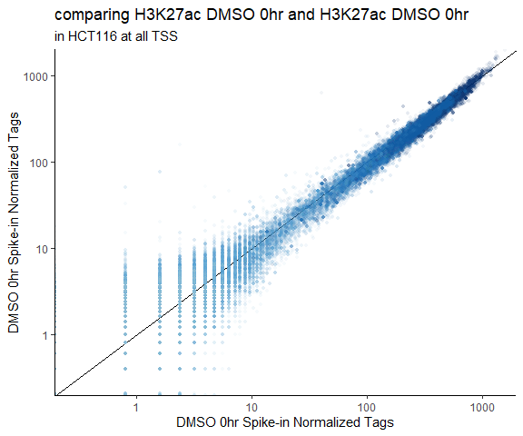
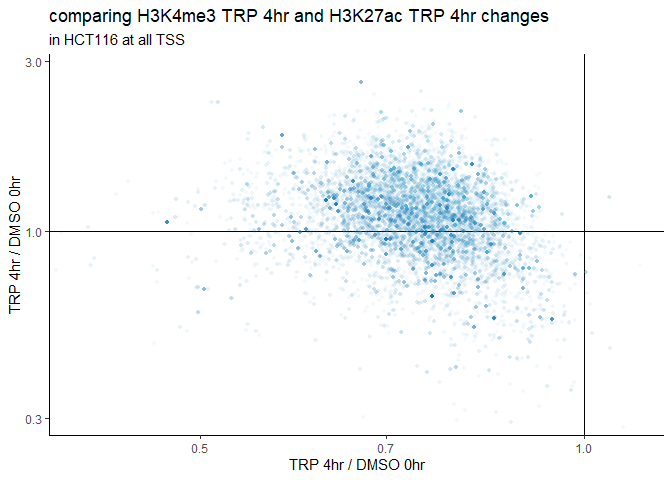
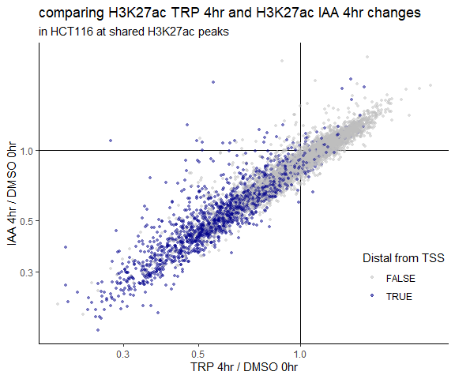

presubmit_final_fig2
================

- <a href="#data-processing" id="toc-data-processing">Data processing</a>
  - <a href="#trimming-.fastq-files" id="toc-trimming-.fastq-files">Trimming
    .FASTQ Files</a>
  - <a href="#alignment-.fastq---.sam"
    id="toc-alignment-.fastq---.sam">Alignment: .FASTQ -&gt; .SAM</a>
    - <a href="#genome-preparation" id="toc-genome-preparation">Genome
      Preparation:</a>
  - <a href="#remove-pcr-duplicates" id="toc-remove-pcr-duplicates">Remove
    PCR Duplicates</a>
  - <a href="#separate-alignment-file-into-species-specific-alignments"
    id="toc-separate-alignment-file-into-species-specific-alignments">Separate
    Alignment File into Species-specific Alignments</a>
  - <a href="#make-homer-tag-directories"
    id="toc-make-homer-tag-directories">Make HOMER Tag Directories</a>
  - <a href="#visualize-with-bigwigs"
    id="toc-visualize-with-bigwigs">Visualize with BigWigs</a>
- <a href="#visualization-in-figure-2"
  id="toc-visualization-in-figure-2">Visualization in Figure 2</a>
  - <a href="#processing-functions" id="toc-processing-functions">processing
    functions</a>
  - <a href="#plotting-functions" id="toc-plotting-functions">plotting
    functions</a>
- <a href="#data-import" id="toc-data-import">data import</a>
- <a href="#plot-before-normalization"
  id="toc-plot-before-normalization">plot before normalization</a>
  - <a href="#h3k27ac" id="toc-h3k27ac">H3K27ac</a>
  - <a href="#h3k4me3" id="toc-h3k4me3">H3K4me3</a>
- <a href="#sequencing-statistics"
  id="toc-sequencing-statistics">Sequencing Statistics</a>
  - <a href="#plotting" id="toc-plotting">plotting</a>
- <a href="#counts" id="toc-counts">Counts</a>
  - <a href="#h3k27ac-iaa-1hr-vs-dmso"
    id="toc-h3k27ac-iaa-1hr-vs-dmso">H3K27ac IAA 1hr vs DMSO</a>
  - <a href="#h3k27ac-trp-vs-dmso" id="toc-h3k27ac-trp-vs-dmso">H3K27ac TRP
    vs DMSO</a>
  - <a href="#h3k4me3-iaa-1hr-vs-dmso"
    id="toc-h3k4me3-iaa-1hr-vs-dmso">H3K4me3 IAA 1hr vs DMSO</a>
  - <a href="#rpb1" id="toc-rpb1">RPb1</a>
  - <a href="#comparing-changes-between-treatments"
    id="toc-comparing-changes-between-treatments">Comparing changes between
    treatments</a>
  - <a href="#comparing-changes-between-histone-marks"
    id="toc-comparing-changes-between-histone-marks">Comparing changes
    between histone marks</a>
  - <a href="#compare-changes-at-shared-peaks-between-iaatrp-treatments"
    id="toc-compare-changes-at-shared-peaks-between-iaatrp-treatments">compare
    changes at shared peaks between IAA/TRP treatments</a>
    - <a
      href="#h3k27ac-peaks-4hr-timepoints-hct116-iaa-and-trp-treatments-23k"
      id="toc-h3k27ac-peaks-4hr-timepoints-hct116-iaa-and-trp-treatments-23k">H3K27ac
      peaks, 4hr timepoints, HCT116 IAA and TRP treatments (~23k)</a>
    - <a
      href="#h3k4me3-peaks-4hr-timepoints-hct116-iaa-and-trp-treatments-15k"
      id="toc-h3k4me3-peaks-4hr-timepoints-hct116-iaa-and-trp-treatments-15k">H3K4me3
      peaks, 4hr timepoints, HCT116 IAA and TRP treatments (~15k)</a>
    - <a href="#h3k27ac-peaks-hct116-vs-hela"
      id="toc-h3k27ac-peaks-hct116-vs-hela">H3K27ac peaks, HCT116 vs Hela</a>
    - <a href="#h3k4me3-peaks-hct116-vs-hela"
      id="toc-h3k4me3-peaks-hct116-vs-hela">H3K4me3 peaks, HCT116 vs Hela</a>
- <a href="#hela-s3-data" id="toc-hela-s3-data">Hela S3 data</a>
  - <a href="#seq-stats" id="toc-seq-stats">seq stats</a>
  - <a href="#normalize-counts" id="toc-normalize-counts">normalize
    counts</a>
    - <a href="#h3k27ac-scatterplots" id="toc-h3k27ac-scatterplots">H3K27ac
      scatterplots</a>
    - <a href="#h3k4me3-scatterplots" id="toc-h3k4me3-scatterplots">H3K4me3
      scatterplots</a>
    - <a href="#rpb1-1" id="toc-rpb1-1">Rpb1</a>
    - <a href="#fold-changes-between-marks"
      id="toc-fold-changes-between-marks">Fold changes between marks</a>
  - <a href="#helas3-histograms" id="toc-helas3-histograms">HelaS3
    histograms</a>
    - <a href="#plotting-hela-normalized-histograms"
      id="toc-plotting-hela-normalized-histograms">plotting hela normalized
      histograms</a>

``` r
library(tidyverse)
```

    Warning: package 'ggplot2' was built under R version 4.3.3

    Warning: package 'lubridate' was built under R version 4.3.2

    ── Attaching core tidyverse packages ──────────────────────── tidyverse 2.0.0 ──
    ✔ dplyr     1.1.3     ✔ readr     2.1.4
    ✔ forcats   1.0.0     ✔ stringr   1.5.1
    ✔ ggplot2   3.5.1     ✔ tibble    3.2.1
    ✔ lubridate 1.9.3     ✔ tidyr     1.3.0
    ✔ purrr     1.0.2     
    ── Conflicts ────────────────────────────────────────── tidyverse_conflicts() ──
    ✖ dplyr::filter() masks stats::filter()
    ✖ dplyr::lag()    masks stats::lag()
    ℹ Use the conflicted package (<http://conflicted.r-lib.org/>) to force all conflicts to become errors

``` r
library(RColorBrewer)
library(ggpp) 
```

    Warning: package 'ggpp' was built under R version 4.3.3

    Registered S3 methods overwritten by 'ggpp':
      method                  from   
      heightDetails.titleGrob ggplot2
      widthDetails.titleGrob  ggplot2

    Attaching package: 'ggpp'

    The following object is masked from 'package:ggplot2':

        annotate

``` r
library(cowplot)
```

    Warning: package 'cowplot' was built under R version 4.3.3


    Attaching package: 'cowplot'

    The following object is masked from 'package:lubridate':

        stamp

``` r
theme_set(theme_classic())
```

# Data processing

## Trimming .FASTQ Files

``` bash
base=$(basename $i _R1_001.fastq.gz)
trimmomatic SE ${base}_R1_001.fastq.gz ${dir}/${base}.trim.fastq.gz \
-threads 8 \
ILLUMINACLIP:/trimmomatic-0.39-hdfd78af_2/share/trimmomatic-0.39-2/adapters/TruSeq3-SE.fa:2:30:7 \
LEADING:3 TRAILING:3 SLIDINGWINDOW:4:20 MINLEN:36
```

## Alignment: .FASTQ -\> .SAM

### Genome Preparation:

Genomes Downloaded with HOMER: hg38, dm6, sacCer3

``` bash
perl /path/to/homer/configureHomer.pl -install hg38

perl /path/to/homer/configureHomer.pl -install dm6

perl /path/to/homer/configureHomer.pl -install sacCer3
```

Add chromosome suffixes to identify spike-in chromosomes

Fasta file of genome location: /homer/data/genomes/hg38/genome.fa

``` bash
## Fly dm6 Genome
# suffix added "_dm6"
sed 's/>.*/&_dm6/' genome.fa > genome_dm6.fa

# check by printing fastq headers
perl -ne 'if(/^>(\S+)/){print "$1\n"}' genome_dm6.fa

## Yeast sacCer3 Genome
# suffix added "_sac3"
sed 's/>.*/&_sac3/' genome.fa > genome_sac3.fa

# check by printing fastq headers
perl -ne 'if(/^>(\S+)/){print "$1\n"}' genome_sac3.fa
```

Combine spike-in/target genomes:

``` bash
cat ${dir}/dm6/genome_dm6.fa ${dir}/sacCer3/genome_sac3.fa ${dir}/hg38/genome.fa > genome_hg38_dm6_sac3.fa
```

Index genome:

``` bash
bwa index -p hg38_dm6_sac3 genome_hg38_dm6_sac3.fa
```

Alignment:

``` bash
bwa mem -t 4 ~/data/genome_index/genome_prefix ${file}.fastq > ${file}.sam
```

## Remove PCR Duplicates

``` bash
# single end reads: don't need to collate
# fixmate can go from sam to bam 
samtools fixmate -m ${file}.sam ${file}.fixmate.bam
samtools sort ${file}.fixmate.bam -o ${file}.sorted.bam
samtools markdup -r -s ${file}.sorted.bam ${file}.nodup.bam
```

## Separate Alignment File into Species-specific Alignments

Split alignment file into files for each chromosome

``` bash
bam splitChromosome --in ${file}.nodup.bam --out ${file}.
```

Remove *chrUn*, *random* files

Merge chromosome files to get one alignment file per species. Need to
merge spike-in species first, then remove those chromosomes

``` bash
# create dm6 spike-in alignment file
samtools merge ${file}.dm6.bam ${file}.chr*_dm6.bam

# remove dm6 spike-in chromosome files
rm ${file}.chr*_dm6.bam

# create sac3 spike-in alignment file
samtools merge ${file}.sac3.bam ${file}.chr*_sac3.bam

# remove sac3 spike-in chromosome files
rm ${file}.chr*_sac3.bam

# create target alignment file
samtools merge ${file}.hg38.bam ${file}.chr*.bam
```

Convert BAM to SAM (-h to keep header), remove suffixes from files with
sed.

``` bash
# remove first set of spike-in suffixes
samtools view -h ${file}.bam | sed -e 's/\_dm6//g' > ${file}.nosuffix.sam

# remove second set of spike-in suffixes
samtools view -h ${file}.nosuffix.sam | sed -e 's/\_sac3//g' > ${file}.nosuffix2.sam
```

## Make HOMER Tag Directories

By default, HOMER `makeTagDirectory` or `batchMakeTagDirectory` only
keep primary alignments with MAPQ \> 10. Tag directories are also
read-depth normalized to 10 million reads unless otherwise specified. To
create Tag Directories in batch mode, first create a tsv file called a
tagkey, containing the names for each input file and each desired output
tag directory.

Format of the tagkey file: TSV <br> file1-tagdir file1.nosuffix2.sam
<br> file2-tagdir file2.nosuffix2.sam <br> file3-tagdir
file3.nosuffix2.sam <br>

Then run HOMER `batchMakeTagDirectory.pl` for each species. Example with
hg38:

``` bash
batchMakeTagDirectory.pl tagkey -genome hg38 \
-cpu 8 -fragLength 150
```

Repeat for dm6, sacCer3 genomes

## Visualize with BigWigs

Can make BigWigs from bam file with Deeptools, or from Tag Directories
with HOMER `makeBigWig.pl`

``` bash
makeBigWig.pl ${file}-tagdir/ hg38 \
-webdir /path/to/webdirectory -url http://webdirectoryurl/
```

Note: you can also make BedGraphs with HOMER `makeBedGraph.pl`

Repeat for dm6, sacCer3 genomes

# Visualization in Figure 2

## processing functions

``` r
### This function processes histograms output by HOMER annotatePeaks.pl
### input: standard output .txt file from HOMER
### output: a clean version with a renamed 1st column, and in tidyr format
### if HOMER histogram was created around tss, enter "tss" in function arg
### if HOMER histogram centered at peaks, enter "center" in function arg

### CURRENT ERROR: final tidy df has wrong name of column 1

process_histograms <- function(x, .x) {
  # change the first column to be named more cleanly
  colnames(x)[1] <- "Distance_from_tss"

  # clean names of remaining columns
  x <- x |>
    ### first two rename_with uses are specific to my sample names
#    dplyr::rename_with(~ gsub(".hg38.tagdir", "", .x), contains("tagdir")) |>
    rename_with(~ gsub(".concat.hg38.tagdir", "", .x), contains("concat")) |> 
    # biorep 2 seqstats sheet has .comb in names
    rename_with(~ gsub(".combined.hg38.tagdir", "", .x), contains("hr")) |>
    rename_with(~ gsub(".final.hg38.tagdir", "", .x), contains("Coverage")) |>
    rename_with(~ gsub(".+HCT", "HCT", .x), contains(".Coverage")) |>
    rename_with(~ gsub(".+Hela", "Hela", .x), contains(".Coverage")) |>
    # gets rid of S## numbers from sequencing output if present
    dplyr::rename_with(~ gsub("\\_S.+\\.Coverage", ".Coverage", .x), contains("Coverage")) |>
    ### below two uses of rename_with are general to HOMER output
    dplyr::rename_with(~ gsub("\\.[[:digit:]]$", "_minus", .x), contains("Tags")) |>
    dplyr::rename_with(~ gsub("\\.\\.\\.", "_", .x), contains("Tags"))

  # select coverage columns (not tag columns)
  xcov <- x |> dplyr::select(contains("Coverage"))

  # add back column 1
  xcov['Distance_from_tss'] <- x[1]

  # get in tidy/long format
  xcovlong <-
    xcov |> tidyr::pivot_longer(
      cols = !Distance_from_tss,
      names_to = "Sample",
      values_to = "Coverage")
}
```

``` r
process_counts_annotpeaks <- function(counts_annotpeaks, .x) {
  colnames(counts_annotpeaks)[1] <- "PeakID"
  counts_annotpeaks <- counts_annotpeaks %>% 
    rename_with(~ gsub(".concat.hg38.tagdir", "", .x), contains("concat")) %>% 
    rename_with(~ gsub(".combined.hg38.tagdir", "", .x), contains("tagdir")) %>% 
    rename_with(~ gsub(".hg38.new.tagdir", "", .x), contains("tagdir")) %>% 
    rename_with(~ gsub(".hg38.tagdir", "", .x), contains("tagdir")) %>% 
    rename_with(~ gsub("_S.+.Tag", ".Tag", .x), contains("Tag")) %>% 
    rename_with(~ gsub(".+HCT", "HCT", .x), contains("LP_88")) %>%
    rename_with(~ gsub(".+Hela", "Hela", .x), contains("Hela")) %>%
    rename_with(~ gsub(".+HCT", "LP91_HCT", .x), contains("LP_91")) %>%
    rename_with(~ gsub("_H3K4me3_1", "_1_H3K4me3", .x), contains("Hela")) |>
    rename_with(~ gsub("_H3K4me3_2", "_2_H3K4me3", .x), contains("Hela")) |>
    rename_with(~ gsub("_H3K4me1_1", "_1_H3K4me1", .x), contains("Hela")) |>
    rename_with(~ gsub("_H3K4me1_2", "_2_H3K4me1", .x), contains("Hela")) |>
    rename_with(~ gsub("_H3K27ac_1", "_1_H3K27ac", .x), contains("Hela")) |>
    rename_with(~ gsub("_H3K27ac_2", "_2_H3K27ac", .x), contains("Hela")) |>
    rename_with(~ gsub("_Rpb1_1", "_1_Rpb1", .x), contains("Hela")) |>
    rename_with(~ gsub("_Rpb1_2", "_2_Rpb1", .x), contains("Hela")) |>
    rename_with(~ gsub("\\.[[:digit:]]$", "_minus", .x), contains("Tag")) %>% 
    rename_with(~ gsub("\\.Count.+", "", .x), contains("Tag"))
} 
```

``` r
## input df: works with snake_case naming
## other required arugments:
##### Sample: the column of unique sample names in snake_case
## Sample must be named according to convention:
##### id: the new ID column, unique sample identifier
##### cell: cell type
##### treatment: treatment/condition
##### timepoint: timepoint of treatment (if n/a just say so)
##### antibody: ChIP IP antibody used (say if input)
##### replicate: replicate (numeric or factor)

sep_hist_byregex <- function(df, Sample) {
  df_sep <- df |>
    dplyr::filter(!grepl("input", Sample)) |>
    tidyr::separate_wider_regex(cols = Sample, patterns = c(
    cell = ".+",
    "\\_",
    treatment = ".+",
    "\\_",
    timepoint = ".+",
    "\\_",
    replicate = ".+", 
    "\\_",
    antibody = ".+",
    "\\_",
    tech_replicate = ".", ".+", "Coverage$"))
}
```

## plotting functions

``` r
plot_histograms_natgen <- function(input_df, regions) {
  xvar <- colnames(input_df)[1]
  cell_name <- input_df[[2]]
  treatment_num <- length(unique(input_df[[3]]))
  treatment <- input_df[[3]]
  timepoint <- input_df[[4]]
  biorep <- input_df[[5]]
  antibody_name <- input_df[[6]]
  
  regions <- rlang::ensym(regions)

  input_df |>
    ggplot2::ggplot(ggplot2::aes(x = Distance_from_tss, y = Coverage, group=interaction(treatment, timepoint, antibody_name, replicate), color = timepoint)) +
    ggplot2::geom_line(alpha = 0.8, linewidth = 1.1) +
    ggplot2::labs(
      title = paste("Read Depth Normalized", antibody_name, "in", cell_name, "at", regions),
         subtitle = paste("Biological Replicate", biorep), 
         x = xvar,
         y = deparse(colnames(input_df[8]))) +
    ggplot2::scale_color_manual(
      values = c("firebrick", "slateblue", "goldenrod2"),
      name = "Timepoint",
      labels = unique(input_df[[4]])) +
    ggplot2::theme_classic()
}
```

``` r
plot_histograms_dualnorm_natgen <- function(input_df, treatment_select, biorep_select, antibody_select, regions) {
  # extract variables
  xvar <- input_df[[1]]
  cell_name <- input_df[[2]]
  treatment_num <- length(unique(input_df[[3]]))
  treatment <- input_df[[3]]
  timepoint <- input_df[[4]]
  replicate <- input_df[[5]]
  antibody <- input_df[[6]]
  dualnorm <- input_df[[8]]
  confidence <- input_df[[9]]
  spike.in <- input_df[[10]]
  yvar <- colnames(input_df)[11]

  # make sure regions and colorbrewer varaiables are interpretable
  regions <- rlang::ensym(regions)
  # treatment_select is either IAA or TRP for HCT, TRP for HeLa
  antibody_select <- rlang::ensym(antibody_select)
  treatment_select <- rlang::ensym(treatment_select)
  biorep_select <- rlang::ensym(biorep_select)
  
#  biorep_select <- as.factor(biorep_select)
  
  # make the plot
  ggplot(input_df %>%
           filter(antibody == antibody_select) %>%
           filter(replicate == biorep_select) %>%
           filter(treatment %in% c("DMSO", treatment_select))) +
    aes(x = Distance_from_tss, 
         group = interaction(treatment, timepoint, replicate, tech_replicate, spike.in), 
         color = timepoint) + 
    geom_line(aes(y = Normalized.Coverage, 
                  linetype = spike.in)) +
    geom_ribbon(aes(ymax = dualnorm + confidence*0.5, 
                    ymin = dualnorm - confidence*0.5, 
                    fill = timepoint), 
                 alpha = 0.4, color = NA) + 
    theme(legend.position = c(0.86, 0.75)) + 
    labs(title = paste("Dual spike-in normalized", antibody_select, "around", regions, treatment_select), 
         subtitle = paste("in", cell_name, "biological replicate", biorep_select),
         x = paste("Distance from", regions, "center"), 
         y = "Normalized Coverage") + 
    scale_color_manual(values = c("firebrick", "slateblue", "goldenrod2")) + 
    scale_fill_manual(values = c("firebrick", "slateblue", "goldenrod2")) + 
    scale_linetype_manual(values = c("dotted", "dashed"),
                          name = "spike-in species", 
                          labels = c("fly normalized", "yeast normalized"))
}
```

Usage example:

``` r
plot_histograms_dualnorm_natgen(toptsscov_all_norm_sep_method_long, "IAA", "2", "H3K27ac", "top TSS")
```

Scatterplot function for individual sample comparisons (xy line, no FC)

``` r
some_function2 <- function(df, quantile, xvar, yvar, regions, colorbrewer) {
  # extract sample conditions from xvariable name
  cell_type <- str_match(xvar, '([^_]+)(?:_[^_]+){5}$')[,2]
  treatmentx <- str_match(xvar, '([^_]+)(?:_[^_]+){4}$')[,2]
  timepointx <- str_match(xvar, '([^_]+)(?:_[^_]+){3}$')[,2]
  treatmenty <- str_match(yvar, '([^_]+)(?:_[^_]+){4}$')[,2]
  timepointy <- str_match(yvar, '([^_]+)(?:_[^_]+){3}$')[,2]
  biorepx <- str_match(xvar, '([^_]+)(?:_[^_]+){2}$')[,2]
  biorepy <- str_match(yvar, '([^_]+)(?:_[^_]+){2}$')[,2]
  antibodyx <- str_match(xvar, '([^_]+)(?:_[^_]+){1}$')[,2]
  antibodyy <- str_match(yvar, '([^_]+)(?:_[^_]+){1}$')[,2]
  xcondition <- paste(antibodyx, treatmentx, timepointx)
  ycondition <- paste(antibodyy, treatmenty, timepointy)
  
  if (biorepx == biorepy) {
      biorep <- biorepx
  }
  else {
    biorep <- NULL
  }
  
  # make sure regions and colorbrewer varaiables are interpretable
  regions <- rlang::ensym(regions)
  colorbrewer <- rlang::ensym(colorbrewer)
  
  # need to convert quantile column to a factor (not 1-4 numeric) for plotting colors to work
  df[, quantile] <- as.factor(df[, quantile]) 
  num_colors <- length(unique(df[["quantile"]]))
  
  # make the plot
ggplot(data = df) + 
    aes(x = .data[[xvar]], y = .data[[yvar]], 
        color = .data[[quantile]]) + 
    scale_x_log10() + scale_y_log10() + geom_abline() + 
    geom_point(alpha = 0.05, stroke = NA) + 
    labs(
      title = paste("comparing", xcondition, "and", ycondition), 
      subtitle = paste("in", cell_type, "at", regions),
      x = paste(treatmentx, timepointx, "Spike-in Normalized Tags"), 
      y = paste(treatmenty, timepointy, "Spike-in Normalized Tags")) +
   scale_color_manual(values = 
                        colorRampPalette(brewer.pal(9, paste0(colorbrewer)))
                      (num_colors + 2)[3:(num_colors + 2)]) + 
  theme(legend.position = "none")
}
```

``` r
some_function2_FC <- function(df, quantile, xnum, xdenom, ynum, ydenom, regions, colorbrewer) {
  # extract sample conditions from xvariable name
    cell_type <- str_match(xnum, '([^_]+)(?:_[^_]+){5}$')[,2]
    ### x axis variables
    treatment_xnum <- str_match(xnum, '([^_]+)(?:_[^_]+){4}$')[,2]
    timepoint_xnum <- str_match(xnum, '([^_]+)(?:_[^_]+){3}$')[,2]
    treatment_xdenom <- str_match(xdenom, '([^_]+)(?:_[^_]+){4}$')[,2]
    timepoint_xdenom <- str_match(xdenom, '([^_]+)(?:_[^_]+){3}$')[,2]
    biorep_xnum <- str_match(xnum, '([^_]+)(?:_[^_]+){2}$')[,2]
    biorep_xdenom <- str_match(xdenom, '([^_]+)(?:_[^_]+){2}$')[,2]
    antibody_xnum <- str_match(xnum, '([^_]+)(?:_[^_]+){1}$')[,2]
    antibody_xdenom <- str_match(xdenom, '([^_]+)(?:_[^_]+){1}$')[,2]
    xnumcondition <- paste(antibody_xnum, treatment_xnum, timepoint_xnum)
    xdenomcondition <- paste(antibody_xdenom, treatment_xdenom, timepoint_xdenom)
    ### y axis variables
    treatment_ynum <- str_match(ynum, '([^_]+)(?:_[^_]+){4}$')[,2]
    timepoint_ynum <- str_match(ynum, '([^_]+)(?:_[^_]+){3}$')[,2]
    treatment_ydenom <- str_match(ydenom, '([^_]+)(?:_[^_]+){4}$')[,2]
    timepoint_ydenom <- str_match(ydenom, '([^_]+)(?:_[^_]+){3}$')[,2]
    biorep_ynum <- str_match(ynum, '([^_]+)(?:_[^_]+){2}$')[,2]
    biorep_ydenom <- str_match(ydenom, '([^_]+)(?:_[^_]+){2}$')[,2]
    antibody_ynum <- str_match(ynum, '([^_]+)(?:_[^_]+){1}$')[,2]
    antibody_ydenom <- str_match(ydenom, '([^_]+)(?:_[^_]+){1}$')[,2]
    ynumcondition <- paste(antibody_ynum, treatment_ynum, timepoint_ynum)
    ydenomcondition <- paste(antibody_ydenom, treatment_ydenom, timepoint_ydenom)
  # make sure regions and colorbrewer varaiables are interpretable
  regions <- rlang::ensym(regions)
  colorbrewer <- rlang::ensym(colorbrewer)
  
  # need to convert quantile column to a factor (not 1-4 numeric) for plotting colors to work
#  df[quantile] <- as.factor(df[, quantile]) 
  num_colors <- length(unique(df[["quantile"]]))
  
  # make the plot
ggplot(data = df) + 
    aes(x = .data[[xnum]]/.data[[xdenom]], y = (.data[[ynum]])/(.data[[ydenom]]), 
        color = as.factor(quantile)) + 
    scale_x_log10() + scale_y_log10() + 
    geom_hline(yintercept = 1) + geom_vline(xintercept = 1) + 
    geom_point(alpha = 0.05, stroke = NA) + 
    labs(
      title = paste("comparing", xnumcondition, "and", ynumcondition, "changes"), 
      subtitle = paste("in", cell_type, "at", regions),
      x = paste(treatment_xnum, timepoint_xnum, "/", treatment_xdenom, timepoint_xdenom), 
      y = paste(treatment_ynum, timepoint_ynum, "/", treatment_ydenom, timepoint_ydenom)) +
  scale_color_manual(
      values = colorRampPalette(brewer.pal(9, paste0(colorbrewer)))(7)[4:7]) + 
  theme(legend.position = "none")
}
```

``` r
FC_violin_plot_quartilecolor <- function(input_df, num, denom, regions, colorbrewer) {
    cell_type <- str_match(num, '([^_]+)(?:_[^_]+){5}$')[,2]
    treatment_num <- str_match(num, '([^_]+)(?:_[^_]+){4}$')[,2]
    timepoint_num <- str_match(num, '([^_]+)(?:_[^_]+){3}$')[,2]
    treatment_denom <- str_match(denom, '([^_]+)(?:_[^_]+){4}$')[,2]
    timepoint_denom <- str_match(denom, '([^_]+)(?:_[^_]+){3}$')[,2]
    biorep_num <- str_match(num, '([^_]+)(?:_[^_]+){2}$')[,2]
    biorep_denom <- str_match(denom, '([^_]+)(?:_[^_]+){2}$')[,2]
    antibody_num <- str_match(num, '([^_]+)(?:_[^_]+){1}$')[,2]
    antibody_denom <- str_match(denom, '([^_]+)(?:_[^_]+){1}$')[,2]
    numcondition <- paste(antibody_num, treatment_num, timepoint_num)
    denomcondition <- paste(antibody_denom, treatment_denom, timepoint_denom)
    
  regions <- rlang::ensym(regions)
  colorbrewer <- rlang::ensym(colorbrewer)
  
  ggplot(data = input_df) + 
    aes(x = as.factor(quantile), 
        y = (.data[[num]]/.data[[denom]]), 
        color = as.factor(quantile), fill = as.factor(quantile)) + 
    geom_hline(yintercept = 1) + 
    geom_violin(alpha = 0.3, draw_quantiles = c(0.25, 0.5, 0.75)) + 
    scale_y_log10() + 
    labs(title = paste("FC in", numcondition, "vs", denomcondition),
         subtitle = paste("In", cell_type, "biological replicate", biorep_num, regions),
         x = "Quartiles of Rpb1 peak signal", 
         y = paste(treatment_num, timepoint_num, "/", treatment_denom, timepoint_denom, "FC")) + 
    theme(legend.position = "none") + 
    scale_color_manual(
      values = colorRampPalette(brewer.pal(9, paste0(colorbrewer)))(7)[3:6]) + 
    scale_fill_manual(
      values = colorRampPalette(brewer.pal(9, paste0(colorbrewer)))(7)[3:6])
  }
```

# data import

``` r
## Top 25% of Rpb1 TSS histogram, biorep1 
hist_toptss_hg38_LP88 <-read.delim("~/Research/LP_91/homer_hist/hist_tss_topquartile_Rpb1_LP91_LP88.txt")

## top 25% of Rpb1 TSS, biorep2 
hist_toptss_hg38_LP92 <- read.delim("~/Research/LP_92/homer_hist/hist_tss_topquartile_LP91Rpb1_hg38_LP92.txt")

## top 25% of Rpb1 TSS, HeLa-S3
# hist_toptss_hg38_LP81 <- 
```

``` r
hist_toptss_hg38_LP88_tidy <- process_histograms(hist_toptss_hg38_LP88)

# hist for LP88 also contained old biorep2 (with PCR dups high) get rid of those
hist_toptss_hg38_LP88_tidy <- hist_toptss_hg38_LP88_tidy[!grepl("hr_2_", hist_toptss_hg38_LP88_tidy$Sample), ]
hist_toptss_hg38_LP88_sep <- sep_hist_byregex(hist_toptss_hg38_LP88_tidy, 
                                              Sample = Sample)


hist_toptss_hg38_LP92_tidy <- process_histograms(hist_toptss_hg38_LP92)
hist_toptss_hg38_LP92_sep <- sep_hist_byregex(hist_toptss_hg38_LP92_tidy, 
                                              Sample = Sample)
```

# plot before normalization

## H3K27ac

``` r
plot_histograms_natgen(hist_toptss_hg38_LP88_sep %>%
                         filter(antibody == "H3K27ac") %>%
                         filter(treatment %in% c("DMSO", "IAA")), "top TSS")
```


``` r
plot_histograms_natgen(hist_toptss_hg38_LP88_sep %>%
                         filter(antibody == "H3K27ac") %>%
                         filter(treatment %in% c("DMSO", "TRP")), "top TSS")
```


``` r
plot_histograms_natgen(hist_toptss_hg38_LP92_sep %>%
                         filter(antibody == "H3K27ac") %>%
                         filter(treatment %in% c("DMSO", "IAA")), "top TSS")
```


``` r
plot_histograms_natgen(hist_toptss_hg38_LP92_sep %>%
                         filter(antibody == "H3K27ac") %>%
                         filter(treatment %in% c("DMSO", "TRP")), "top TSS")
```


## H3K4me3

``` r
plot_histograms_natgen(hist_toptss_hg38_LP92_sep %>%
                         filter(antibody == "H3K4me3"), "top TSS")
```


# Sequencing Statistics

``` r
LP92_seqstats <- read.delim("~/Research/LP_92/LP92_seqstats.tsv")
# set NA's to zero
LP92_seqstats[is.na(LP92_seqstats)] = 0

LP92_seqstats$avg.normfactor.adj <- as.numeric(LP92_seqstats$avg.normfactor.adj)
LP92_seqstats$dm6.normfactor.adj <- as.numeric(LP92_seqstats$dm6.normfactor.adj)
LP92_seqstats$sac3.normfactor.adj <- as.numeric(LP92_seqstats$sac3.normfactor.adj)
LP92_seqstats$sac3.normfactor <- as.numeric(LP92_seqstats$sac3.normfactor)

LP88_seqstats_techrep2 <- read.delim("~/Research/LP_91/LP88_techrep2_seqstats.tsv")

LP88_seqstats_techrep2$avg.normfactor.adj <- LP88_seqstats_techrep2$dual.normfactor.adj

LP88_LP92_seqstats <- bind_rows(LP92_seqstats, LP88_seqstats_techrep2)

# set NAs to 0
LP88_LP92_seqstats[is.na(LP88_LP92_seqstats)] = 0
```

``` r
hist_toptss_hg38_LP88_tidyIP <- hist_toptss_hg38_LP88_tidy %>% 
  filter(!grepl("input", Sample)) %>%
  filter(!grepl("Rpb1", Sample)) 

# copy the hist_tss_hg38 dataframe 
tsscov_dual_norm <- hist_toptss_hg38_LP88_tidyIP

# dataframe 1: original read-normalized data
# dataframe 2: seq stats
# dataframe 3: peakcov_avg_ip_input_norm (output df)

# When Sample rows of df1 match Sample.ID in df2, multiply Coverage column in df1 by factor in df2, assign to df3

for (i in 1:nrow(hist_toptss_hg38_LP88_tidyIP)) {
  # make get current sampleID, remove .Coverage 
 seqstatIDi <- sub('.Coverage', '', hist_toptss_hg38_LP88_tidyIP[i, 2] )
 
 # get normalization factor from sequencing stats (df3)
 
 normfactori <- LP88_LP92_seqstats[grep(seqstatIDi, LP88_LP92_seqstats$ID), 'avg.normfactor.adj']
 
 # multiply read_norm coverage by norm factor, assign to new df
tsscov_dual_norm[i, 3] <- 
  hist_toptss_hg38_LP88_tidyIP[i, 3]/(normfactori)
  
}

#### fly

# copy the hist_tss_hg38_LH58_cov dataframe 
tsscov_fly_norm <- hist_toptss_hg38_LP88_tidyIP

# dataframe 1: original read-normalized data
# dataframe 2: seq stats
# dataframe 3: peakcov_avg_ip_input_norm (output df)

# When Sample rows of df1 match Sample.ID in df2, multiply Coverage column in df1 by factor in df2, assign to df3

for (i in 1:nrow(hist_toptss_hg38_LP88_tidyIP)) {
  
  # make get current sampleID, remove .Coverage 
 seqstatIDi <- sub('.Coverage', '', hist_toptss_hg38_LP88_tidyIP[i, 2] )
 
 # get normalization factor from sequencing stats (df3)
 
 normfactori <- LP88_LP92_seqstats[grep(seqstatIDi, LP88_LP92_seqstats$ID), 'dm6.normfactor.adj']
 
 # multiply read_norm coverage by norm factor, assign to new df
tsscov_fly_norm[i, 3] <- 
  hist_toptss_hg38_LP88_tidyIP[i, 3]/(normfactori)
  
}

#### yeast

# copy the hist_tss_hg38_LH58_cov dataframe 
tsscov_yeast_norm <- hist_toptss_hg38_LP88_tidyIP

# dataframe 1: original read-normalized data
# dataframe 2: seq stats
# dataframe 3: peakcov_avg_ip_input_norm (output df)

# When Sample rows of df1 match Sample.ID in df2, multiply Coverage column in df1 by factor in df2, assign to df3

for (i in 1:nrow(hist_toptss_hg38_LP88_tidyIP)) {
  
  # make get current sampleID, remove .Coverage 
 seqstatIDi <- sub('.Coverage', '', hist_toptss_hg38_LP88_tidyIP[i, 2] )
 
 # get normalization factor from sequencing stats (df3)
 
 normfactori <- LP88_LP92_seqstats[grep(seqstatIDi, LP88_LP92_seqstats$ID), 'sac3.normfactor.adj']
 
 # multiply read_norm coverage by norm factor, assign to new df
tsscov_yeast_norm[i, 3] <- 
  hist_toptss_hg38_LP88_tidyIP[i, 3]/(normfactori)
  
}

tsscov_dual_norm$method <- "dualnorm"
tsscov_fly_norm$method <- "flynorm"
tsscov_yeast_norm$method <- "yeastnorm"
```

``` r
tsscov_all_norm <- rbind(tsscov_dual_norm, tsscov_yeast_norm, tsscov_fly_norm)
```

``` r
tsscov_all_norm_sep <- tsscov_all_norm %>% separate_wider_regex(cols = Sample, patterns = c(
  cell = ".+", 
  "\\_", 
  treatment = ".+", 
  "\\_", 
  timepoint = ".+", 
  "\\_",
  replicate = ".+", 
  "\\_",
  antibody = ".+", 
  "\\_",
  tech_replicate = "[[:digit:]]",
  ".+Coverage$"))

tsscov_all_norm_sep_method <- tsscov_all_norm_sep %>% pivot_wider(
  names_from = method, values_from = Coverage
)

tsscov_all_norm_sep_method <- tsscov_all_norm_sep_method %>%
  mutate(confidence = abs(flynorm - yeastnorm))

tsscov_all_norm_sep_method_long <- tsscov_all_norm_sep_method %>%
  pivot_longer(cols = c("flynorm", "yeastnorm"), 
               names_to = "spike.in", 
               values_to = "Normalized.Coverage")
```

## plotting

``` r
dualnorm_IAA_H3K27ac_topTSS_HCTbiorep1 <- 
  ggdraw(plot_histograms_dualnorm_natgen(tsscov_all_norm_sep_method_long, "IAA", "1", "H3K27ac", "top TSS") + 
  coord_cartesian(ylim = c(0, 40))) + 
  draw_image("~/Research/LP_92/degraded_protein_iaa.png", 
             x = 0.46, y = 0.86, scale = 0.33, 
             hjust = 1, vjust = 1, halign = 1, valign = 1) 
```

    Warning: A numeric `legend.position` argument in `theme()` was deprecated in ggplot2
    3.5.0.
    ℹ Please use the `legend.position.inside` argument of `theme()` instead.

``` r
ggsave("plots/241212_dualnorm_IAA_H3K27ac_topTSS_HCTbiorep1.svg", dualnorm_IAA_H3K27ac_topTSS_HCTbiorep1, width = 6, height = 5)
```

``` r
dualnorm_TRP_H3K27ac_topTSS_HCTbiorep1 <- 
  ggdraw(plot_histograms_dualnorm_natgen(tsscov_all_norm_sep_method_long, "TRP", "1", "H3K27ac", "top TSS") + 
  coord_cartesian(ylim = c(0, 40))) + 
  draw_image("~/Research/LP_92/triptolide_structure.png", 
             x = 0.36, y = 0.86, scale = 0.23, 
             hjust = 1, vjust = 1, halign = 1, valign = 1) 

ggsave("plots/241212_dualnorm_TRP_H3K27ac_topTSS_HCTbiorep1.svg", dualnorm_TRP_H3K27ac_topTSS_HCTbiorep1, width = 6, height = 5)
```

``` r
ggdraw(plot_histograms_dualnorm_natgen(tsscov_all_norm_sep_method_long, "IAA", "1", "H3K4me3", "top TSS") + 
  coord_cartesian(ylim = c(0, 105))) + 
  draw_image("~/Research/LP_92/degraded_protein_iaa.png", 
             x = 0.46, y = 0.86, scale = 0.33, 
             hjust = 1, vjust = 1, halign = 1, valign = 1) 
```


``` r
dualnorm_IAA_H3K4me3_topTSS_HCTbiorep1 <- ggdraw(plot_histograms_dualnorm_natgen(tsscov_all_norm_sep_method_long, "IAA", "1", "H3K4me3", "top TSS") + 
  coord_cartesian(ylim = c(0, 105))) + 
  draw_image("~/Research/LP_92/degraded_protein_iaa.png", 
             x = 0.46, y = 0.86, scale = 0.33, 
             hjust = 1, vjust = 1, halign = 1, valign = 1) 

ggsave("plots/241212_dualnorm_IAA_H3K4me3_topTSS_HCTbiorep1.svg", dualnorm_IAA_H3K4me3_topTSS_HCTbiorep1, width = 6, height = 5)
```

``` r
ggdraw(plot_histograms_dualnorm_natgen(tsscov_all_norm_sep_method_long, "TRP", "1", "H3K4me3", "top TSS") + 
  coord_cartesian(ylim = c(0, 105))) + 
  draw_image("~/Research/LP_92/triptolide_structure.png", 
             x = 0.36, y = 0.86, scale = 0.23, 
             hjust = 1, vjust = 1, halign = 1, valign = 1) 
```


``` r
dualnorm_TRP_H3K4me3_topTSS_HCTbiorep1 <- ggdraw(plot_histograms_dualnorm_natgen(tsscov_all_norm_sep_method_long, "TRP", "1", "H3K4me3", "top TSS") + 
  coord_cartesian(ylim = c(0, 105))) + 
  draw_image("~/Research/LP_92/triptolide_structure.png", 
             x = 0.36, y = 0.86, scale = 0.23, 
             hjust = 1, vjust = 1, halign = 1, valign = 1) 

ggsave("plots/241212_dualnorm_TRP_H3K4me3_topTSS_HCTbiorep1.svg", dualnorm_TRP_H3K4me3_topTSS_HCTbiorep1, width = 6, height = 5)
```

# Counts

``` r
## All TSS counts - use for top 25% scatterplots!
counts_tss_hg38_LP88_LP92 <- read.delim("~/Research/LP_92/homer_counts/counts_tss_hg38_LP88_LP92.txt")
# counts_tss_hg38_LP91_LP92 <- read.delim("~/Research/LP_92/homer_counts/counts_tss_hg38_LP91_LP92.txt")
```

``` r
counts_tss_hg38_LP88_LP92 <- process_counts_annotpeaks(counts_tss_hg38_LP88_LP92)
# counts_tss_hg38_LP91_LP92 <- process_counts_annotpeaks(counts_tss_hg38_LP91_LP92)
```

``` r
# get all DMSO Rpb1 samples, average tags
counts_tss_hg38_LP88_LP92 <- counts_tss_hg38_LP88_LP92 %>% 
  mutate(avg_DMSO_Rpb1 = select(., matches('DMSO') & matches('Rpb1')) %>% rowMeans()) 

counts_tss_hg38_LP88_LP92_topH3K27ac <- counts_tss_hg38_LP88_LP92 %>%
  filter(HCT116_DMSO_0hr_1_H3K27ac_1.Tag > mean(HCT116_DMSO_0hr_1_H3K27ac_1.Tag)) %>% 
  mutate(avg_DMSO_Rpb1 = select(., matches('DMSO') & matches('Rpb1')) %>% rowMeans()) 
counts_tss_hg38_LP88_LP92_topH3K4me3 <- counts_tss_hg38_LP88_LP92 %>%
  filter(HCT116_DMSO_0hr_1_H3K4me3_1.Tag > mean(HCT116_DMSO_0hr_1_H3K4me3_1.Tag)) %>% 
  mutate(avg_DMSO_Rpb1 = select(., matches('DMSO') & matches('Rpb1')) %>% rowMeans()) 

# Sort by descending DMSO Rpb1 with dplyr arrange()
counts_tss_hg38_LP88_LP92 <- arrange(counts_tss_hg38_LP88_LP92, desc(avg_DMSO_Rpb1))
# Split into quartiles with dplyr ntile()
counts_tss_hg38_LP88_LP92 <- counts_tss_hg38_LP88_LP92 %>% mutate(quantile = ntile(avg_DMSO_Rpb1, 4))

# Sort by descending DMSO Rpb1 with dplyr arrange()
counts_tss_hg38_LP88_LP92_topH3K27ac <- arrange(counts_tss_hg38_LP88_LP92_topH3K27ac, desc(avg_DMSO_Rpb1))
# Split into quartiles with dplyr ntile()
counts_tss_hg38_LP88_LP92_topH3K27ac <- counts_tss_hg38_LP88_LP92_topH3K27ac %>% mutate(quantile = ntile(avg_DMSO_Rpb1, 4))
# Sort by descending DMSO Rpb1 with dplyr arrange()
counts_tss_hg38_LP88_LP92_topH3K4me3 <- arrange(counts_tss_hg38_LP88_LP92_topH3K4me3, desc(avg_DMSO_Rpb1))
# Split into quartiles with dplyr ntile()
counts_tss_hg38_LP88_LP92_topH3K4me3 <- counts_tss_hg38_LP88_LP92_topH3K4me3 %>% mutate(quantile = ntile(avg_DMSO_Rpb1, 4))


counts_tss_hg38_LP88_LP92$Annotation <- 
    gsub("\\(.*", "", as.character(counts_tss_hg38_LP88_LP92$Annotation))
counts_tss_hg38_LP88_LP92$Annotation <- 
    gsub(" ", "", as.character(counts_tss_hg38_LP88_LP92$Annotation))
counts_tss_hg38_LP88_LP92_topH3K27ac$Annotation <- 
    gsub("\\(.*", "", as.character(counts_tss_hg38_LP88_LP92_topH3K27ac$Annotation))
counts_tss_hg38_LP88_LP92_topH3K27ac$Annotation <- 
    gsub(" ", "", as.character(counts_tss_hg38_LP88_LP92_topH3K27ac$Annotation))
counts_tss_hg38_LP88_LP92_topH3K4me3$Annotation <- 
    gsub("\\(.*", "", as.character(counts_tss_hg38_LP88_LP92_topH3K4me3$Annotation))
counts_tss_hg38_LP88_LP92_topH3K4me3$Annotation <- 
    gsub(" ", "", as.character(counts_tss_hg38_LP88_LP92_topH3K4me3$Annotation))

# cleanup Chr col
counts_tss_hg38_LP88_LP92$Chr <- 
    gsub("\\_.*", "", as.character(counts_tss_hg38_LP88_LP92$Chr))
```

``` r
#### dual normalization at tss: for H3K4me3 and H3K27ac samples only!
counts_tss_hg38_allHCT_samples <- counts_tss_hg38_LP88_LP92 %>% 
  select(contains(".Tag") & !contains("input"))

counts_tss_hg38_dual <- counts_tss_hg38_allHCT_samples

# dataframe 1: original read-normalized data
# dataframe 2: seq stats
# dataframe 3: peakcov_avg_ip_input_norm (output df)

# When Sample rows of df1 match Sample.ID in df2, multiply Coverage column in df1 by factor in df2, assign to df3
sampleID <- sub('.Tag', '', colnames(counts_tss_hg38_allHCT_samples))

for (i in 1:ncol(counts_tss_hg38_allHCT_samples)) {
  
  # make get current sampleID, remove .Coverage 
 sampleIDi <- sampleID[i]
 
 if (!sampleIDi %in% 
      sub(".Tag", "", LP88_LP92_seqstats$ID)) {
   print(paste("warning: No matching normalization factor found for sample", sampleIDi))
    next()
  }
 # get normalization factor from sequencing stats (df3)
 # Col 23 in seqstats df3 contains yeast normalization factor
 
 normfactori <- LP88_LP92_seqstats[grep(sampleIDi, LP88_LP92_seqstats$ID), 'avg.normfactor.adj']
 
 # multiply read_norm coverage by norm factor, assign to new df
counts_tss_hg38_dual[, i] <- 
  counts_tss_hg38_allHCT_samples[, i]/(normfactori)
  
}

counts_tss_hg38_dual$quantile <- counts_tss_hg38_LP88_LP92$quantile

#### fly normalization at tss: for Rpb1 samples only!

counts_tss_hg38_fly <- counts_tss_hg38_allHCT_samples

# dataframe 1: original read-normalized data
# dataframe 2: seq stats
# dataframe 3: peakcov_avg_ip_input_norm (output df)

# When Sample rows of df1 match Sample.ID in df2, multiply Coverage column in df1 by factor in df2, assign to df3
sampleID <- sub('_2_Rpb1_1.Tag', '_2_Rpb1_2', colnames(counts_tss_hg38_allHCT_samples))
sampleID <- sub('.Tag', '', sampleID)

for (i in 1:ncol(counts_tss_hg38_allHCT_samples)) {
 
  # make get current sampleID, remove .Coverage 
 sampleIDi <- sampleID[i]
 # get normalization factor from sequencing stats (df3)
 # Col 23 in seqstats df3 contains yeast normalization factor
 
 normfactori <- LP88_LP92_seqstats[grep(sampleIDi, LP88_LP92_seqstats$ID), 'dm6.normfactor.adj']
 
 # multiply read_norm coverage by norm factor, assign to new df
counts_tss_hg38_fly[, i] <- 
  counts_tss_hg38_allHCT_samples[, i]/(normfactori)
  
}

counts_tss_hg38_fly$quantile <- counts_tss_hg38_LP88_LP92$quantile

counts_tss_hg38_dual$Chr <- counts_tss_hg38_LP88_LP92$Chr
```

``` r
#### dual normalization at tss: for H3K4me3 and H3K27ac samples only!
counts_tss_hg38_topH3K27ac_samples <- counts_tss_hg38_LP88_LP92_topH3K27ac %>% 
  select(contains(".Tag") & !contains("input"))

counts_tss_hg38_dual_topH3K27ac <- counts_tss_hg38_topH3K27ac_samples

# dataframe 1: original read-normalized data
# dataframe 2: seq stats
# dataframe 3: peakcov_avg_ip_input_norm (output df)

# When Sample rows of df1 match Sample.ID in df2, multiply Coverage column in df1 by factor in df2, assign to df3
sampleID <- sub('.Tag', '', colnames(counts_tss_hg38_topH3K27ac_samples))

for (i in 1:ncol(counts_tss_hg38_topH3K27ac_samples)) {
  
  # make get current sampleID, remove .Coverage 
 sampleIDi <- sampleID[i]
 
 if (!sampleIDi %in% 
      sub(".Tag", "", LP88_LP92_seqstats$ID)) {
   print(paste("warning: No matching normalization factor found for sample", sampleIDi))
    next()
  }
 # get normalization factor from sequencing stats (df3)
 # Col 23 in seqstats df3 contains yeast normalization factor
 
 normfactori <- LP88_LP92_seqstats[grep(sampleIDi, LP88_LP92_seqstats$ID), 'avg.normfactor.adj']
 
 # multiply read_norm coverage by norm factor, assign to new df
counts_tss_hg38_dual_topH3K27ac[, i] <- 
  counts_tss_hg38_topH3K27ac_samples[, i]/(normfactori)
  
}

counts_tss_hg38_dual_topH3K27ac$quantile <- counts_tss_hg38_LP88_LP92_topH3K27ac$quantile

#### fly normalization at tss: for Rpb1 samples only!

counts_tss_hg38_fly_topH3K27ac <- counts_tss_hg38_topH3K27ac_samples

# dataframe 1: original read-normalized data
# dataframe 2: seq stats
# dataframe 3: peakcov_avg_ip_input_norm (output df)

# When Sample rows of df1 match Sample.ID in df2, multiply Coverage column in df1 by factor in df2, assign to df3
sampleID <- sub('_2_Rpb1_1.Tag', '_2_Rpb1_2', colnames(counts_tss_hg38_topH3K27ac_samples))
sampleID <- sub('.Tag', '', sampleID)

for (i in 1:ncol(counts_tss_hg38_topH3K27ac_samples)) {
 
  # make get current sampleID, remove .Coverage 
 sampleIDi <- sampleID[i]
 # get normalization factor from sequencing stats (df3)
 # Col 23 in seqstats df3 contains yeast normalization factor
 
 normfactori <- LP88_LP92_seqstats[grep(sampleIDi, LP88_LP92_seqstats$ID), 'dm6.normfactor.adj']
 
 # multiply read_norm coverage by norm factor, assign to new df
counts_tss_hg38_fly_topH3K27ac[, i] <- 
  counts_tss_hg38_topH3K27ac_samples[, i]/(normfactori)
  
}

counts_tss_hg38_fly_topH3K27ac$quantile <- counts_tss_hg38_LP88_LP92_topH3K27ac$quantile

counts_tss_hg38_dual_topH3K27ac$Chr <- counts_tss_hg38_LP88_LP92_topH3K27ac$Chr
```

``` r
#### dual normalization at tss: for H3K4me3 and H3K27ac samples only!
counts_tss_hg38_topH3K4me3_samples <- counts_tss_hg38_LP88_LP92_topH3K4me3 %>% 
  select(contains(".Tag") & !contains("input"))

counts_tss_hg38_dual_topH3K4me3 <- counts_tss_hg38_topH3K4me3_samples

# dataframe 1: original read-normalized data
# dataframe 2: seq stats
# dataframe 3: peakcov_avg_ip_input_norm (output df)

# When Sample rows of df1 match Sample.ID in df2, multiply Coverage column in df1 by factor in df2, assign to df3
sampleID <- sub('.Tag', '', colnames(counts_tss_hg38_topH3K4me3_samples))

for (i in 1:ncol(counts_tss_hg38_topH3K4me3_samples)) {
  
  # make get current sampleID, remove .Coverage 
 sampleIDi <- sampleID[i]
 
 if (!sampleIDi %in% 
      sub(".Tag", "", LP88_LP92_seqstats$ID)) {
   print(paste("warning: No matching normalization factor found for sample", sampleIDi))
    next()
  }
 # get normalization factor from sequencing stats (df3)
 # Col 23 in seqstats df3 contains yeast normalization factor
 
 normfactori <- LP88_LP92_seqstats[grep(sampleIDi, LP88_LP92_seqstats$ID), 'avg.normfactor.adj']
 
 # multiply read_norm coverage by norm factor, assign to new df
counts_tss_hg38_dual_topH3K4me3[, i] <- 
  counts_tss_hg38_topH3K4me3_samples[, i]/(normfactori)
  
}

counts_tss_hg38_dual_topH3K4me3$quantile <- counts_tss_hg38_LP88_LP92_topH3K4me3$quantile

#### fly normalization at tss: for Rpb1 samples only!

counts_tss_hg38_fly_topH3K4me3 <- counts_tss_hg38_topH3K4me3_samples

# dataframe 1: original read-normalized data
# dataframe 2: seq stats
# dataframe 3: peakcov_avg_ip_input_norm (output df)

# When Sample rows of df1 match Sample.ID in df2, multiply Coverage column in df1 by factor in df2, assign to df3
sampleID <- sub('_2_Rpb1_1.Tag', '_2_Rpb1_2', colnames(counts_tss_hg38_topH3K4me3_samples))
sampleID <- sub('.Tag', '', sampleID)

for (i in 1:ncol(counts_tss_hg38_topH3K4me3_samples)) {
 
  # make get current sampleID, remove .Coverage 
 sampleIDi <- sampleID[i]
 # get normalization factor from sequencing stats (df3)
 # Col 23 in seqstats df3 contains yeast normalization factor
 
 normfactori <- LP88_LP92_seqstats[grep(sampleIDi, LP88_LP92_seqstats$ID), 'dm6.normfactor.adj']
 
 # multiply read_norm coverage by norm factor, assign to new df
counts_tss_hg38_fly_topH3K4me3[, i] <- 
  counts_tss_hg38_topH3K4me3_samples[, i]/(normfactori)
  
}

counts_tss_hg38_fly_topH3K4me3$quantile <- counts_tss_hg38_LP88_LP92_topH3K4me3$quantile

counts_tss_hg38_dual_topH3K4me3$Chr <- counts_tss_hg38_LP88_LP92_topH3K4me3$Chr
```

``` r
some_function2(counts_tss_hg38_dual, "quantile", 
               xvar = "HCT116_DMSO_0hr_1_H3K27ac_1.Tag", 
               yvar = "HCT116_DMSO_0hr_2_H3K27ac_1.Tag", 
               regions = "all TSS", Blues) +
  coord_cartesian(xlim = c(0.3, 1300), ylim = c(0.3, 1300)) 
```

    Warning in scale_x_log10(): log-10 transformation introduced infinite values.

    Warning in scale_y_log10(): log-10 transformation introduced infinite values.



### H3K27ac IAA 1hr vs DMSO

``` r
some_function2(counts_tss_hg38_dual, "quantile", 
               xvar = "HCT116_DMSO_0hr_1_H3K27ac_1.Tag", 
               yvar = "HCT116_IAA_1hr_1_H3K27ac_1.Tag", 
               regions = "all TSS", Blues) +
  coord_cartesian(xlim = c(0.3, 1300), ylim = c(0.3, 1300))
```

    Warning in scale_x_log10(): log-10 transformation introduced infinite values.

    Warning in scale_y_log10(): log-10 transformation introduced infinite values.


``` r
dualnorm_IAA1hr_H3K27ac_allTSS_scatter_HCTbiorep1 <- 
  some_function2(counts_tss_hg38_dual, "quantile", 
               xvar = "HCT116_DMSO_0hr_1_H3K27ac_1.Tag", 
               yvar = "HCT116_IAA_1hr_1_H3K27ac_1.Tag", 
               regions = "all TSS", Blues) +
  coord_cartesian(xlim = c(0.3, 1300), ylim = c(0.3, 1300))

ggsave("plots/241212_dualnorm_IAA1hr_H3K27ac_allTSS_scatter_HCTbiorep1.png", dualnorm_IAA1hr_H3K27ac_allTSS_scatter_HCTbiorep1, width = 5, height = 4)
```

    Warning in scale_x_log10(): log-10 transformation introduced infinite values.
    log-10 transformation introduced infinite values.

``` r
FC_violin_plot_quartilecolor(counts_tss_hg38_dual_topH3K27ac, 
                             num = "HCT116_IAA_1hr_1_H3K27ac_1.Tag", 
                             denom = "HCT116_DMSO_0hr_1_H3K27ac_1.Tag",
                             regions = "all TSS", colorbrewer = "Blues")
```


``` r
dualnorm_1hrIAA_H3K27ac_violin_HCTbiorep1 <- 
  FC_violin_plot_quartilecolor(counts_tss_hg38_dual_topH3K27ac, 
                             num = "HCT116_IAA_1hr_1_H3K27ac_1.Tag", 
                             denom = "HCT116_DMSO_0hr_1_H3K27ac_1.Tag",
                             regions = "all TSS", colorbrewer = "Blues")

ggsave("plots/241212_dualnorm_1hrIAA_H3K27ac_violin_HCTbiorep1.svg", 
       dualnorm_1hrIAA_H3K27ac_violin_HCTbiorep1, width = 4.6, height = 4)
```

``` r
some_function2(counts_tss_hg38_dual, "quantile", 
               xvar = "HCT116_DMSO_0hr_1_H3K27ac_1.Tag", 
               yvar = "HCT116_IAA_4hr_1_H3K27ac_1.Tag", 
               regions = "all TSS", Blues) +
  coord_cartesian(xlim = c(0.3, 1300), ylim = c(0.3, 1300))
```

    Warning in scale_x_log10(): log-10 transformation introduced infinite values.

    Warning in scale_y_log10(): log-10 transformation introduced infinite values.


``` r
dualnorm_IAA4hr_H3K27ac_allTSS_scatter_HCTbiorep1 <- 
  some_function2(counts_tss_hg38_dual, "quantile", 
               xvar = "HCT116_DMSO_0hr_1_H3K27ac_1.Tag", 
               yvar = "HCT116_IAA_4hr_1_H3K27ac_1.Tag", 
               regions = "all TSS", Blues) +
  coord_cartesian(xlim = c(0.3, 1300), ylim = c(0.3, 1300))

ggsave("plots/241212_dualnorm_IAA4hr_H3K27ac_allTSS_scatter_HCTbiorep1.png", dualnorm_IAA4hr_H3K27ac_allTSS_scatter_HCTbiorep1, width = 5, height = 4)
```

    Warning in scale_x_log10(): log-10 transformation introduced infinite values.
    log-10 transformation introduced infinite values.

``` r
FC_violin_plot_quartilecolor(counts_tss_hg38_dual_topH3K27ac, 
                             num = "HCT116_IAA_4hr_1_H3K27ac_1.Tag", 
                             denom = "HCT116_DMSO_0hr_1_H3K27ac_1.Tag",
                             regions = "all TSS", colorbrewer = "Blues")
```


``` r
dualnorm_4hrIAA_H3K27ac_violin_HCTbiorep1 <- 
  FC_violin_plot_quartilecolor(counts_tss_hg38_dual_topH3K27ac, 
                             num = "HCT116_IAA_4hr_1_H3K27ac_1.Tag", 
                             denom = "HCT116_DMSO_0hr_1_H3K27ac_1.Tag",
                             regions = "all TSS", colorbrewer = "Blues")

ggsave("plots/241212_dualnorm_4hrIAA_H3K27ac_violin_HCTbiorep1.svg", 
       dualnorm_4hrIAA_H3K27ac_violin_HCTbiorep1, width = 4.6, height = 4)
```

### H3K27ac TRP vs DMSO

``` r
some_function2(counts_tss_hg38_dual, "quantile", 
               xvar = "HCT116_DMSO_0hr_1_H3K27ac_1.Tag", 
               yvar = "HCT116_TRP_1hr_1_H3K27ac_1.Tag", 
               regions = "all TSS", Blues) +
  coord_cartesian(xlim = c(0.3, 1300), ylim = c(0.3, 1300))
```

    Warning in scale_x_log10(): log-10 transformation introduced infinite values.

    Warning in scale_y_log10(): log-10 transformation introduced infinite values.


``` r
dualnorm_TRP1hr_H3K27ac_allTSS_scatter_HCTbiorep1 <- 
  some_function2(counts_tss_hg38_dual, "quantile", 
               xvar = "HCT116_DMSO_0hr_1_H3K27ac_1.Tag", 
               yvar = "HCT116_TRP_1hr_1_H3K27ac_1.Tag", 
               regions = "all TSS", Blues) +
  coord_cartesian(xlim = c(0.3, 1300), ylim = c(0.3, 1300))

ggsave("plots/241212_dualnorm_TRP1hr_H3K27ac_allTSS_scatter_HCTbiorep1.png", dualnorm_TRP1hr_H3K27ac_allTSS_scatter_HCTbiorep1, width = 5, height = 4)
```

    Warning in scale_x_log10(): log-10 transformation introduced infinite values.
    log-10 transformation introduced infinite values.

``` r
FC_violin_plot_quartilecolor(counts_tss_hg38_dual_topH3K27ac, 
                             num = "HCT116_TRP_1hr_1_H3K27ac_1.Tag", 
                             denom = "HCT116_DMSO_0hr_1_H3K27ac_1.Tag",
                             regions = "all TSS", colorbrewer = "Blues")
```


``` r
dualnorm_1hrTRP_H3K27ac_violin_HCTbiorep1 <- 
  FC_violin_plot_quartilecolor(counts_tss_hg38_dual_topH3K27ac, 
                             num = "HCT116_TRP_1hr_1_H3K27ac_1.Tag", 
                             denom = "HCT116_DMSO_0hr_1_H3K27ac_1.Tag",
                             regions = "all TSS", colorbrewer = "Blues")

ggsave("plots/241212_dualnorm_1hrTRP_H3K27ac_violin_HCTbiorep1.svg", 
       dualnorm_1hrTRP_H3K27ac_violin_HCTbiorep1, width = 4.6, height = 4)
```

``` r
some_function2(counts_tss_hg38_dual, "quantile", 
               xvar = "HCT116_DMSO_0hr_1_H3K27ac_1.Tag", 
               yvar = "HCT116_TRP_4hr_1_H3K27ac_1.Tag", 
               regions = "all TSS", Blues) +
  coord_cartesian(xlim = c(0.3, 1300), ylim = c(0.3, 1300))
```

    Warning in scale_x_log10(): log-10 transformation introduced infinite values.

    Warning in scale_y_log10(): log-10 transformation introduced infinite values.


``` r
dualnorm_TRP4hr_H3K27ac_allTSS_scatter_HCTbiorep1 <- 
  some_function2(counts_tss_hg38_dual, "quantile", 
               xvar = "HCT116_DMSO_0hr_1_H3K27ac_1.Tag", 
               yvar = "HCT116_TRP_4hr_1_H3K27ac_1.Tag", 
               regions = "all TSS", Blues) +
  coord_cartesian(xlim = c(0.3, 1300), ylim = c(0.3, 1300))

ggsave("plots/241212_dualnorm_TRP4hr_H3K27ac_allTSS_scatter_HCTbiorep1.png", dualnorm_TRP4hr_H3K27ac_allTSS_scatter_HCTbiorep1, width = 5, height = 4)
```

    Warning in scale_x_log10(): log-10 transformation introduced infinite values.
    log-10 transformation introduced infinite values.

``` r
FC_violin_plot_quartilecolor(counts_tss_hg38_dual_topH3K27ac, 
                             num = "HCT116_TRP_4hr_1_H3K27ac_1.Tag", 
                             denom = "HCT116_DMSO_0hr_1_H3K27ac_1.Tag",
                             regions = "all TSS", colorbrewer = "Blues")
```


``` r
dualnorm_4hrTRP_H3K27ac_violin_HCTbiorep1 <- 
  FC_violin_plot_quartilecolor(counts_tss_hg38_dual_topH3K27ac, 
                             num = "HCT116_TRP_4hr_1_H3K27ac_1.Tag", 
                             denom = "HCT116_DMSO_0hr_1_H3K27ac_1.Tag",
                             regions = "all TSS", colorbrewer = "Blues")

ggsave("plots/241212_dualnorm_4hrTRP_H3K27ac_violin_HCTbiorep1.svg", 
       dualnorm_4hrTRP_H3K27ac_violin_HCTbiorep1, width = 4.6, height = 4)
```

### H3K4me3 IAA 1hr vs DMSO

``` r
some_function2(counts_tss_hg38_dual, "quantile", 
               xvar = "HCT116_DMSO_0hr_1_H3K4me3_1.Tag", 
               yvar = "HCT116_IAA_1hr_1_H3K4me3_1.Tag", 
               regions = "all TSS", Greens) +
  coord_cartesian(xlim = c(0.3, 2200), ylim = c(0.3, 2200)) 
```

    Warning in scale_x_log10(): log-10 transformation introduced infinite values.

    Warning in scale_y_log10(): log-10 transformation introduced infinite values.


``` r
dualnorm_IAA1hr_H3K4me3_allTSS_scatter_HCTbiorep1 <- 
  some_function2(counts_tss_hg38_dual, "quantile", 
               xvar = "HCT116_DMSO_0hr_1_H3K4me3_1.Tag", 
               yvar = "HCT116_IAA_1hr_1_H3K4me3_1.Tag", 
               regions = "all TSS", Greens) +
  coord_cartesian(xlim = c(0.3, 2200), ylim = c(0.3, 2200)) 

ggsave("plots/241212_dualnorm_IAA1hr_H3K4me3_allTSS_scatter_HCTbiorep1.png", 
       dualnorm_IAA1hr_H3K4me3_allTSS_scatter_HCTbiorep1, width = 5, height = 4)
```

    Warning in scale_x_log10(): log-10 transformation introduced infinite values.
    log-10 transformation introduced infinite values.

``` r
FC_violin_plot_quartilecolor(counts_tss_hg38_dual_topH3K4me3, 
                             num = "HCT116_IAA_1hr_1_H3K4me3_1.Tag", 
                             denom = "HCT116_DMSO_0hr_1_H3K4me3_1.Tag",
                             regions = "all TSS", colorbrewer = "Greens")
```


``` r
dualnorm_1hrIAA_H3K4me3_violin_HCTbiorep1 <- 
  FC_violin_plot_quartilecolor(counts_tss_hg38_dual_topH3K4me3, 
                             num = "HCT116_IAA_1hr_1_H3K4me3_1.Tag", 
                             denom = "HCT116_DMSO_0hr_1_H3K4me3_1.Tag",
                             regions = "all TSS", colorbrewer = "Greens")

ggsave("plots/241212_dualnorm_1hrIAA_H3K4me3_violin_HCTbiorep1.svg", 
       dualnorm_1hrIAA_H3K4me3_violin_HCTbiorep1, width = 4.6, height = 4)
```

``` r
some_function2(counts_tss_hg38_dual, "quantile", 
               xvar = "HCT116_DMSO_0hr_1_H3K4me3_1.Tag", 
               yvar = "HCT116_TRP_1hr_1_H3K4me3_1.Tag", 
               regions = "all TSS", Greens) +
  coord_cartesian(xlim = c(0.3, 2200), ylim = c(0.3, 2200))
```

    Warning in scale_x_log10(): log-10 transformation introduced infinite values.

    Warning in scale_y_log10(): log-10 transformation introduced infinite values.


``` r
dualnorm_TRP1hr_H3K4me3_allTSS_scatter_HCTbiorep1 <- some_function2(counts_tss_hg38_dual, "quantile", 
               xvar = "HCT116_DMSO_0hr_1_H3K4me3_1.Tag", 
               yvar = "HCT116_TRP_1hr_1_H3K4me3_1.Tag", 
               regions = "all TSS", Greens) +
  coord_cartesian(xlim = c(0.3, 2200), ylim = c(0.3, 2200))

ggsave("plots/241212_dualnorm_TRP1hr_H3K4me3_allTSS_scatter_HCTbiorep1.png", 
       dualnorm_TRP1hr_H3K4me3_allTSS_scatter_HCTbiorep1, width = 5, height = 4)
```

    Warning in scale_x_log10(): log-10 transformation introduced infinite values.
    log-10 transformation introduced infinite values.

``` r
FC_violin_plot_quartilecolor(counts_tss_hg38_dual_topH3K4me3, 
                             num = "HCT116_TRP_1hr_1_H3K4me3_1.Tag", 
                             denom = "HCT116_DMSO_0hr_1_H3K4me3_1.Tag",
                             regions = "all TSS", colorbrewer = "Greens")
```


``` r
dualnorm_1hrTRP_H3K4me3_violin_HCTbiorep1 <- FC_violin_plot_quartilecolor(counts_tss_hg38_dual_topH3K4me3, 
                             num = "HCT116_TRP_1hr_1_H3K4me3_1.Tag", 
                             denom = "HCT116_DMSO_0hr_1_H3K4me3_1.Tag",
                             regions = "all TSS", colorbrewer = "Greens") 

ggsave("plots/241212_dualnorm_1hrTRP_H3K4me3_violin_HCTbiorep1.svg", 
       dualnorm_1hrTRP_H3K4me3_violin_HCTbiorep1, width = 4.6, height = 4)
```

``` r
some_function2(counts_tss_hg38_dual, "quantile", 
               xvar = "HCT116_DMSO_0hr_1_H3K4me3_1.Tag", 
               yvar = "HCT116_IAA_4hr_1_H3K4me3_1.Tag", 
               regions = "all TSS", Greens) +
  coord_cartesian(xlim = c(0.3, 2200), ylim = c(0.3, 2200))
```

    Warning in scale_x_log10(): log-10 transformation introduced infinite values.

    Warning in scale_y_log10(): log-10 transformation introduced infinite values.


``` r
dualnorm_IAA4hr_H3K4me3_allTSS_scatter_HCTbiorep1 <- ggdraw(some_function2(counts_tss_hg38_dual, "quantile", 
               xvar = "HCT116_DMSO_0hr_1_H3K4me3_1.Tag", 
               yvar = "HCT116_IAA_4hr_1_H3K4me3_1.Tag", 
               regions = "all TSS", Greens) +
  coord_cartesian(xlim = c(0.3, 2200), ylim = c(0.3, 2200)) ) + 
  draw_image("~/Research/LP_92/degraded_protein_iaa.png", 
             x = 0.46, y = 0.86, scale = 0.33, 
             hjust = 1, vjust = 1, halign = 1, valign = 1)
```

    Warning in scale_x_log10(): log-10 transformation introduced infinite values.
    log-10 transformation introduced infinite values.

``` r
ggsave("plots/241212_dualnorm_IAA4hr_H3K4me3_allTSS_scatter_HCTbiorep1.png", 
       dualnorm_IAA4hr_H3K4me3_allTSS_scatter_HCTbiorep1, width = 5, height = 4)
```

``` r
ggdraw(FC_violin_plot_quartilecolor(counts_tss_hg38_dual_topH3K4me3, 
                             num = "HCT116_IAA_4hr_1_H3K4me3_1.Tag", 
                             denom = "HCT116_DMSO_0hr_1_H3K4me3_1.Tag",
                             regions = "all TSS", colorbrewer = "Greens")) + 
  draw_image("~/Research/LP_92/degraded_protein_iaa.png", 
             x = 0.32, y = 0.86, scale = 0.18, 
             hjust = 1, vjust = 1, halign = 1, valign = 1) 
```


``` r
dualnorm_4hrIAA_H3K4me3_violin_HCTbiorep1 <- FC_violin_plot_quartilecolor(counts_tss_hg38_dual_topH3K4me3, 
                             num = "HCT116_IAA_4hr_1_H3K4me3_1.Tag", 
                             denom = "HCT116_DMSO_0hr_1_H3K4me3_1.Tag",
                             regions = "all TSS", colorbrewer = "Greens")

ggsave("plots/241212_dualnorm_4hrIAA_H3K4me3_violin_HCTbiorep1.svg", 
       dualnorm_4hrIAA_H3K4me3_violin_HCTbiorep1, width = 4.6, height = 4)
```

``` r
some_function2(counts_tss_hg38_dual, "quantile", 
               xvar = "HCT116_DMSO_0hr_1_H3K4me3_1.Tag", 
               yvar = "HCT116_TRP_4hr_1_H3K4me3_1.Tag", 
               regions = "all TSS", Greens) +
  coord_cartesian(xlim = c(0.3, 2200), ylim = c(0.3, 2200))
```

    Warning in scale_x_log10(): log-10 transformation introduced infinite values.

    Warning in scale_y_log10(): log-10 transformation introduced infinite values.


``` r
dualnorm_TRP4hr_H3K4me3_allTSS_scatter_HCTbiorep1 <- some_function2(counts_tss_hg38_dual, "quantile", 
               xvar = "HCT116_DMSO_0hr_1_H3K4me3_1.Tag", 
               yvar = "HCT116_TRP_4hr_1_H3K4me3_1.Tag", 
               regions = "all TSS", Greens) +
  coord_cartesian(xlim = c(0.3, 2200), ylim = c(0.3, 2200))

ggsave("plots/241212_dualnorm_TRP4hr_H3K4me3_allTSS_scatter_HCTbiorep1.png", 
       dualnorm_TRP4hr_H3K4me3_allTSS_scatter_HCTbiorep1, width = 5, height = 4)
```

    Warning in scale_x_log10(): log-10 transformation introduced infinite values.
    log-10 transformation introduced infinite values.

``` r
FC_violin_plot_quartilecolor(counts_tss_hg38_dual_topH3K4me3, 
                             num = "HCT116_TRP_4hr_1_H3K4me3_1.Tag", 
                             denom = "HCT116_DMSO_0hr_1_H3K4me3_1.Tag",
                             regions = "all TSS", colorbrewer = "Greens") 
```


``` r
dualnorm_4hrTRP_H3K4me3_violin_HCTbiorep1 <- FC_violin_plot_quartilecolor(counts_tss_hg38_dual_topH3K4me3, 
                             num = "HCT116_TRP_4hr_1_H3K4me3_1.Tag", 
                             denom = "HCT116_DMSO_0hr_1_H3K4me3_1.Tag",
                             regions = "all TSS", colorbrewer = "Greens")

ggsave("plots/241212_dualnorm_4hrTRP_H3K4me3_violin_HCTbiorep1.svg", 
       dualnorm_4hrTRP_H3K4me3_violin_HCTbiorep1, width = 4.6, height = 4)
```

### RPb1

#### Notes 12/14

Questions for Chris Units for scatter axis: “Sample condition Spike-in
normalized tags” Remove plot titles/subtitles RPB1 all capital? double
check and update in figures and text Rahel will update the Auxin degron
image

4 hour treatments, do exact same format as in 1hr panel (TRP and Auxin)
and put in supplement and have Rahel add index cards

Part e put below c/d, since its long we will flip the orientation of the
hela to be just like C/d but only triptolide and 1 biorep, also with key
cards

``` r
some_function2(counts_tss_hg38_fly, "quantile", 
               xvar = "HCT116_DMSO_0hr_1_Rpb1_1.Tag", 
               yvar = "HCT116_IAA_1hr_1_Rpb1_1.Tag", 
               regions = "all TSS", Greys) +
  coord_cartesian(xlim = c(0.3, 3100), ylim = c(0.3, 3100))  
```

    Warning in scale_x_log10(): log-10 transformation introduced infinite values.

    Warning in scale_y_log10(): log-10 transformation introduced infinite values.


``` r
dualnorm_IAA1hr_Rpb1_allTSS_scatter_HCTbiorep1 <- 
  some_function2(counts_tss_hg38_fly, "quantile", 
               xvar = "HCT116_DMSO_0hr_1_Rpb1_1.Tag", 
               yvar = "HCT116_IAA_1hr_1_Rpb1_1.Tag", 
               regions = "all TSS", Greys) +
  coord_cartesian(xlim = c(0.3, 3100), ylim = c(0.3, 3100)) 

ggsave("plots/241212_dualnorm_IAA1hr_Rpb1_allTSS_scatter_HCTbiorep1.png", 
       dualnorm_IAA1hr_Rpb1_allTSS_scatter_HCTbiorep1, width = 5, height = 4)
```

    Warning in scale_x_log10(): log-10 transformation introduced infinite values.
    log-10 transformation introduced infinite values.

``` r
some_function2(counts_tss_hg38_fly, "quantile", 
               xvar = "HCT116_DMSO_0hr_1_Rpb1_1.Tag", 
               yvar = "HCT116_TRP_1hr_1_Rpb1_1.Tag", 
               regions = "all TSS", Greys) +
  coord_cartesian(xlim = c(0.3, 3100), ylim = c(0.3, 3100))  
```

    Warning in scale_x_log10(): log-10 transformation introduced infinite values.

    Warning in scale_y_log10(): log-10 transformation introduced infinite values.


``` r
dualnorm_TRP1hr_Rpb1_allTSS_scatter_HCTbiorep1 <- 
  some_function2(counts_tss_hg38_fly, "quantile", 
               xvar = "HCT116_DMSO_0hr_1_Rpb1_1.Tag", 
               yvar = "HCT116_TRP_1hr_1_Rpb1_1.Tag", 
               regions = "all TSS", Greys) +
  coord_cartesian(xlim = c(0.3, 3100), ylim = c(0.3, 3100)) 

ggsave("plots/241212_dualnorm_TRP1hr_Rpb1_allTSS_scatter_HCTbiorep1.png", 
       dualnorm_TRP1hr_Rpb1_allTSS_scatter_HCTbiorep1, width = 5, height = 4)
```

    Warning in scale_x_log10(): log-10 transformation introduced infinite values.
    log-10 transformation introduced infinite values.

``` r
some_function2(counts_tss_hg38_fly, "quantile", 
               xvar = "HCT116_DMSO_0hr_1_Rpb1_1.Tag", 
               yvar = "HCT116_IAA_4hr_1_Rpb1_1.Tag", 
               regions = "all TSS", Greys) +
  coord_cartesian(xlim = c(0.3, 3100), ylim = c(0.3, 3100))
```

    Warning in scale_x_log10(): log-10 transformation introduced infinite values.

    Warning in scale_y_log10(): log-10 transformation introduced infinite values.


``` r
dualnorm_IAA4hr_Rpb1_allTSS_scatter_HCTbiorep1 <- some_function2(counts_tss_hg38_fly, "quantile", 
               xvar = "HCT116_DMSO_0hr_1_Rpb1_1.Tag", 
               yvar = "HCT116_IAA_4hr_1_Rpb1_1.Tag", 
               regions = "all TSS", Greys) +
  coord_cartesian(xlim = c(0.3, 3100), ylim = c(0.3, 3100))

ggsave("plots/241212_dualnorm_IAA4hr_Rpb1_allTSS_scatter_HCTbiorep1.png", 
       dualnorm_IAA4hr_Rpb1_allTSS_scatter_HCTbiorep1, width = 5, height = 4)
```

    Warning in scale_x_log10(): log-10 transformation introduced infinite values.
    log-10 transformation introduced infinite values.

``` r
some_function2(counts_tss_hg38_fly, "quantile", 
               xvar = "HCT116_DMSO_0hr_1_Rpb1_1.Tag", 
               yvar = "HCT116_TRP_4hr_1_Rpb1_1.Tag", 
               regions = "all TSS", Greys) +
  coord_cartesian(xlim = c(0.3, 3100), ylim = c(0.3, 3100))
```

    Warning in scale_x_log10(): log-10 transformation introduced infinite values.

    Warning in scale_y_log10(): log-10 transformation introduced infinite values.


``` r
dualnorm_TRP4hr_Rpb1_allTSS_scatter_HCTbiorep1 <- some_function2(counts_tss_hg38_fly, "quantile", 
               xvar = "HCT116_DMSO_0hr_1_Rpb1_1.Tag", 
               yvar = "HCT116_TRP_4hr_1_Rpb1_1.Tag", 
               regions = "all TSS", Greys) +
  coord_cartesian(xlim = c(0.3, 3100), ylim = c(0.3, 3100))

ggsave("plots/241212_dualnorm_TRP4hr_Rpb1_allTSS_scatter_HCTbiorep1.png", 
       dualnorm_TRP4hr_Rpb1_allTSS_scatter_HCTbiorep1, width = 5, height = 4)
```

    Warning in scale_x_log10(): log-10 transformation introduced infinite values.
    log-10 transformation introduced infinite values.

## Comparing changes between treatments

``` r
ggdraw(some_function2_FC(counts_tss_hg38_dual %>%
                    filter(HCT116_DMSO_0hr_1_H3K27ac_1.Tag > 
                             mean(HCT116_DMSO_0hr_1_H3K27ac_1.Tag)), quantile, 
                  xnum = "HCT116_TRP_1hr_1_H3K27ac_1.Tag", 
                  xdenom = "HCT116_DMSO_0hr_1_H3K27ac_1.Tag", 
                  ynum = "HCT116_IAA_1hr_1_H3K27ac_1.Tag", 
                  ydenom = "HCT116_DMSO_0hr_1_H3K27ac_1.Tag", 
                  regions = "all TSS", 
                  colorbrewer = "Blues")) + 
  draw_image("~/Research/LP_92/degraded_protein_iaa.png", 
             x = 0.244, y = 0.891, scale = 0.15, 
             hjust = 1, vjust = 1, halign = 1, valign = 1) + 
  draw_image("~/Research/LP_92/triptolide_structure.png", 
             x = 0.98, y = 0.23, scale = 0.12, 
             hjust = 1, vjust = 1, halign = 1, valign = 1)
```


``` r
FC_H3K27ac_1hrTRP_vs_1hrIAA_HCTbiorep1 <- ggdraw(some_function2_FC(counts_tss_hg38_dual %>%
                    filter(HCT116_DMSO_0hr_1_H3K27ac_1.Tag > 
                             mean(HCT116_DMSO_0hr_1_H3K27ac_1.Tag)), quantile, 
                  xnum = "HCT116_TRP_1hr_1_H3K27ac_1.Tag", 
                  xdenom = "HCT116_DMSO_0hr_1_H3K27ac_1.Tag", 
                  ynum = "HCT116_IAA_1hr_1_H3K27ac_1.Tag", 
                  ydenom = "HCT116_DMSO_0hr_1_H3K27ac_1.Tag", 
                  regions = "all TSS", 
                  colorbrewer = "Blues")) + 
  draw_image("~/Research/LP_92/degraded_protein_iaa.png", 
             x = 0.244, y = 0.891, scale = 0.15, 
             hjust = 1, vjust = 1, halign = 1, valign = 1) + 
  draw_image("~/Research/LP_92/triptolide_structure.png", 
             x = 0.98, y = 0.23, scale = 0.12, 
             hjust = 1, vjust = 1, halign = 1, valign = 1)

ggsave("plots/241212_FC_H3K27ac_1hrTRP_vs_1hrIAA_HCTbiorep1.png", 
       FC_H3K27ac_1hrTRP_vs_1hrIAA_HCTbiorep1, width = 5.5, height = 4.5)  
```

``` r
ggdraw(some_function2_FC(counts_tss_hg38_dual %>%
                    filter(HCT116_DMSO_0hr_1_H3K27ac_1.Tag > 
                             mean(HCT116_DMSO_0hr_1_H3K27ac_1.Tag)), quantile, 
                  xnum = "HCT116_TRP_4hr_1_H3K27ac_1.Tag", 
                  xdenom = "HCT116_DMSO_0hr_1_H3K27ac_1.Tag", 
                  ynum = "HCT116_IAA_4hr_1_H3K27ac_1.Tag", 
                  ydenom = "HCT116_DMSO_0hr_1_H3K27ac_1.Tag", 
                  regions = "all TSS", 
                  colorbrewer = "Blues")) + 
  draw_image("~/Research/LP_92/degraded_protein_iaa.png", 
             x = 0.244, y = 0.891, scale = 0.15, 
             hjust = 1, vjust = 1, halign = 1, valign = 1) + 
  draw_image("~/Research/LP_92/triptolide_structure.png", 
             x = 0.98, y = 0.23, scale = 0.12, 
             hjust = 1, vjust = 1, halign = 1, valign = 1)
```


``` r
FC_H3K27ac_4hrTRP_vs_4hrIAA_HCTbiorep1 <- ggdraw(some_function2_FC(counts_tss_hg38_dual %>%
                    filter(HCT116_DMSO_0hr_1_H3K27ac_1.Tag > 
                             mean(HCT116_DMSO_0hr_1_H3K27ac_1.Tag)), quantile, 
                  xnum = "HCT116_TRP_4hr_1_H3K27ac_1.Tag", 
                  xdenom = "HCT116_DMSO_0hr_1_H3K27ac_1.Tag", 
                  ynum = "HCT116_IAA_4hr_1_H3K27ac_1.Tag", 
                  ydenom = "HCT116_DMSO_0hr_1_H3K27ac_1.Tag", 
                  regions = "all TSS", 
                  colorbrewer = "Blues")) + 
  draw_image("~/Research/LP_92/degraded_protein_iaa.png", 
             x = 0.244, y = 0.891, scale = 0.15, 
             hjust = 1, vjust = 1, halign = 1, valign = 1) + 
  draw_image("~/Research/LP_92/triptolide_structure.png", 
             x = 0.98, y = 0.23, scale = 0.12, 
             hjust = 1, vjust = 1, halign = 1, valign = 1)

ggsave("plots/241212_FC_H3K27ac_4hrTRP_vs_4hrIAA_HCTbiorep1.png", 
       FC_H3K27ac_4hrTRP_vs_4hrIAA_HCTbiorep1, width = 5.5, height = 4.5)
```

``` r
ggdraw(some_function2_FC(counts_tss_hg38_dual %>%
                    filter(HCT116_DMSO_0hr_1_H3K4me3_1.Tag > 
                             mean(HCT116_DMSO_0hr_1_H3K4me3_1.Tag)), quantile, 
                  xnum = "HCT116_TRP_1hr_1_H3K4me3_1.Tag", 
                  xdenom = "HCT116_DMSO_0hr_1_H3K4me3_1.Tag", 
                  ynum = "HCT116_IAA_1hr_1_H3K4me3_1.Tag", 
                  ydenom = "HCT116_DMSO_0hr_1_H3K4me3_1.Tag", 
                  regions = "all TSS", 
                  colorbrewer = "Greens")) + 
  draw_image("~/Research/LP_92/degraded_protein_iaa.png", 
             x = 0.244, y = 0.891, scale = 0.15, 
             hjust = 1, vjust = 1, halign = 1, valign = 1) + 
  draw_image("~/Research/LP_92/triptolide_structure.png", 
             x = 0.98, y = 0.23, scale = 0.12, 
             hjust = 1, vjust = 1, halign = 1, valign = 1)
```


``` r
FC_H3K4me3_1hrTRP_vs_1hrIAA_HCTbiorep1 <- ggdraw(some_function2_FC(counts_tss_hg38_dual %>%
                    filter(HCT116_DMSO_0hr_1_H3K4me3_1.Tag > 
                             mean(HCT116_DMSO_0hr_1_H3K4me3_1.Tag)), quantile, 
                  xnum = "HCT116_TRP_1hr_1_H3K4me3_1.Tag", 
                  xdenom = "HCT116_DMSO_0hr_1_H3K4me3_1.Tag", 
                  ynum = "HCT116_IAA_1hr_1_H3K4me3_1.Tag", 
                  ydenom = "HCT116_DMSO_0hr_1_H3K4me3_1.Tag", 
                  regions = "all TSS", 
                  colorbrewer = "Greens")) + 
  draw_image("~/Research/LP_92/degraded_protein_iaa.png", 
             x = 0.244, y = 0.891, scale = 0.15, 
             hjust = 1, vjust = 1, halign = 1, valign = 1) + 
  draw_image("~/Research/LP_92/triptolide_structure.png", 
             x = 0.98, y = 0.23, scale = 0.12, 
             hjust = 1, vjust = 1, halign = 1, valign = 1)
  
ggsave("plots/241212_FC_H3K4me3_1hrTRP_vs_1hrIAA_HCTbiorep1.png", 
       FC_H3K4me3_1hrTRP_vs_1hrIAA_HCTbiorep1, width = 5.5, height = 4.5)
```

``` r
ggdraw(some_function2_FC(counts_tss_hg38_dual %>%
                    filter(HCT116_DMSO_0hr_1_H3K4me3_1.Tag > 
                             mean(HCT116_DMSO_0hr_1_H3K4me3_1.Tag)), quantile, 
                  xnum = "HCT116_TRP_4hr_1_H3K4me3_1.Tag", 
                  xdenom = "HCT116_DMSO_0hr_1_H3K4me3_1.Tag", 
                  ynum = "HCT116_IAA_4hr_1_H3K4me3_1.Tag", 
                  ydenom = "HCT116_DMSO_0hr_1_H3K4me3_1.Tag", 
                  regions = "all TSS", 
                  colorbrewer = "Greens")) + 
  draw_image("~/Research/LP_92/degraded_protein_iaa.png", 
             x = 0.244, y = 0.891, scale = 0.15, 
             hjust = 1, vjust = 1, halign = 1, valign = 1) + 
  draw_image("~/Research/LP_92/triptolide_structure.png", 
             x = 0.98, y = 0.23, scale = 0.12, 
             hjust = 1, vjust = 1, halign = 1, valign = 1) 
```


``` r
FC_H3K4me3_4hrTRP_vs_4hrIAA_HCTbiorep1 <- ggdraw(some_function2_FC(counts_tss_hg38_dual %>%
                    filter(HCT116_DMSO_0hr_1_H3K4me3_1.Tag > 
                             mean(HCT116_DMSO_0hr_1_H3K4me3_1.Tag)), quantile, 
                  xnum = "HCT116_TRP_4hr_1_H3K4me3_1.Tag", 
                  xdenom = "HCT116_DMSO_0hr_1_H3K4me3_1.Tag", 
                  ynum = "HCT116_IAA_4hr_1_H3K4me3_1.Tag", 
                  ydenom = "HCT116_DMSO_0hr_1_H3K4me3_1.Tag", 
                  regions = "all TSS", 
                  colorbrewer = "Greens")) + 
  draw_image("~/Research/LP_92/degraded_protein_iaa.png", 
             x = 0.244, y = 0.891, scale = 0.15, 
             hjust = 1, vjust = 1, halign = 1, valign = 1) + 
  draw_image("~/Research/LP_92/triptolide_structure.png", 
             x = 0.98, y = 0.23, scale = 0.12, 
             hjust = 1, vjust = 1, halign = 1, valign = 1) 

ggsave("plots/241212_FC_H3K4me3_4hrTRP_vs_4hrIAA_HCTbiorep1.png", 
       FC_H3K4me3_4hrTRP_vs_4hrIAA_HCTbiorep1, width = 5.5, height = 4.5)
```

``` r
ggdraw(some_function2_FC(counts_tss_hg38_fly %>%
                    filter(HCT116_DMSO_0hr_1_Rpb1_1.Tag > 
                             mean(HCT116_DMSO_0hr_1_Rpb1_1.Tag)), quantile, 
                  xnum = "HCT116_TRP_4hr_1_Rpb1_1.Tag", 
                  xdenom = "HCT116_DMSO_0hr_1_Rpb1_1.Tag", 
                  ynum = "HCT116_IAA_4hr_1_Rpb1_1.Tag", 
                  ydenom = "HCT116_DMSO_0hr_1_Rpb1_1.Tag", 
                  regions = "all TSS", 
                  colorbrewer = "Greys") + 
                    coord_cartesian(xlim = c(0.001, 1.1), ylim = c(0.001, 1.1))) + 
  draw_image("~/Research/LP_92/degraded_protein_iaa.png", 
             x = 0.244, y = 0.891, scale = 0.15, 
             hjust = 1, vjust = 1, halign = 1, valign = 1) + 
  draw_image("~/Research/LP_92/triptolide_structure.png", 
             x = 0.98, y = 0.23, scale = 0.12, 
             hjust = 1, vjust = 1, halign = 1, valign = 1) 
```

    Warning in scale_x_log10(): log-10 transformation introduced infinite values.

    Warning in scale_y_log10(): log-10 transformation introduced infinite values.


``` r
FC_Rpb1_4hrTRP_vs_4hrIAA_HCTbiorep1 <- ggdraw(some_function2_FC(counts_tss_hg38_fly %>%
                    filter(HCT116_DMSO_0hr_1_Rpb1_1.Tag > 
                             mean(HCT116_DMSO_0hr_1_Rpb1_1.Tag)), quantile, 
                  xnum = "HCT116_TRP_4hr_1_Rpb1_1.Tag", 
                  xdenom = "HCT116_DMSO_0hr_1_Rpb1_1.Tag", 
                  ynum = "HCT116_IAA_4hr_1_Rpb1_1.Tag", 
                  ydenom = "HCT116_DMSO_0hr_1_Rpb1_1.Tag", 
                  regions = "all TSS", 
                  colorbrewer = "Greys") + 
                    coord_cartesian(xlim = c(0.001, 1.1), ylim = c(0.001, 1.1))) + 
  draw_image("~/Research/LP_92/degraded_protein_iaa.png", 
             x = 0.244, y = 0.891, scale = 0.15, 
             hjust = 1, vjust = 1, halign = 1, valign = 1) + 
  draw_image("~/Research/LP_92/triptolide_structure.png", 
             x = 0.98, y = 0.23, scale = 0.12, 
             hjust = 1, vjust = 1, halign = 1, valign = 1) 
```

    Warning in scale_x_log10(): log-10 transformation introduced infinite values.
    log-10 transformation introduced infinite values.

``` r
ggsave("plots/241212_FC_Rpb1_4hrTRP_vs_4hrIAA_HCTbiorep1.png", 
       FC_Rpb1_4hrTRP_vs_4hrIAA_HCTbiorep1, width = 5.5, height = 4.5)
```

``` r
ggdraw(some_function2_FC(counts_tss_hg38_fly %>%
                    filter(HCT116_DMSO_0hr_1_Rpb1_1.Tag > 
                             mean(HCT116_DMSO_0hr_1_Rpb1_1.Tag)), quantile, 
                  xnum = "HCT116_TRP_1hr_1_Rpb1_1.Tag", 
                  xdenom = "HCT116_DMSO_0hr_1_Rpb1_1.Tag", 
                  ynum = "HCT116_IAA_1hr_1_Rpb1_1.Tag", 
                  ydenom = "HCT116_DMSO_0hr_1_Rpb1_1.Tag", 
                  regions = "all TSS", 
                  colorbrewer = "Greys") + 
                    coord_cartesian(xlim = c(0.001, 1.1), ylim = c(0.001, 1.1))) + 
  draw_image("~/Research/LP_92/degraded_protein_iaa.png", 
             x = 0.244, y = 0.891, scale = 0.15, 
             hjust = 1, vjust = 1, halign = 1, valign = 1) + 
  draw_image("~/Research/LP_92/triptolide_structure.png", 
             x = 0.98, y = 0.23, scale = 0.12, 
             hjust = 1, vjust = 1, halign = 1, valign = 1) 
```


``` r
FC_Rpb1_1hrTRP_vs_1hrIAA_HCTbiorep1 <- ggdraw(some_function2_FC(counts_tss_hg38_fly %>%
                    filter(HCT116_DMSO_0hr_1_Rpb1_1.Tag > 
                             mean(HCT116_DMSO_0hr_1_Rpb1_1.Tag)), quantile, 
                  xnum = "HCT116_TRP_1hr_1_Rpb1_1.Tag", 
                  xdenom = "HCT116_DMSO_0hr_1_Rpb1_1.Tag", 
                  ynum = "HCT116_IAA_1hr_1_Rpb1_1.Tag", 
                  ydenom = "HCT116_DMSO_0hr_1_Rpb1_1.Tag", 
                  regions = "all TSS", 
                  colorbrewer = "Greys") + 
                    coord_cartesian(xlim = c(0.001, 1.1), ylim = c(0.001, 1.1))) + 
  draw_image("~/Research/LP_92/degraded_protein_iaa.png", 
             x = 0.244, y = 0.891, scale = 0.15, 
             hjust = 1, vjust = 1, halign = 1, valign = 1) + 
  draw_image("~/Research/LP_92/triptolide_structure.png", 
             x = 0.98, y = 0.23, scale = 0.12, 
             hjust = 1, vjust = 1, halign = 1, valign = 1) 

ggsave("plots/241212_FC_Rpb1_1hrTRP_vs_1hrIAA_HCTbiorep1.png", 
       FC_Rpb1_1hrTRP_vs_1hrIAA_HCTbiorep1, width = 5.5, height = 4.5)
```

## Comparing changes between histone marks

``` r
ggdraw(some_function2_FC(counts_tss_hg38_dual %>%
                    filter(HCT116_DMSO_0hr_1_H3K27ac_1.Tag > 
                             mean(HCT116_DMSO_0hr_1_H3K27ac_1.Tag)) %>%
                    filter(HCT116_DMSO_0hr_1_H3K4me3_1.Tag > 
                             mean(HCT116_DMSO_0hr_1_H3K4me3_1.Tag)), quantile, 
                  xnum = "HCT116_IAA_1hr_1_H3K4me3_1.Tag", 
                  xdenom = "HCT116_DMSO_0hr_1_H3K4me3_1.Tag", 
                  ynum = "HCT116_IAA_1hr_1_H3K27ac_1.Tag", 
                  ydenom = "HCT116_DMSO_0hr_1_H3K27ac_1.Tag", 
                  regions = "all TSS", 
                  colorbrewer = "GnBu") + 
         coord_cartesian(xlim = c(0.8, 1.5), ylim = c(0.5, 2.5)))  
```


``` r
ggdraw(some_function2_FC(counts_tss_hg38_dual %>%
                    filter(HCT116_DMSO_0hr_1_H3K27ac_1.Tag > 
                             mean(HCT116_DMSO_0hr_1_H3K27ac_1.Tag)) %>%
                    filter(HCT116_DMSO_0hr_1_H3K4me3_1.Tag > 
                             mean(HCT116_DMSO_0hr_1_H3K4me3_1.Tag)), quantile, 
                  xnum = "HCT116_IAA_4hr_1_H3K4me3_1.Tag", 
                  xdenom = "HCT116_DMSO_0hr_1_H3K4me3_1.Tag", 
                  ynum = "HCT116_IAA_4hr_1_H3K27ac_1.Tag", 
                  ydenom = "HCT116_DMSO_0hr_1_H3K27ac_1.Tag", 
                  regions = "all TSS", 
                  colorbrewer = "GnBu") + 
         coord_cartesian(xlim = c(0.34, 1.1), ylim = c(0.2, 2.5)))  
```


``` r
ggdraw(some_function2_FC(counts_tss_hg38_dual %>%
                    filter(HCT116_DMSO_0hr_1_H3K27ac_1.Tag > 
                             mean(HCT116_DMSO_0hr_1_H3K27ac_1.Tag)) %>%
                    filter(HCT116_DMSO_0hr_1_H3K4me3_1.Tag > 
                             mean(HCT116_DMSO_0hr_1_H3K4me3_1.Tag)), quantile, 
                  xnum = "HCT116_TRP_1hr_1_H3K4me3_1.Tag", 
                  xdenom = "HCT116_DMSO_0hr_1_H3K4me3_1.Tag", 
                  ynum = "HCT116_TRP_1hr_1_H3K27ac_1.Tag", 
                  ydenom = "HCT116_DMSO_0hr_1_H3K27ac_1.Tag", 
                  regions = "all TSS", 
                  colorbrewer = "GnBu") + 
         coord_cartesian(xlim = c(0.8, 1.5), ylim = c(0.5, 2.5)))  
```


``` r
ggdraw(some_function2_FC(counts_tss_hg38_dual %>%
                    filter(HCT116_DMSO_0hr_1_H3K27ac_1.Tag > 
                             mean(HCT116_DMSO_0hr_1_H3K27ac_1.Tag)) %>%
                    filter(HCT116_DMSO_0hr_1_H3K4me3_1.Tag > 
                             mean(HCT116_DMSO_0hr_1_H3K4me3_1.Tag)), quantile, 
                  xnum = "HCT116_TRP_4hr_1_H3K4me3_1.Tag", 
                  xdenom = "HCT116_DMSO_0hr_1_H3K4me3_1.Tag", 
                  ynum = "HCT116_TRP_4hr_1_H3K27ac_1.Tag", 
                  ydenom = "HCT116_DMSO_0hr_1_H3K27ac_1.Tag", 
                  regions = "all TSS", 
                  colorbrewer = "GnBu") + 
         coord_cartesian(xlim = c(0.4, 1.1), ylim = c(0.3, 2.8)))  
```



## compare changes at shared peaks between IAA/TRP treatments

### H3K27ac peaks, 4hr timepoints, HCT116 IAA and TRP treatments (\~23k)

``` r
counts_common_4hr_H3K27ac_peaks <- read.delim("~/Research/LP_88/homer_counts/counts_HCT_biorep1_0hr_4hrIAA_4hrTRP_common_H3K27ac.regions.txt")

counts_common_4hr_H3K27ac_peaks <- process_counts_annotpeaks(counts_common_4hr_H3K27ac_peaks)

counts_common_4hr_H3K27ac_peaks <- counts_common_4hr_H3K27ac_peaks %>% 
  mutate(avg_DMSO_Rpb1 = select(., matches('DMSO') & matches('Rpb1')) %>% rowMeans()) 

# Sort by descending DMSO Rpb1 with dplyr arrange()
counts_common_4hr_H3K27ac_peaks <- arrange(counts_common_4hr_H3K27ac_peaks, desc(avg_DMSO_Rpb1))
# Split into quartiles with dplyr ntile()
counts_common_4hr_H3K27ac_peaks <- counts_common_4hr_H3K27ac_peaks %>% mutate(quantile = ntile(avg_DMSO_Rpb1, 4))
```

``` r
#### dual normalization at tss: for H3K4me3 and H3K27ac samples only!
counts_common_4hr_H3K27ac_peaks_samples <- counts_common_4hr_H3K27ac_peaks %>% 
  select(contains(".Tag") & !contains("input"))

counts_K27acpeaks_hg38_dual <- counts_common_4hr_H3K27ac_peaks_samples

# dataframe 1: original read-normalized data
# dataframe 2: seq stats
# dataframe 3: peakcov_avg_ip_input_norm (output df)

# When Sample rows of df1 match Sample.ID in df2, multiply Coverage column in df1 by factor in df2, assign to df3
sampleID <- sub('.Tag', '', colnames(counts_common_4hr_H3K27ac_peaks_samples))

for (i in 1:ncol(counts_common_4hr_H3K27ac_peaks_samples)) {
  
  # make get current sampleID, remove .Coverage 
 sampleIDi <- sampleID[i]
 
 if (!sampleIDi %in% 
      sub(".Tag", "", LP88_LP92_seqstats$ID)) {
   print(paste("warning: No matching normalization factor found for sample", sampleIDi))
    next()
  }
 # get normalization factor from sequencing stats (df3)
 # Col 23 in seqstats df3 contains yeast normalization factor
 
 normfactori <- LP88_LP92_seqstats[grep(sampleIDi, LP88_LP92_seqstats$ID), 'avg.normfactor.adj']
 
 # multiply read_norm coverage by norm factor, assign to new df
counts_K27acpeaks_hg38_dual[, i] <- 
  counts_common_4hr_H3K27ac_peaks_samples[, i]/(normfactori)
  
}

counts_K27acpeaks_hg38_dual$quantile <- counts_common_4hr_H3K27ac_peaks$quantile
counts_K27acpeaks_hg38_dual$Distance.to.TSS <- counts_common_4hr_H3K27ac_peaks$Distance.to.TSS
#### fly normalization at tss: for Rpb1 samples only!

counts_K27acpeaks_hg38_fly <- counts_common_4hr_H3K27ac_peaks_samples

# dataframe 1: original read-normalized data
# dataframe 2: seq stats
# dataframe 3: peakcov_avg_ip_input_norm (output df)

# When Sample rows of df1 match Sample.ID in df2, multiply Coverage column in df1 by factor in df2, assign to df3
sampleID <- sub('_2_Rpb1_1.Tag', '_2_Rpb1_2', colnames(counts_common_4hr_H3K27ac_peaks_samples))
sampleID <- sub('.Tag', '', sampleID)

for (i in 1:ncol(counts_common_4hr_H3K27ac_peaks_samples)) {
 
  # make get current sampleID, remove .Coverage 
 sampleIDi <- sampleID[i]
 # get normalization factor from sequencing stats (df3)
 # Col 23 in seqstats df3 contains yeast normalization factor
 
 normfactori <- LP88_LP92_seqstats[grep(sampleIDi, LP88_LP92_seqstats$ID), 'dm6.normfactor.adj']
 
 # multiply read_norm coverage by norm factor, assign to new df
counts_K27acpeaks_hg38_fly[, i] <- 
  counts_common_4hr_H3K27ac_peaks_samples[, i]/(normfactori)
  
}

counts_K27acpeaks_hg38_fly$quantile <- counts_common_4hr_H3K27ac_peaks$quantile

counts_K27acpeaks_hg38_dual$Chr <- counts_common_4hr_H3K27ac_peaks$Chr
```

``` r
colnames(counts_K27acpeaks_hg38_dual)
```

     [1] "HCT116_DMSO_0hr_1_H3K27ac_1.Tag"  "HCT116_DMSO_0hr_1_H3K27ac_2.Tag" 
     [3] "HCT116_DMSO_0hr_1_H3K36me3_1.Tag" "HCT116_DMSO_0hr_1_H3K4me1_1.Tag" 
     [5] "HCT116_DMSO_0hr_1_H3K4me3_1.Tag"  "HCT116_DMSO_0hr_1_Rpb1_1.Tag"    
     [7] "HCT116_IAA_1hr_1_H3K27ac_1.Tag"   "HCT116_IAA_1hr_1_H3K27ac_2.Tag"  
     [9] "HCT116_IAA_1hr_1_H3K36me3_1.Tag"  "HCT116_IAA_1hr_1_H3K4me1_1.Tag"  
    [11] "HCT116_IAA_1hr_1_H3K4me3_1.Tag"   "HCT116_IAA_1hr_1_Rpb1_1.Tag"     
    [13] "HCT116_IAA_4hr_1_H3K27ac_1.Tag"   "HCT116_IAA_4hr_1_H3K27ac_2.Tag"  
    [15] "HCT116_IAA_4hr_1_H3K36me3_1.Tag"  "HCT116_IAA_4hr_1_H3K4me1_1.Tag"  
    [17] "HCT116_IAA_4hr_1_H3K4me3_1.Tag"   "HCT116_IAA_4hr_1_Rpb1_1.Tag"     
    [19] "HCT116_TRP_1hr_1_H3K27ac_1.Tag"   "HCT116_TRP_1hr_1_H3K27ac_2.Tag"  
    [21] "HCT116_TRP_1hr_1_H3K36me3_1.Tag"  "HCT116_TRP_1hr_1_H3K4me1_1.Tag"  
    [23] "HCT116_TRP_1hr_1_H3K4me3_1.Tag"   "HCT116_TRP_1hr_1_Rpb1_1.Tag"     
    [25] "HCT116_TRP_4hr_1_H3K27ac_1.Tag"   "HCT116_TRP_4hr_1_H3K27ac_2.Tag"  
    [27] "HCT116_TRP_4hr_1_H3K36me3_1.Tag"  "HCT116_TRP_4hr_1_H3K4me1_1.Tag"  
    [29] "HCT116_TRP_4hr_1_H3K4me3_1.Tag"   "HCT116_TRP_4hr_1_Rpb1_1.Tag"     
    [31] "quantile"                         "Distance.to.TSS"                 
    [33] "Chr"                             

``` r
some_function2_FC(counts_K27acpeaks_hg38_dual %>%
                    filter(HCT116_DMSO_0hr_1_H3K27ac_1.Tag > 
                             mean(HCT116_DMSO_0hr_1_H3K27ac_1.Tag)), quantile, 
                  xnum = "HCT116_TRP_1hr_1_H3K27ac_1.Tag", 
                  xdenom = "HCT116_DMSO_0hr_1_H3K27ac_1.Tag", 
                  ynum = "HCT116_IAA_1hr_1_H3K27ac_1.Tag", 
                  ydenom = "HCT116_DMSO_0hr_1_H3K27ac_1.Tag", 
                  regions = "shared H3K27ac peaks", 
                  colorbrewer = "Blues") 
```


``` r
some_function2_FC(counts_K27acpeaks_hg38_dual %>%
                    filter(HCT116_DMSO_0hr_1_H3K27ac_1.Tag > 
                             mean(HCT116_DMSO_0hr_1_H3K27ac_1.Tag)), quantile, 
                  xnum = "HCT116_TRP_4hr_1_H3K27ac_1.Tag", 
                  xdenom = "HCT116_DMSO_0hr_1_H3K27ac_1.Tag", 
                  ynum = "HCT116_IAA_4hr_1_H3K27ac_1.Tag", 
                  ydenom = "HCT116_DMSO_0hr_1_H3K27ac_1.Tag", 
                  regions = "shared H3K27ac peaks", 
                  colorbrewer = "RdYlBu") +
  aes(color = log(abs(Distance.to.TSS))) + 
  geom_point(alpha = 0.5, stroke = NA) + 
  scale_color_gradient(low = "blue3", high = "red2") + 
  theme(legend.position = c(0.89, 0.22))
```

    Scale for colour is already present.
    Adding another scale for colour, which will replace the existing scale.


``` r
scatter_HCT_commonH3K27ac_TRPvsIAA_gradientTSSdist <- some_function2_FC(counts_K27acpeaks_hg38_dual %>%
                    filter(HCT116_DMSO_0hr_1_H3K27ac_1.Tag > 
                             mean(HCT116_DMSO_0hr_1_H3K27ac_1.Tag)), quantile, 
                  xnum = "HCT116_TRP_4hr_1_H3K27ac_1.Tag", 
                  xdenom = "HCT116_DMSO_0hr_1_H3K27ac_1.Tag", 
                  ynum = "HCT116_IAA_4hr_1_H3K27ac_1.Tag", 
                  ydenom = "HCT116_DMSO_0hr_1_H3K27ac_1.Tag", 
                  regions = "shared H3K27ac peaks", 
                  colorbrewer = "RdYlBu") +
  aes(color = log(abs(Distance.to.TSS))) + 
  geom_point(alpha = 0.5, stroke = NA) + 
  scale_color_gradient(low = "blue3", high = "red2") + 
  theme(legend.position = c(0.89, 0.22))
```

    Scale for colour is already present.
    Adding another scale for colour, which will replace the existing scale.

``` r
ggsave("plots/241212_scatter_HCT_commonH3K27ac_TRPvsIAA_gradientTSSdist.png", 
       scatter_HCT_commonH3K27ac_TRPvsIAA_gradientTSSdist, width = 5, height = 4)
```

``` r
some_function2_FC(counts_K27acpeaks_hg38_dual %>%
                    filter(HCT116_DMSO_0hr_1_H3K27ac_1.Tag > 
                             mean(HCT116_DMSO_0hr_1_H3K27ac_1.Tag)), quantile, 
                  xnum = "HCT116_TRP_1hr_1_H3K27ac_1.Tag", 
                  xdenom = "HCT116_DMSO_0hr_1_H3K27ac_1.Tag", 
                  ynum = "HCT116_IAA_1hr_1_H3K27ac_1.Tag", 
                  ydenom = "HCT116_DMSO_0hr_1_H3K27ac_1.Tag", 
                  regions = "shared H3K27ac peaks", 
                  colorbrewer = "RdYlBu") +
  aes(color = abs(Distance.to.TSS) < 1000) +
  coord_cartesian(xlim = c(0.2, 2), ylim = c(0.2, 2)) + 
  geom_point(alpha = 0.5, stroke = NA) + 
  scale_color_manual(values = c("grey", "blue4"),
                     name = "Proximal to TSS") + 
  theme(legend.position = c(0.89, 0.22))
```

    Scale for colour is already present.
    Adding another scale for colour, which will replace the existing scale.


``` r
scatter_HCT_commonH3K27ac_1hrTRPvsIAA_proximalcolor <- some_function2_FC(counts_K27acpeaks_hg38_dual %>%
                    filter(HCT116_DMSO_0hr_1_H3K27ac_1.Tag > 
                             mean(HCT116_DMSO_0hr_1_H3K27ac_1.Tag)), quantile, 
                  xnum = "HCT116_TRP_1hr_1_H3K27ac_1.Tag", 
                  xdenom = "HCT116_DMSO_0hr_1_H3K27ac_1.Tag", 
                  ynum = "HCT116_IAA_1hr_1_H3K27ac_1.Tag", 
                  ydenom = "HCT116_DMSO_0hr_1_H3K27ac_1.Tag", 
                  regions = "shared H3K27ac peaks", 
                  colorbrewer = "RdYlBu") +
  aes(color = abs(Distance.to.TSS) < 1000) + 
  geom_point(alpha = 0.5, stroke = NA) + 
  coord_cartesian(xlim = c(0.2, 2), ylim = c(0.2, 2)) + 
  scale_color_manual(values = c("grey", "blue4"),
                     name = "Proximal to TSS") + 
  theme(legend.position = c(0.89, 0.22))
```

    Scale for colour is already present.
    Adding another scale for colour, which will replace the existing scale.

``` r
ggsave("plots/241212_scatter_HCT_commonH3K27ac_1hrTRPvsIAA_proximalcolor.png", 
       scatter_HCT_commonH3K27ac_1hrTRPvsIAA_proximalcolor, width = 6, height = 5)
```

``` r
some_function2_FC(counts_K27acpeaks_hg38_dual %>%
                    filter(HCT116_DMSO_0hr_1_H3K27ac_1.Tag > 
                             mean(HCT116_DMSO_0hr_1_H3K27ac_1.Tag)), quantile, 
                  xnum = "HCT116_TRP_1hr_1_H3K27ac_1.Tag", 
                  xdenom = "HCT116_DMSO_0hr_1_H3K27ac_1.Tag", 
                  ynum = "HCT116_IAA_1hr_1_H3K27ac_1.Tag", 
                  ydenom = "HCT116_DMSO_0hr_1_H3K27ac_1.Tag", 
                  regions = "shared H3K27ac peaks", 
                  colorbrewer = "RdYlBu") +
  aes(color = abs(Distance.to.TSS) > 5000) + 
  geom_point(alpha = 0.5, stroke = NA) + 
  coord_cartesian(xlim = c(0.3, 1.5), ylim = c(0.3, 1.5)) + 
  scale_color_manual(values = c("grey", "blue4"),
                     name = "Distal from TSS") + 
  theme(legend.position = c(0.89, 0.22))
```

    Scale for colour is already present.
    Adding another scale for colour, which will replace the existing scale.


``` r
scatter_HCT_commonH3K27ac_1hrTRPvsIAA_distalcolor <- some_function2_FC(counts_K27acpeaks_hg38_dual %>%
                    filter(HCT116_DMSO_0hr_1_H3K27ac_1.Tag > 
                             mean(HCT116_DMSO_0hr_1_H3K27ac_1.Tag)), quantile, 
                  xnum = "HCT116_TRP_1hr_1_H3K27ac_1.Tag", 
                  xdenom = "HCT116_DMSO_0hr_1_H3K27ac_1.Tag", 
                  ynum = "HCT116_IAA_1hr_1_H3K27ac_1.Tag", 
                  ydenom = "HCT116_DMSO_0hr_1_H3K27ac_1.Tag", 
                  regions = "shared H3K27ac peaks", 
                  colorbrewer = "RdYlBu") +
  aes(color = abs(Distance.to.TSS) > 5000) + 
  geom_point(alpha = 0.5, stroke = NA) + 
  scale_color_manual(values = c("grey", "blue4"),
                     name = "Distal from TSS") + 
  theme(legend.position = c(0.89, 0.22))
```

    Scale for colour is already present.
    Adding another scale for colour, which will replace the existing scale.

``` r
ggsave("plots/241212_scatter_HCT_commonH3K27ac_1hrTRPvsIAA_distalcolor.png", 
       scatter_HCT_commonH3K27ac_1hrTRPvsIAA_distalcolor, width = 6, height = 5)
```

``` r
some_function2_FC(counts_K27acpeaks_hg38_dual %>%
                    filter(HCT116_DMSO_0hr_1_H3K27ac_1.Tag > 
                             mean(HCT116_DMSO_0hr_1_H3K27ac_1.Tag)), quantile, 
                  xnum = "HCT116_TRP_4hr_1_H3K27ac_1.Tag", 
                  xdenom = "HCT116_DMSO_0hr_1_H3K27ac_1.Tag", 
                  ynum = "HCT116_IAA_4hr_1_H3K27ac_1.Tag", 
                  ydenom = "HCT116_DMSO_0hr_1_H3K27ac_1.Tag", 
                  regions = "shared H3K27ac peaks", 
                  colorbrewer = "RdYlBu") +
  aes(color = abs(Distance.to.TSS) < 1000) + 
  coord_cartesian(xlim = c(0.2, 2), ylim = c(0.2, 2)) + 
  geom_point(alpha = 0.5, stroke = NA) + 
  scale_color_manual(values = c("grey", "blue4"),
                     name = "Proximal to TSS") + 
  theme(legend.position = c(0.89, 0.22))
```

    Scale for colour is already present.
    Adding another scale for colour, which will replace the existing scale.


``` r
scatter_HCT_commonH3K27ac_4hrTRPvsIAA_proximalcolor <- some_function2_FC(counts_K27acpeaks_hg38_dual %>%
                    filter(HCT116_DMSO_0hr_1_H3K27ac_1.Tag > 
                             mean(HCT116_DMSO_0hr_1_H3K27ac_1.Tag)), quantile, 
                  xnum = "HCT116_TRP_4hr_1_H3K27ac_1.Tag", 
                  xdenom = "HCT116_DMSO_0hr_1_H3K27ac_1.Tag", 
                  ynum = "HCT116_IAA_4hr_1_H3K27ac_1.Tag", 
                  ydenom = "HCT116_DMSO_0hr_1_H3K27ac_1.Tag", 
                  regions = "shared H3K27ac peaks", 
                  colorbrewer = "RdYlBu") +
  aes(color = abs(Distance.to.TSS) < 1000) + 
  coord_cartesian(xlim = c(0.2, 2), ylim = c(0.2, 2)) + 
  geom_point(alpha = 0.5, stroke = NA) + 
  scale_color_manual(values = c("grey", "blue4"),
                     name = "Proximal to TSS") + 
  theme(legend.position = c(0.89, 0.22))
```

    Scale for colour is already present.
    Adding another scale for colour, which will replace the existing scale.

``` r
ggsave("plots/241212_scatter_HCT_commonH3K27ac_4hrTRPvsIAA_proximalcolor.png", 
       scatter_HCT_commonH3K27ac_4hrTRPvsIAA_proximalcolor, width = 6, height = 5)
```

``` r
some_function2_FC(counts_K27acpeaks_hg38_dual %>%
                    filter(HCT116_DMSO_0hr_1_H3K27ac_1.Tag > 
                             mean(HCT116_DMSO_0hr_1_H3K27ac_1.Tag)), quantile, 
                  xnum = "HCT116_TRP_4hr_1_H3K27ac_1.Tag", 
                  xdenom = "HCT116_DMSO_0hr_1_H3K27ac_1.Tag", 
                  ynum = "HCT116_IAA_4hr_1_H3K27ac_1.Tag", 
                  ydenom = "HCT116_DMSO_0hr_1_H3K27ac_1.Tag", 
                  regions = "shared H3K27ac peaks", 
                  colorbrewer = "RdYlBu") +
  aes(color = abs(Distance.to.TSS) > 5000) + 
  geom_point(alpha = 0.5, stroke = NA) + 
  scale_color_manual(values = c("grey", "blue4"),
                     name = "Distal from TSS") + 
  theme(legend.position = c(0.89, 0.22))
```

    Scale for colour is already present.
    Adding another scale for colour, which will replace the existing scale.



``` r
scatter_HCT_commonH3K27ac_TRPvsIAA_distalcolor <- some_function2_FC(counts_K27acpeaks_hg38_dual %>%
                    filter(HCT116_DMSO_0hr_1_H3K27ac_1.Tag > 
                             mean(HCT116_DMSO_0hr_1_H3K27ac_1.Tag)), quantile, 
                  xnum = "HCT116_TRP_4hr_1_H3K27ac_1.Tag", 
                  xdenom = "HCT116_DMSO_0hr_1_H3K27ac_1.Tag", 
                  ynum = "HCT116_IAA_4hr_1_H3K27ac_1.Tag", 
                  ydenom = "HCT116_DMSO_0hr_1_H3K27ac_1.Tag", 
                  regions = "shared H3K27ac peaks", 
                  colorbrewer = "RdYlBu") +
  aes(color = abs(Distance.to.TSS) > 5000) + 
  geom_point(alpha = 0.5, stroke = NA) + 
  scale_color_manual(values = c("grey", "blue4"),
                     name = "Distal from TSS") + 
  theme(legend.position = c(0.89, 0.22))
```

    Scale for colour is already present.
    Adding another scale for colour, which will replace the existing scale.

``` r
ggsave("plots/241212_scatter_HCT_commonH3K27ac_TRPvsIAA_distalcolor.png", 
       scatter_HCT_commonH3K27ac_TRPvsIAA_distalcolor, width = 5, height = 4)
```

### H3K4me3 peaks, 4hr timepoints, HCT116 IAA and TRP treatments (\~15k)

``` r
counts_common_4hr_H3K4me3_peaks <- read.delim("~/Research/LP_88/homer_counts/counts_HCT_biorep1_0hr_4hrIAA_4hrTRP_common_H3K4me3.regions.txt")

counts_common_4hr_H3K4me3_peaks <- process_counts_annotpeaks(counts_common_4hr_H3K4me3_peaks)

counts_common_4hr_H3K4me3_peaks <- counts_common_4hr_H3K4me3_peaks %>% 
  mutate(avg_DMSO_Rpb1 = select(., matches('DMSO') & matches('Rpb1')) %>% rowMeans()) 

# Sort by descending DMSO Rpb1 with dplyr arrange()
counts_common_4hr_H3K4me3_peaks <- arrange(counts_common_4hr_H3K4me3_peaks, desc(avg_DMSO_Rpb1))
# Split into quartiles with dplyr ntile()
counts_common_4hr_H3K4me3_peaks <- counts_common_4hr_H3K4me3_peaks %>% mutate(quantile = ntile(avg_DMSO_Rpb1, 4))
```

``` r
#### dual normalization at tss: for H3K4me3 and H3K4me3 samples only!
counts_common_4hr_H3K4me3_peaks_samples <- counts_common_4hr_H3K4me3_peaks %>% 
  select(contains(".Tag") & !contains("input"))

counts_K4me3peaks_hg38_dual <- counts_common_4hr_H3K4me3_peaks_samples

# dataframe 1: original read-normalized data
# dataframe 2: seq stats
# dataframe 3: peakcov_avg_ip_input_norm (output df)

# When Sample rows of df1 match Sample.ID in df2, multiply Coverage column in df1 by factor in df2, assign to df3
sampleID <- sub('.Tag', '', colnames(counts_common_4hr_H3K4me3_peaks_samples))

for (i in 1:ncol(counts_common_4hr_H3K4me3_peaks_samples)) {
  
  # make get current sampleID, remove .Coverage 
 sampleIDi <- sampleID[i]
 
 if (!sampleIDi %in% 
      sub(".Tag", "", LP88_LP92_seqstats$ID)) {
   print(paste("warning: No matching normalization factor found for sample", sampleIDi))
    next()
  }
 # get normalization factor from sequencing stats (df3)
 # Col 23 in seqstats df3 contains yeast normalization factor
 
 normfactori <- LP88_LP92_seqstats[grep(sampleIDi, LP88_LP92_seqstats$ID), 'avg.normfactor.adj']
 
 # multiply read_norm coverage by norm factor, assign to new df
counts_K4me3peaks_hg38_dual[, i] <- 
  counts_common_4hr_H3K4me3_peaks_samples[, i]/(normfactori)
  
}

counts_K4me3peaks_hg38_dual$quantile <- counts_common_4hr_H3K4me3_peaks$quantile
counts_K4me3peaks_hg38_dual$Distance.to.TSS <- counts_common_4hr_H3K4me3_peaks$Distance.to.TSS
#### fly normalization at tss: for Rpb1 samples only!

counts_K4me3peaks_hg38_fly <- counts_common_4hr_H3K4me3_peaks_samples

# dataframe 1: original read-normalized data
# dataframe 2: seq stats
# dataframe 3: peakcov_avg_ip_input_norm (output df)

# When Sample rows of df1 match Sample.ID in df2, multiply Coverage column in df1 by factor in df2, assign to df3
sampleID <- sub('_2_Rpb1_1.Tag', '_2_Rpb1_2', colnames(counts_common_4hr_H3K4me3_peaks_samples))
sampleID <- sub('.Tag', '', sampleID)

for (i in 1:ncol(counts_common_4hr_H3K4me3_peaks_samples)) {
 
  # make get current sampleID, remove .Coverage 
 sampleIDi <- sampleID[i]
 # get normalization factor from sequencing stats (df3)
 # Col 23 in seqstats df3 contains yeast normalization factor
 
 normfactori <- LP88_LP92_seqstats[grep(sampleIDi, LP88_LP92_seqstats$ID), 'dm6.normfactor.adj']
 
 # multiply read_norm coverage by norm factor, assign to new df
counts_K4me3peaks_hg38_fly[, i] <- 
  counts_common_4hr_H3K4me3_peaks_samples[, i]/(normfactori)
  
}

counts_K4me3peaks_hg38_fly$quantile <- counts_common_4hr_H3K4me3_peaks$quantile

counts_K4me3peaks_hg38_dual$Chr <- counts_common_4hr_H3K4me3_peaks$Chr
```

``` r
colnames(counts_K4me3peaks_hg38_dual)
```

     [1] "HCT116_DMSO_0hr_1_H3K27ac_1.Tag"  "HCT116_DMSO_0hr_1_H3K27ac_2.Tag" 
     [3] "HCT116_DMSO_0hr_1_H3K36me3_1.Tag" "HCT116_DMSO_0hr_1_H3K4me1_1.Tag" 
     [5] "HCT116_DMSO_0hr_1_H3K4me3_1.Tag"  "HCT116_DMSO_0hr_1_Rpb1_1.Tag"    
     [7] "HCT116_IAA_1hr_1_H3K27ac_1.Tag"   "HCT116_IAA_1hr_1_H3K27ac_2.Tag"  
     [9] "HCT116_IAA_1hr_1_H3K36me3_1.Tag"  "HCT116_IAA_1hr_1_H3K4me1_1.Tag"  
    [11] "HCT116_IAA_1hr_1_H3K4me3_1.Tag"   "HCT116_IAA_1hr_1_Rpb1_1.Tag"     
    [13] "HCT116_IAA_4hr_1_H3K27ac_1.Tag"   "HCT116_IAA_4hr_1_H3K27ac_2.Tag"  
    [15] "HCT116_IAA_4hr_1_H3K36me3_1.Tag"  "HCT116_IAA_4hr_1_H3K4me1_1.Tag"  
    [17] "HCT116_IAA_4hr_1_H3K4me3_1.Tag"   "HCT116_IAA_4hr_1_Rpb1_1.Tag"     
    [19] "HCT116_TRP_1hr_1_H3K27ac_1.Tag"   "HCT116_TRP_1hr_1_H3K27ac_2.Tag"  
    [21] "HCT116_TRP_1hr_1_H3K36me3_1.Tag"  "HCT116_TRP_1hr_1_H3K4me1_1.Tag"  
    [23] "HCT116_TRP_1hr_1_H3K4me3_1.Tag"   "HCT116_TRP_1hr_1_Rpb1_1.Tag"     
    [25] "HCT116_TRP_4hr_1_H3K27ac_1.Tag"   "HCT116_TRP_4hr_1_H3K27ac_2.Tag"  
    [27] "HCT116_TRP_4hr_1_H3K36me3_1.Tag"  "HCT116_TRP_4hr_1_H3K4me1_1.Tag"  
    [29] "HCT116_TRP_4hr_1_H3K4me3_1.Tag"   "HCT116_TRP_4hr_1_Rpb1_1.Tag"     
    [31] "quantile"                         "Distance.to.TSS"                 
    [33] "Chr"                             

``` r
some_function2_FC(counts_K4me3peaks_hg38_dual %>%
                    filter(HCT116_DMSO_0hr_1_H3K4me3_1.Tag > 
                             mean(HCT116_DMSO_0hr_1_H3K4me3_1.Tag)), quantile, 
                  xnum = "HCT116_TRP_1hr_1_H3K4me3_1.Tag", 
                  xdenom = "HCT116_DMSO_0hr_1_H3K4me3_1.Tag", 
                  ynum = "HCT116_IAA_1hr_1_H3K4me3_1.Tag", 
                  ydenom = "HCT116_DMSO_0hr_1_H3K4me3_1.Tag", 
                  regions = "shared H3K4me3 peaks", 
                  colorbrewer = "Greens") +
  aes(color = abs(Distance.to.TSS)) + 
  geom_point(alpha = 0.5, stroke = NA) + 
  scale_color_gradient(low = "blue3", high = "red2") + 
  theme(legend.position = c(0.89, 0.22))
```

    Scale for colour is already present.
    Adding another scale for colour, which will replace the existing scale.


``` r
some_function2_FC(counts_K4me3peaks_hg38_dual %>%
                    filter(HCT116_DMSO_0hr_1_H3K4me3_1.Tag > 
                             mean(HCT116_DMSO_0hr_1_H3K4me3_1.Tag)), quantile, 
                  xnum = "HCT116_TRP_1hr_1_H3K4me3_1.Tag", 
                  xdenom = "HCT116_DMSO_0hr_1_H3K4me3_1.Tag", 
                  ynum = "HCT116_IAA_1hr_1_H3K4me3_1.Tag", 
                  ydenom = "HCT116_DMSO_0hr_1_H3K4me3_1.Tag", 
                  regions = "shared H3K4me3 peaks", 
                  colorbrewer = "Greens") +
  geom_point(alpha = 0.2, stroke = NA, color = "forestgreen") +
  theme(legend.position = c(0.89, 0.22))
```


``` r
some_function2_FC(counts_K4me3peaks_hg38_dual %>%
                    filter(HCT116_DMSO_0hr_1_H3K4me3_1.Tag > 
                             mean(HCT116_DMSO_0hr_1_H3K4me3_1.Tag)), quantile, 
                  xnum = "HCT116_TRP_4hr_1_H3K4me3_1.Tag", 
                  xdenom = "HCT116_DMSO_0hr_1_H3K4me3_1.Tag", 
                  ynum = "HCT116_IAA_4hr_1_H3K4me3_1.Tag", 
                  ydenom = "HCT116_DMSO_0hr_1_H3K4me3_1.Tag", 
                  regions = "shared H3K4me3 peaks", 
                  colorbrewer = "Greens") +
  geom_point(alpha = 0.5, stroke = NA, color = "forestgreen") + 
  theme(legend.position = c(0.89, 0.22))
```


### H3K27ac peaks, HCT116 vs Hela

``` r
counts_common_HCT_Hela_H3K27ac_peaks <- read.delim("~/Research/natgen_presubmit_2024/homer_counts/counts_HCT_biorep1_Hela_common_H3K27ac.regions.txt")

counts_common_HCT_Hela_H3K27ac_peaks <- process_counts_annotpeaks(counts_common_HCT_Hela_H3K27ac_peaks)

counts_common_HCT_Hela_H3K27ac_peaks <- counts_common_HCT_Hela_H3K27ac_peaks %>% 
  mutate(avg_DMSO_Rpb1 = select(., matches('DMSO') & matches('Rpb1')) %>% rowMeans()) 

# Sort by descending DMSO Rpb1 with dplyr arrange()
counts_common_HCT_Hela_H3K27ac_peaks <- arrange(counts_common_HCT_Hela_H3K27ac_peaks, desc(avg_DMSO_Rpb1))
# Split into quartiles with dplyr ntile()
counts_common_HCT_Hela_H3K27ac_peaks <- counts_common_HCT_Hela_H3K27ac_peaks %>% mutate(quantile = ntile(avg_DMSO_Rpb1, 4))
```

``` r
LP81_seqstats <- read.delim("~/Research/LP_81/lp81_seqstats.tsv")
```

``` r
LP81_seqstats_norm <- LP81_seqstats %>%
  select(ID, contains("normfactor.adj"))

LP88_LP92_seqstats_norm <- LP88_LP92_seqstats %>%
  select(ID, contains("normfactor.adj"))

HCT_Hela_seqstats <- bind_rows(LP81_seqstats_norm, LP88_LP92_seqstats_norm)
```

``` r
#### dual normalization at tss: for H3K4me3 and H3K4me3 samples only!
counts_common_HCT_Hela_H3K27ac_peaks_samples <- counts_common_HCT_Hela_H3K27ac_peaks %>% 
  select(contains(".Tag") & !contains("input") & !contains("H3K27ac_2.concat"))

counts_common_H3K27ac_hg38_dual <- counts_common_HCT_Hela_H3K27ac_peaks_samples

# dataframe 1: original read-normalized data
# dataframe 2: seq stats
# dataframe 3: peakcov_avg_ip_input_norm (output df)

# When Sample rows of df1 match Sample.ID in df2, multiply Coverage column in df1 by factor in df2, assign to df3
sampleID <- sub('.Tag', '', colnames(counts_common_HCT_Hela_H3K27ac_peaks_samples))
sampleIDnew <- sub('DSG.FA', 'DSG-FA', sampleID)

for (i in 1:ncol(counts_common_HCT_Hela_H3K27ac_peaks_samples)) {
  
  # make get current sampleID, remove .Coverage 
 sampleIDi <- sampleIDnew[i]
 
 if (!sampleIDi %in% 
      sub(".Tag", "", HCT_Hela_seqstats$ID)) {
   print(paste("warning: No matching normalization factor found for sample", sampleIDi))
    next()
  }
 # get normalization factor from sequencing stats (df3)
 # Col 23 in seqstats df3 contains yeast normalization factor
 
 normfactori <- HCT_Hela_seqstats[grep(sampleIDi, HCT_Hela_seqstats$ID), 'avg.normfactor.adj']
 
 # multiply read_norm coverage by norm factor, assign to new df
counts_common_H3K27ac_hg38_dual[, i] <- 
  counts_common_HCT_Hela_H3K27ac_peaks_samples[, i]/(normfactori)
  
}

counts_common_H3K27ac_hg38_dual$quantile <- counts_common_HCT_Hela_H3K27ac_peaks$quantile
counts_common_H3K27ac_hg38_dual$Distance.to.TSS <- counts_common_HCT_Hela_H3K27ac_peaks$Distance.to.TSS

counts_common_H3K27ac_hg38_dual$Chr <- counts_common_HCT_Hela_H3K27ac_peaks$Chr
```

``` r
colnames(counts_common_H3K27ac_hg38_dual)
```

     [1] "HCT116_DMSO_0hr_1_H3K27ac_1.Tag"     "HCT116_DMSO_0hr_1_H3K27ac_2.Tag"    
     [3] "HCT116_IAA_1hr_1_H3K27ac_1.Tag"      "HCT116_IAA_1hr_1_H3K27ac_2.Tag"     
     [5] "HCT116_IAA_4hr_1_H3K27ac_1.Tag"      "HCT116_IAA_4hr_1_H3K27ac_2.Tag"     
     [7] "HCT116_TRP_1hr_1_H3K27ac_1.Tag"      "HCT116_TRP_1hr_1_H3K27ac_2.Tag"     
     [9] "HCT116_TRP_4hr_1_H3K27ac_1.Tag"      "HCT116_TRP_4hr_1_H3K27ac_2.Tag"     
    [11] "HelaS3_TRP_0hr_1_H3K27ac_DSG.FA.Tag" "HelaS3_TRP_0hr_2_H3K27ac_DSG.FA.Tag"
    [13] "HelaS3_TRP_1hr_1_H3K27ac_DSG.FA.Tag" "HelaS3_TRP_1hr_2_H3K27ac_DSG.FA.Tag"
    [15] "HelaS3_TRP_4hr_1_H3K27ac_DSG.FA.Tag" "HelaS3_TRP_4hr_2_H3K27ac_DSG.FA.Tag"
    [17] "quantile"                            "Distance.to.TSS"                    
    [19] "Chr"                                

``` r
some_function2_FC(counts_common_H3K27ac_hg38_dual %>%
                    filter(HCT116_DMSO_0hr_1_H3K27ac_1.Tag > 
                             mean(HCT116_DMSO_0hr_1_H3K27ac_1.Tag)), quantile, 
                  xnum = "HCT116_TRP_1hr_1_H3K27ac_1.Tag", 
                  xdenom = "HCT116_DMSO_0hr_1_H3K27ac_1.Tag", 
                  ynum = "HelaS3_TRP_1hr_1_H3K27ac_DSG.FA.Tag", 
                  ydenom = "HelaS3_TRP_0hr_1_H3K27ac_DSG.FA.Tag", 
                  regions = "shared H3K27ac peaks", 
                  colorbrewer = "Blues") +
  aes(color = abs(Distance.to.TSS) < 1000) + 
  geom_point(alpha = 0.5, stroke = NA) + 
  scale_color_manual(values = c("grey", "blue4")) + 
  theme(legend.position = c(0.89, 0.22))
```

    Scale for colour is already present.
    Adding another scale for colour, which will replace the existing scale.

    Warning in scale_y_log10(): log-10 transformation introduced infinite values.
    log-10 transformation introduced infinite values.


``` r
dualnorm_FC_H3K27ac_1hrTRP_HCT_vs_1hrTRP_Hela_scatter <- some_function2_FC(counts_common_H3K27ac_hg38_dual %>%
                    filter(HCT116_DMSO_0hr_1_H3K27ac_1.Tag > 
                             mean(HCT116_DMSO_0hr_1_H3K27ac_1.Tag)), quantile, 
                  xnum = "HCT116_TRP_1hr_1_H3K27ac_1.Tag", 
                  xdenom = "HCT116_DMSO_0hr_1_H3K27ac_1.Tag", 
                  ynum = "HelaS3_TRP_1hr_1_H3K27ac_DSG.FA.Tag", 
                  ydenom = "HelaS3_TRP_0hr_1_H3K27ac_DSG.FA.Tag", 
                  regions = "shared H3K27ac peaks", 
                  colorbrewer = "Blues") +
  aes(color = abs(Distance.to.TSS) < 1000) + 
  geom_point(alpha = 0.5, stroke = NA) + 
  scale_color_manual(values = c("grey", "blue4")) + 
  theme(legend.position = c(0.89, 0.22))
```

    Scale for colour is already present.
    Adding another scale for colour, which will replace the existing scale.

``` r
ggsave("plots/dualnorm_FC_H3K27ac_1hrTRP_HCT_vs_1hrTRP_Hela_scatter.png",
       dualnorm_FC_H3K27ac_1hrTRP_HCT_vs_1hrTRP_Hela_scatter, width = 5, height = 4)
```

    Warning in scale_y_log10(): log-10 transformation introduced infinite values.
    log-10 transformation introduced infinite values.

``` r
some_function2_FC(counts_common_H3K27ac_hg38_dual %>%
                    filter(HCT116_DMSO_0hr_1_H3K27ac_1.Tag > 
                             mean(HCT116_DMSO_0hr_1_H3K27ac_1.Tag)), quantile, 
                  xnum = "HCT116_TRP_4hr_1_H3K27ac_1.Tag", 
                  xdenom = "HCT116_DMSO_0hr_1_H3K27ac_1.Tag", 
                  ynum = "HelaS3_TRP_4hr_1_H3K27ac_DSG.FA.Tag", 
                  ydenom = "HelaS3_TRP_0hr_1_H3K27ac_DSG.FA.Tag", 
                  regions = "shared H3K27ac peaks", 
                  colorbrewer = "Blues") +
  aes(color = abs(Distance.to.TSS) < 1000) + 
  geom_point(alpha = 0.5, stroke = NA) + 
  scale_color_manual(values = c("grey", "blue4")) + 
  theme(legend.position = c(0.89, 0.22))
```

    Scale for colour is already present.
    Adding another scale for colour, which will replace the existing scale.


``` r
dualnorm_FC_H3K27ac_4hrTRP_HCT_vs_4hrTRP_Hela_scatter <- some_function2_FC(counts_common_H3K27ac_hg38_dual %>%
                    filter(HCT116_DMSO_0hr_1_H3K27ac_1.Tag > 
                             mean(HCT116_DMSO_0hr_1_H3K27ac_1.Tag)), quantile, 
                  xnum = "HCT116_TRP_4hr_1_H3K27ac_1.Tag", 
                  xdenom = "HCT116_DMSO_0hr_1_H3K27ac_1.Tag", 
                  ynum = "HelaS3_TRP_4hr_1_H3K27ac_DSG.FA.Tag", 
                  ydenom = "HelaS3_TRP_0hr_1_H3K27ac_DSG.FA.Tag", 
                  regions = "shared H3K27ac peaks", 
                  colorbrewer = "Blues") +
  aes(color = abs(Distance.to.TSS) < 1000) + 
  geom_point(alpha = 0.5, stroke = NA) + 
  scale_color_manual(values = c("grey", "blue4")) + 
  theme(legend.position = c(0.89, 0.22))
```

    Scale for colour is already present.
    Adding another scale for colour, which will replace the existing scale.

``` r
ggsave("plots/dualnorm_FC_H3K27ac_4hrTRP_HCT_vs_4hrTRP_Hela_scatter.png", 
       dualnorm_FC_H3K27ac_4hrTRP_HCT_vs_4hrTRP_Hela_scatter, width = 5, height = 4)
```

### H3K4me3 peaks, HCT116 vs Hela

``` r
counts_common_HCT_Hela_H3K4me3_peaks <- read.delim("~/Research/natgen_presubmit_2024/homer_counts/counts_HCT_biorep1_Hela_common_H3K4me3.regions.txt")

counts_common_HCT_Hela_H3K4me3_peaks <- process_counts_annotpeaks(counts_common_HCT_Hela_H3K4me3_peaks)

counts_common_HCT_Hela_H3K4me3_peaks <- counts_common_HCT_Hela_H3K4me3_peaks %>% 
  mutate(avg_DMSO_Rpb1 = select(., matches('DMSO') & matches('Rpb1')) %>% rowMeans()) 

# Sort by descending DMSO Rpb1 with dplyr arrange()
counts_common_HCT_Hela_H3K4me3_peaks <- arrange(counts_common_HCT_Hela_H3K4me3_peaks, desc(avg_DMSO_Rpb1))
# Split into quartiles with dplyr ntile()
counts_common_HCT_Hela_H3K4me3_peaks <- counts_common_HCT_Hela_H3K4me3_peaks %>% mutate(quantile = ntile(avg_DMSO_Rpb1, 4))
```

``` r
#### dual normalization at tss: for H3K4me3 and H3K4me3 samples only!
counts_common_HCT_Hela_H3K4me3_peaks_samples <- counts_common_HCT_Hela_H3K4me3_peaks %>% 
  select(contains(".Tag") & !contains("input") & !contains("H3K4me3_2.concat"))

counts_common_H3K4me3_hg38_dual <- counts_common_HCT_Hela_H3K4me3_peaks_samples

# dataframe 1: original read-normalized data
# dataframe 2: seq stats
# dataframe 3: peakcov_avg_ip_input_norm (output df)

# When Sample rows of df1 match Sample.ID in df2, multiply Coverage column in df1 by factor in df2, assign to df3
sampleID <- sub('.Tag', '', colnames(counts_common_HCT_Hela_H3K4me3_peaks_samples))
sampleIDnew <- sub('DSG.FA', 'DSG-FA', sampleID)

for (i in 1:ncol(counts_common_HCT_Hela_H3K4me3_peaks_samples)) {
  
  # make get current sampleID, remove .Coverage 
 sampleIDi <- sampleIDnew[i]
 
 if (!sampleIDi %in% 
      sub(".Tag", "", HCT_Hela_seqstats$ID)) {
   print(paste("warning: No matching normalization factor found for sample", sampleIDi))
    next()
  }
 # get normalization factor from sequencing stats (df3)
 # Col 23 in seqstats df3 contains yeast normalization factor
 
 normfactori <- HCT_Hela_seqstats[grep(sampleIDi, HCT_Hela_seqstats$ID), 'avg.normfactor.adj']
 
 # multiply read_norm coverage by norm factor, assign to new df
counts_common_H3K4me3_hg38_dual[, i] <- 
  counts_common_HCT_Hela_H3K4me3_peaks_samples[, i]/(normfactori)
  
}

counts_common_H3K4me3_hg38_dual$quantile <- counts_common_HCT_Hela_H3K4me3_peaks$quantile
counts_common_H3K4me3_hg38_dual$Distance.to.TSS <- counts_common_HCT_Hela_H3K4me3_peaks$Distance.to.TSS

counts_common_H3K4me3_hg38_dual$Chr <- counts_common_HCT_Hela_H3K4me3_peaks$Chr
```

``` r
colnames(counts_common_H3K4me3_hg38_dual)
```

     [1] "HCT116_DMSO_0hr_1_H3K4me3_1.Tag"     "HCT116_IAA_1hr_1_H3K4me3_1.Tag"     
     [3] "HCT116_IAA_4hr_1_H3K4me3_1.Tag"      "HCT116_TRP_1hr_1_H3K4me3_1.Tag"     
     [5] "HCT116_TRP_4hr_1_H3K4me3_1.Tag"      "HelaS3_TRP_0hr_1_H3K4me3_DSG.FA.Tag"
     [7] "HelaS3_TRP_0hr_2_H3K4me3_DSG.FA.Tag" "HelaS3_TRP_1hr_1_H3K4me3_DSG.FA.Tag"
     [9] "HelaS3_TRP_1hr_2_H3K4me3_DSG.FA.Tag" "HelaS3_TRP_4hr_1_H3K4me3_DSG.FA.Tag"
    [11] "HelaS3_TRP_4hr_2_H3K4me3_DSG.FA.Tag" "quantile"                           
    [13] "Distance.to.TSS"                     "Chr"                                

``` r
some_function2_FC(counts_common_H3K4me3_hg38_dual %>%
                    filter(HCT116_DMSO_0hr_1_H3K4me3_1.Tag > 
                             mean(HCT116_DMSO_0hr_1_H3K4me3_1.Tag)), quantile, 
                  xnum = "HCT116_TRP_1hr_1_H3K4me3_1.Tag", 
                  xdenom = "HCT116_DMSO_0hr_1_H3K4me3_1.Tag", 
                  ynum = "HelaS3_TRP_1hr_1_H3K4me3_DSG.FA.Tag", 
                  ydenom = "HelaS3_TRP_0hr_1_H3K4me3_DSG.FA.Tag", 
                  regions = "shared H3K4me3 peaks", 
                  colorbrewer = "Greens") +
  geom_point(alpha = 0.5, stroke = NA, color = "forestgreen") 
```


``` r
dualnorm_FC_H3K4me3_1hrTRP_HCT_vs_1hrTRP_Hela_scatter <- some_function2_FC(counts_common_H3K4me3_hg38_dual %>%
                    filter(HCT116_DMSO_0hr_1_H3K4me3_1.Tag > 
                             mean(HCT116_DMSO_0hr_1_H3K4me3_1.Tag)), quantile, 
                  xnum = "HCT116_TRP_1hr_1_H3K4me3_1.Tag", 
                  xdenom = "HCT116_DMSO_0hr_1_H3K4me3_1.Tag", 
                  ynum = "HelaS3_TRP_1hr_1_H3K4me3_DSG.FA.Tag", 
                  ydenom = "HelaS3_TRP_0hr_1_H3K4me3_DSG.FA.Tag", 
                  regions = "shared H3K4me3 peaks", 
                  colorbrewer = "Blues") +
  geom_point(alpha = 0.5, stroke = NA, color = "forestgreen") 

ggsave("plots/dualnorm_FC_H3K4me3_1hrTRP_HCT_vs_1hrTRP_Hela_scatter.png",
       dualnorm_FC_H3K4me3_1hrTRP_HCT_vs_1hrTRP_Hela_scatter, width = 5, height = 4)
```

``` r
some_function2_FC(counts_common_H3K4me3_hg38_dual %>%
                    filter(HCT116_DMSO_0hr_1_H3K4me3_1.Tag > 
                             mean(HCT116_DMSO_0hr_1_H3K4me3_1.Tag)), quantile, 
                  xnum = "HCT116_TRP_4hr_1_H3K4me3_1.Tag", 
                  xdenom = "HCT116_DMSO_0hr_1_H3K4me3_1.Tag", 
                  ynum = "HelaS3_TRP_4hr_1_H3K4me3_DSG.FA.Tag", 
                  ydenom = "HelaS3_TRP_0hr_1_H3K4me3_DSG.FA.Tag", 
                  regions = "shared H3K4me3 peaks", 
                  colorbrewer = "Greens") +
  geom_point(alpha = 0.5, stroke = NA, color = "forestgreen") 
```


``` r
dualnorm_FC_H3K4me3_4hrTRP_HCT_vs_4hrTRP_Hela_scatter <- some_function2_FC(counts_common_H3K4me3_hg38_dual %>%
                    filter(HCT116_DMSO_0hr_1_H3K4me3_1.Tag > 
                             mean(HCT116_DMSO_0hr_1_H3K4me3_1.Tag)), quantile, 
                  xnum = "HCT116_TRP_4hr_1_H3K4me3_1.Tag", 
                  xdenom = "HCT116_DMSO_0hr_1_H3K4me3_1.Tag", 
                  ynum = "HelaS3_TRP_4hr_1_H3K4me3_DSG.FA.Tag", 
                  ydenom = "HelaS3_TRP_0hr_1_H3K4me3_DSG.FA.Tag", 
                  regions = "shared H3K4me3 peaks", 
                  colorbrewer = "Greens") +
  geom_point(alpha = 0.5, stroke = NA, color = "forestgreen") 

ggsave("plots/dualnorm_FC_H3K4me3_4hrTRP_HCT_vs_4hrTRP_Hela_scatter.png", 
       dualnorm_FC_H3K4me3_4hrTRP_HCT_vs_4hrTRP_Hela_scatter, width = 5, height = 4)
```

# Hela S3 data

``` r
counts_tss_hg38_Hela <- read.delim("~/Research/LP_81/counts_raw_files/counts_tss_hg38_LP81_combinedseq.txt")

counts_tss_hg38_Hela <- process_counts_annotpeaks(counts_tss_hg38_Hela)
```

``` r
counts_tss_hg38_Hela_topH3K27ac <- counts_tss_hg38_Hela %>%
  filter(HelaS3_TRP_0hr_1_H3K27ac_DSG.FA.Tag > 
           mean(HelaS3_TRP_0hr_1_H3K27ac_DSG.FA.Tag))

counts_tss_hg38_Hela_topH3K4me3 <- counts_tss_hg38_Hela %>%
  filter(HelaS3_TRP_0hr_1_H3K4me3_DSG.FA.Tag > 
           mean(HelaS3_TRP_0hr_1_H3K4me3_DSG.FA.Tag))
```

``` r
# get all DMSO Rpb1 samples, average tags
counts_tss_hg38_Hela <- counts_tss_hg38_Hela %>% mutate(avg_DMSO_Rpb1 = select(., matches('0hr') & matches('Rpb1')) %>% rowMeans())

# Sort by descending DMSO Rpb1 with dplyr arrange()
counts_tss_hg38_Hela <- arrange(counts_tss_hg38_Hela, desc(avg_DMSO_Rpb1))
# Split into quartiles with dplyr ntile()
counts_tss_hg38_Hela <- counts_tss_hg38_Hela %>% mutate(quantile = ntile(avg_DMSO_Rpb1, 4))

counts_tss_hg38_Hela$Annotation <- 
    gsub("\\(.*", "", as.character(counts_tss_hg38_Hela$Annotation))
counts_tss_hg38_Hela$Annotation <- 
    gsub(" ", "", as.character(counts_tss_hg38_Hela$Annotation))

# cleanup Chr col
counts_tss_hg38_Hela$Chr <- 
    gsub("\\_.*", "", as.character(counts_tss_hg38_Hela$Chr))
```

``` r
# get all DMSO Rpb1 samples, average tags
counts_tss_hg38_Hela_topH3K27ac <- counts_tss_hg38_Hela_topH3K27ac %>% mutate(avg_DMSO_Rpb1 = select(., matches('0hr') & matches('Rpb1')) %>% rowMeans())

# Sort by descending DMSO Rpb1 with dplyr arrange()
counts_tss_hg38_Hela_topH3K27ac <- arrange(counts_tss_hg38_Hela_topH3K27ac, desc(avg_DMSO_Rpb1))
# Split into quartiles with dplyr ntile()
counts_tss_hg38_Hela_topH3K27ac <- counts_tss_hg38_Hela_topH3K27ac %>% mutate(quantile = ntile(avg_DMSO_Rpb1, 4))

counts_tss_hg38_Hela_topH3K27ac$Annotation <- 
    gsub("\\(.*", "", as.character(counts_tss_hg38_Hela_topH3K27ac$Annotation))
counts_tss_hg38_Hela_topH3K27ac$Annotation <- 
    gsub(" ", "", as.character(counts_tss_hg38_Hela_topH3K27ac$Annotation))
```

``` r
# get all DMSO Rpb1 samples, average tags
counts_tss_hg38_Hela_topH3K4me3 <- counts_tss_hg38_Hela_topH3K4me3 %>% mutate(avg_DMSO_Rpb1 = select(., matches('0hr') & matches('Rpb1')) %>% rowMeans())

# Sort by descending DMSO Rpb1 with dplyr arrange()
counts_tss_hg38_Hela_topH3K4me3 <- arrange(counts_tss_hg38_Hela_topH3K4me3, desc(avg_DMSO_Rpb1))
# Split into quartiles with dplyr ntile()
counts_tss_hg38_Hela_topH3K4me3 <- counts_tss_hg38_Hela_topH3K4me3 %>% mutate(quantile = ntile(avg_DMSO_Rpb1, 4))

counts_tss_hg38_Hela_topH3K4me3$Annotation <- 
    gsub("\\(.*", "", as.character(counts_tss_hg38_Hela_topH3K4me3$Annotation))
counts_tss_hg38_Hela_topH3K4me3$Annotation <- 
    gsub(" ", "", as.character(counts_tss_hg38_Hela_topH3K4me3$Annotation))
```

Get top quartile of peaks saved for histogram

``` r
counts_tss_hg38_Hela_topRpb1 <-  counts_tss_hg38_Hela %>%
  filter(quantile == 4)
write.table(counts_tss_hg38_Hela_topRpb1, file = "~/Research/LP_81/counts_tss_hg38_Hela_topRpb1.txt", 
            quote = FALSE, row.names = FALSE, sep = "\t")
```

## seq stats

``` r
LP81_seqstats <- read.delim("~/Research/LP_81/lp81_seqstats.tsv")
```

## normalize counts

``` r
#### dual normalization at tss: for H3K4me3 and H3K27ac samples only!
counts_tss_hg38_Hela_samples <- counts_tss_hg38_Hela %>% 
  select(contains(".Tag") & !contains("input"))

counts_tss_hg38_dual <- counts_tss_hg38_Hela_samples

# dataframe 1: original read-normalized data
# dataframe 2: seq stats
# dataframe 3: peakcov_avg_ip_input_norm (output df)

# When Sample rows of df1 match Sample.ID in df2, multiply Coverage column in df1 by factor in df2, assign to df3
sampleID <- sub('DSG.FA.Tag', 'DSG-FA', colnames(counts_tss_hg38_Hela_samples))

for (i in 1:ncol(counts_tss_hg38_Hela_samples)) {
  
  # make get current sampleID, remove .Coverage 
 sampleIDi <- sampleID[i]
 
 if (!sampleIDi %in% 
      sub(".Tag", "", LP81_seqstats$ID)) {
   print(paste("warning: No matching normalization factor found for sample", sampleIDi))
    next()
  }
 # get normalization factor from sequencing stats (df3)
 # Col 23 in seqstats df3 contains yeast normalization factor
 
 normfactori <- LP81_seqstats[grep(sampleIDi, LP81_seqstats$ID), 'avg.normfactor.adj']
 
 # multiply read_norm coverage by norm factor, assign to new df
counts_tss_hg38_dual[, i] <- 
  counts_tss_hg38_Hela_samples[, i]/(normfactori)
  
}

counts_tss_hg38_dual$quantile <- counts_tss_hg38_Hela$quantile

#### fly normalization at tss: for Rpb1 samples only!

counts_tss_hg38_fly <- counts_tss_hg38_Hela_samples

# dataframe 1: original read-normalized data
# dataframe 2: seq stats
# dataframe 3: peakcov_avg_ip_input_norm (output df)

# When Sample rows of df1 match Sample.ID in df2, multiply Coverage column in df1 by factor in df2, assign to df3
sampleID <- sub('_2_Rpb1_1.Tag', '_2_Rpb1_2', colnames(counts_tss_hg38_Hela_samples))
sampleID <- sub('.Tag', '', sampleID)

for (i in 1:ncol(counts_tss_hg38_Hela_samples)) {
 
  # make get current sampleID, remove .Coverage 
 sampleIDi <- sampleID[i]
 # get normalization factor from sequencing stats (df3)
 # Col 23 in seqstats df3 contains yeast normalization factor
 
 normfactori <- LP81_seqstats[grep(sampleIDi, LP81_seqstats$ID), 'dm6.normfactor.adj']
 
 # multiply read_norm coverage by norm factor, assign to new df
counts_tss_hg38_fly[, i] <- 
  counts_tss_hg38_Hela_samples[, i]/(normfactori)
  
}

counts_tss_hg38_fly$quantile <- counts_tss_hg38_Hela$quantile

counts_tss_hg38_dual$Chr <- counts_tss_hg38_Hela$Chr
```

``` r
#### dual normalization at tss: for H3K4me3 and H3K27ac samples only!
counts_tss_hg38_topH3K27ac_samples <- counts_tss_hg38_Hela_topH3K27ac %>% 
  select(contains(".Tag") & !contains("input"))

counts_tss_hg38_dual_topH3K27ac <- counts_tss_hg38_topH3K27ac_samples

# dataframe 1: original read-normalized data
# dataframe 2: seq stats
# dataframe 3: peakcov_avg_ip_input_norm (output df)

# When Sample rows of df1 match Sample.ID in df2, multiply Coverage column in df1 by factor in df2, assign to df3
sampleID <- sub('DSG.FA.Tag', 'DSG-FA', colnames(counts_tss_hg38_topH3K27ac_samples))

for (i in 1:ncol(counts_tss_hg38_topH3K27ac_samples)) {
  
  # make get current sampleID, remove .Coverage 
 sampleIDi <- sampleID[i]
 
 if (!sampleIDi %in% 
      sub(".Tag", "", LP81_seqstats$ID)) {
   print(paste("warning: No matching normalization factor found for sample", sampleIDi))
    next()
  }
 # get normalization factor from sequencing stats (df3)
 # Col 23 in seqstats df3 contains yeast normalization factor
 
 normfactori <- LP81_seqstats[grep(sampleIDi, LP81_seqstats$ID), 'avg.normfactor.adj']
 
 # multiply read_norm coverage by norm factor, assign to new df
counts_tss_hg38_dual_topH3K27ac[, i] <- 
  counts_tss_hg38_topH3K27ac_samples[, i]/(normfactori)
  
}

counts_tss_hg38_dual_topH3K27ac$quantile <- counts_tss_hg38_Hela_topH3K27ac$quantile

#### fly normalization at tss: for Rpb1 samples only!

counts_tss_hg38_fly_topH3K27ac <- counts_tss_hg38_topH3K27ac_samples

# dataframe 1: original read-normalized data
# dataframe 2: seq stats
# dataframe 3: peakcov_avg_ip_input_norm (output df)

# When Sample rows of df1 match Sample.ID in df2, multiply Coverage column in df1 by factor in df2, assign to df3
sampleID <- sub('_2_Rpb1_1.Tag', '_2_Rpb1_2', colnames(counts_tss_hg38_topH3K27ac_samples))
sampleID <- sub('DSG.FA.Tag', 'DSG-FA', sampleID)

for (i in 1:ncol(counts_tss_hg38_topH3K27ac_samples)) {
 
  # make get current sampleID, remove .Coverage 
 sampleIDi <- sampleID[i]
 # get normalization factor from sequencing stats (df3)
 # Col 23 in seqstats df3 contains yeast normalization factor
 
 normfactori <- LP81_seqstats[grep(sampleIDi, LP81_seqstats$ID), 'dm6.normfactor.adj']
 
 # multiply read_norm coverage by norm factor, assign to new df
counts_tss_hg38_fly_topH3K27ac[, i] <- 
  counts_tss_hg38_topH3K27ac_samples[, i]/(normfactori)
  
}

counts_tss_hg38_fly_topH3K27ac$quantile <- counts_tss_hg38_Hela_topH3K27ac$quantile

counts_tss_hg38_dual_topH3K27ac$Chr <- counts_tss_hg38_Hela_topH3K27ac$Chr
```

``` r
#### dual normalization at tss: for H3K4me3 and H3K27ac samples only!
counts_tss_hg38_topH3K4me3_samples <- counts_tss_hg38_Hela_topH3K4me3 %>% 
  select(contains(".Tag") & !contains("input"))

counts_tss_hg38_dual_topH3K4me3 <- counts_tss_hg38_topH3K4me3_samples

# dataframe 1: original read-normalized data
# dataframe 2: seq stats
# dataframe 3: peakcov_avg_ip_input_norm (output df)

# When Sample rows of df1 match Sample.ID in df2, multiply Coverage column in df1 by factor in df2, assign to df3
sampleID <- sub('DSG.FA', 'DSG-FA', sampleID)

for (i in 1:ncol(counts_tss_hg38_topH3K4me3_samples)) {
  
  # make get current sampleID, remove .Coverage 
 sampleIDi <- sampleID[i]
 
 if (!sampleIDi %in% 
      sub(".Tag", "", LP81_seqstats$ID)) {
   print(paste("warning: No matching normalization factor found for sample", sampleIDi))
    next()
  }
 # get normalization factor from sequencing stats (df3)
 # Col 23 in seqstats df3 contains yeast normalization factor
 
 normfactori <- LP81_seqstats[grep(sampleIDi, LP81_seqstats$ID), 'avg.normfactor.adj']
 
 # multiply read_norm coverage by norm factor, assign to new df
counts_tss_hg38_dual_topH3K4me3[, i] <- 
  counts_tss_hg38_topH3K4me3_samples[, i]/(normfactori)
  
}

counts_tss_hg38_dual_topH3K4me3$quantile <- counts_tss_hg38_Hela_topH3K4me3$quantile

#### fly normalization at tss: for Rpb1 samples only!

counts_tss_hg38_fly_topH3K4me3 <- counts_tss_hg38_topH3K4me3_samples

# dataframe 1: original read-normalized data
# dataframe 2: seq stats
# dataframe 3: peakcov_avg_ip_input_norm (output df)

# When Sample rows of df1 match Sample.ID in df2, multiply Coverage column in df1 by factor in df2, assign to df3
sampleID <- sub('_2_Rpb1_1.Tag', '_2_Rpb1_2', colnames(counts_tss_hg38_topH3K4me3_samples))
sampleID <- sub('DSG.FA.Tag', 'DSG-FA', sampleID)

for (i in 1:ncol(counts_tss_hg38_topH3K4me3_samples)) {
 
  # make get current sampleID, remove .Coverage 
 sampleIDi <- sampleID[i]
 # get normalization factor from sequencing stats (df3)
 # Col 23 in seqstats df3 contains yeast normalization factor
 
 normfactori <- LP81_seqstats[grep(sampleIDi, LP81_seqstats$ID), 'dm6.normfactor.adj']
 
 # multiply read_norm coverage by norm factor, assign to new df
counts_tss_hg38_fly_topH3K4me3[, i] <- 
  counts_tss_hg38_topH3K4me3_samples[, i]/(normfactori)
  
}

counts_tss_hg38_fly_topH3K4me3$quantile <- counts_tss_hg38_Hela_topH3K4me3$quantile

counts_tss_hg38_dual_topH3K4me3$Chr <- counts_tss_hg38_Hela_topH3K4me3$Chr
```

### H3K27ac scatterplots

``` r
some_function2(counts_tss_hg38_dual, "quantile", 
               xvar = "HelaS3_TRP_0hr_1_H3K27ac_DSG.FA.Tag", 
               yvar = "HelaS3_TRP_1hr_1_H3K27ac_DSG.FA.Tag", 
               regions = "all TSS", Blues) +
  coord_cartesian(xlim = c(1, 2300), ylim = c(1, 2300))
```

    Warning in scale_x_log10(): log-10 transformation introduced infinite values.

    Warning in scale_y_log10(): log-10 transformation introduced infinite values.


``` r
dualnorm_TRP1hr_H3K27ac_allTSS_scatter_Helabiorep1 <- some_function2(counts_tss_hg38_dual, "quantile", 
               xvar = "HelaS3_TRP_0hr_1_H3K27ac_DSG.FA.Tag", 
               yvar = "HelaS3_TRP_1hr_1_H3K27ac_DSG.FA.Tag", 
               regions = "all TSS", Blues) +
  coord_cartesian(xlim = c(1, 2300), ylim = c(1, 2300)) 

ggsave("plots/241212_dualnorm_TRP1hr_H3K27ac_allTSS_scatter_Helabiorep1.png", 
       dualnorm_TRP1hr_H3K27ac_allTSS_scatter_Helabiorep1, width = 5, height = 4)
```

    Warning in scale_x_log10(): log-10 transformation introduced infinite values.
    log-10 transformation introduced infinite values.

``` r
some_function2(counts_tss_hg38_dual, "quantile", 
               xvar = "HelaS3_TRP_0hr_2_H3K27ac_DSG.FA.Tag", 
               yvar = "HelaS3_TRP_1hr_2_H3K27ac_DSG.FA.Tag", 
               regions = "all TSS", Blues) +
  coord_cartesian(xlim = c(1, 2300), ylim = c(1, 2300))  
```

    Warning in scale_x_log10(): log-10 transformation introduced infinite values.

    Warning in scale_y_log10(): log-10 transformation introduced infinite values.


``` r
FC_violin_plot_quartilecolor(counts_tss_hg38_dual_topH3K27ac, 
                             num = "HelaS3_TRP_1hr_1_H3K27ac_DSG.FA.Tag", 
                             denom = "HelaS3_TRP_0hr_1_H3K27ac_DSG.FA.Tag",
                             regions = "all TSS", colorbrewer = "Blues")
```


``` r
dualnorm_1hrTRP_H3K27ac_violin_Helabiorep1 <- 
  FC_violin_plot_quartilecolor(counts_tss_hg38_dual_topH3K27ac, 
                             num = "HelaS3_TRP_1hr_1_H3K27ac_DSG.FA.Tag", 
                             denom = "HelaS3_TRP_0hr_1_H3K27ac_DSG.FA.Tag",
                             regions = "all TSS", colorbrewer = "Blues")

ggsave("plots/241212_dualnorm_1hrTRP_H3K27ac_violin_Helabiorep1.svg", 
       dualnorm_1hrTRP_H3K27ac_violin_Helabiorep1, width = 4.6, height = 4)
```

``` r
FC_violin_plot_quartilecolor(counts_tss_hg38_dual, 
                             num = "HelaS3_TRP_1hr_2_H3K27ac_DSG.FA.Tag", 
                             denom = "HelaS3_TRP_0hr_2_H3K27ac_DSG.FA.Tag",
                             regions = "all TSS", colorbrewer = "Blues")
```

    Warning in scale_y_log10(): log-10 transformation introduced infinite values.

    Warning: Removed 33902 rows containing non-finite outside the scale range
    (`stat_ydensity()`).


``` r
dualnorm_1hrTRP_H3K27ac_violin_Helabiorep2 <- ggdraw(FC_violin_plot_quartilecolor(counts_tss_hg38_dual, 
                             num = "HelaS3_TRP_1hr_2_H3K27ac_DSG.FA.Tag", 
                             denom = "HelaS3_TRP_0hr_2_H3K27ac_DSG.FA.Tag",
                             regions = "all TSS", colorbrewer = "Blues") ) + 
  draw_image("~/Research/LP_92/triptolide_structure.png", 
             x = 0.36, y = 0.34, scale = 0.23, 
             hjust = 1, vjust = 1, halign = 1, valign = 1)
```

    Warning in scale_y_log10(): log-10 transformation introduced infinite values.
    Removed 33902 rows containing non-finite outside the scale range
    (`stat_ydensity()`).

``` r
ggsave("plots/241212_dualnorm_1hrTRP_H3K27ac_violin_Helabiorep2.svg", 
       dualnorm_1hrTRP_H3K27ac_violin_Helabiorep2, width = 4.6, height = 4)
```

``` r
some_function2(counts_tss_hg38_dual, "quantile", 
               xvar = "HelaS3_TRP_0hr_1_H3K27ac_DSG.FA.Tag", 
               yvar = "HelaS3_TRP_4hr_1_H3K27ac_DSG.FA.Tag", 
               regions = "all TSS", Blues) +
  coord_cartesian(xlim = c(1, 2300), ylim = c(1, 2300))
```

    Warning in scale_x_log10(): log-10 transformation introduced infinite values.

    Warning in scale_y_log10(): log-10 transformation introduced infinite values.


``` r
dualnorm_TRP4hr_H3K27ac_allTSS_scatter_Helabiorep1 <- some_function2(counts_tss_hg38_dual, "quantile", 
               xvar = "HelaS3_TRP_0hr_1_H3K27ac_DSG.FA.Tag", 
               yvar = "HelaS3_TRP_4hr_1_H3K27ac_DSG.FA.Tag", 
               regions = "all TSS", Blues) +
  coord_cartesian(xlim = c(1, 2300), ylim = c(1, 2300)) 

ggsave("plots/241212_dualnorm_TRP4hr_H3K27ac_allTSS_scatter_Helabiorep1.png", 
       dualnorm_TRP4hr_H3K27ac_allTSS_scatter_Helabiorep1, width = 5, height = 4)
```

    Warning in scale_x_log10(): log-10 transformation introduced infinite values.
    log-10 transformation introduced infinite values.

``` r
FC_violin_plot_quartilecolor(counts_tss_hg38_dual_topH3K27ac, 
                             num = "HelaS3_TRP_4hr_1_H3K27ac_DSG.FA.Tag", 
                             denom = "HelaS3_TRP_0hr_1_H3K27ac_DSG.FA.Tag",
                             regions = "all TSS", colorbrewer = "Blues")
```


``` r
dualnorm_4hrTRP_H3K27ac_violin_Helabiorep1 <- 
  FC_violin_plot_quartilecolor(counts_tss_hg38_dual_topH3K27ac, 
                             num = "HelaS3_TRP_4hr_1_H3K27ac_DSG.FA.Tag", 
                             denom = "HelaS3_TRP_0hr_1_H3K27ac_DSG.FA.Tag",
                             regions = "all TSS", colorbrewer = "Blues")

ggsave("plots/241212_dualnorm_4hrTRP_H3K27ac_violin_Helabiorep1.svg", 
       dualnorm_4hrTRP_H3K27ac_violin_Helabiorep1, width = 4.6, height = 4)
```

``` r
some_function2(counts_tss_hg38_dual, "quantile", 
               xvar = "HelaS3_TRP_0hr_2_H3K27ac_DSG.FA.Tag", 
               yvar = "HelaS3_TRP_4hr_2_H3K27ac_DSG.FA.Tag", 
               regions = "all TSS", Blues) +
  coord_cartesian(xlim = c(1, 2300), ylim = c(1, 2300))
```

    Warning in scale_x_log10(): log-10 transformation introduced infinite values.

    Warning in scale_y_log10(): log-10 transformation introduced infinite values.


``` r
dualnorm_TRP4hr_H3K27ac_allTSS_scatter_Helabiorep2 <- some_function2(counts_tss_hg38_dual, "quantile", 
               xvar = "HelaS3_TRP_0hr_2_H3K27ac_DSG.FA.Tag", 
               yvar = "HelaS3_TRP_4hr_2_H3K27ac_DSG.FA.Tag", 
               regions = "all TSS", Blues) +
  coord_cartesian(xlim = c(1, 2300), ylim = c(1, 2300)) 

ggsave("plots/241212_dualnorm_TRP4hr_H3K27ac_allTSS_scatter_Helabiorep2.png", 
       dualnorm_TRP4hr_H3K27ac_allTSS_scatter_Helabiorep2, width = 5, height = 4)
```

    Warning in scale_x_log10(): log-10 transformation introduced infinite values.
    log-10 transformation introduced infinite values.

``` r
FC_violin_plot_quartilecolor(counts_tss_hg38_dual_topH3K27ac, 
                             num = "HelaS3_TRP_4hr_2_H3K27ac_DSG.FA.Tag", 
                             denom = "HelaS3_TRP_0hr_2_H3K27ac_DSG.FA.Tag",
                             regions = "all TSS", colorbrewer = "Blues")
```


``` r
dualnorm_4hrTRP_H3K27ac_violin_Helabiorep2 <- 
  FC_violin_plot_quartilecolor(counts_tss_hg38_dual_topH3K27ac, 
                             num = "HelaS3_TRP_4hr_2_H3K27ac_DSG.FA.Tag", 
                             denom = "HelaS3_TRP_0hr_2_H3K27ac_DSG.FA.Tag",
                             regions = "all TSS", colorbrewer = "Blues")

ggsave("plots/241212_dualnorm_4hrTRP_H3K27ac_violin_Helabiorep2.svg", 
       dualnorm_4hrTRP_H3K27ac_violin_Helabiorep2, width = 4.6, height = 4)
```

### H3K4me3 scatterplots

``` r
some_function2(counts_tss_hg38_dual, "quantile", 
               xvar = "HelaS3_TRP_0hr_1_H3K4me3_DSG.FA.Tag", 
               yvar = "HelaS3_TRP_1hr_1_H3K4me3_DSG.FA.Tag", 
               regions = "all TSS", Greens) +
  coord_cartesian(xlim = c(1, 2300), ylim = c(1, 2300)) 
```

    Warning in scale_x_log10(): log-10 transformation introduced infinite values.

    Warning in scale_y_log10(): log-10 transformation introduced infinite values.


``` r
dualnorm_TRP1hr_H3K4me3_allTSS_scatter_Helabiorep1 <- some_function2(counts_tss_hg38_dual, "quantile", 
               xvar = "HelaS3_TRP_0hr_1_H3K4me3_DSG.FA.Tag", 
               yvar = "HelaS3_TRP_1hr_1_H3K4me3_DSG.FA.Tag", 
               regions = "all TSS", Greens) +
  coord_cartesian(xlim = c(1, 2300), ylim = c(1, 2300))  

ggsave("plots/241212_dualnorm_TRP1hr_H3K4me3_allTSS_scatter_Helabiorep1.png", 
       dualnorm_TRP1hr_H3K4me3_allTSS_scatter_Helabiorep1, 
       width = 6, height = 5)
```

    Warning in scale_x_log10(): log-10 transformation introduced infinite values.
    log-10 transformation introduced infinite values.

``` r
some_function2(counts_tss_hg38_dual, "quantile", 
               xvar = "HelaS3_TRP_0hr_2_H3K4me3_DSG.FA.Tag", 
               yvar = "HelaS3_TRP_1hr_2_H3K4me3_DSG.FA.Tag", 
               regions = "all TSS", Greens) +
  coord_cartesian(xlim = c(1, 2300), ylim = c(1, 2300)) 
```

    Warning in scale_x_log10(): log-10 transformation introduced infinite values.

    Warning in scale_y_log10(): log-10 transformation introduced infinite values.


``` r
dualnorm_TRP1hr_H3K27ac_allTSS_scatter_Helabiorep2 <- ggdraw(some_function2(counts_tss_hg38_dual, "quantile", 
               xvar = "HelaS3_TRP_0hr_2_H3K4me3_DSG.FA.Tag", 
               yvar = "HelaS3_TRP_1hr_2_H3K4me3_DSG.FA.Tag", 
               regions = "all TSS", Greens) +
  coord_cartesian(xlim = c(1, 2300), ylim = c(1, 2300)) ) + 
  draw_image("~/Research/LP_92/triptolide_structure.png", 
             x = 0.36, y = 0.86, scale = 0.23, 
             hjust = 1, vjust = 1, halign = 1, valign = 1) 
```

    Warning in scale_x_log10(): log-10 transformation introduced infinite values.
    log-10 transformation introduced infinite values.

``` r
ggsave("plots/241212_dualnorm_TRP1hr_H3K27ac_allTSS_scatter_Helabiorep2.png",
       dualnorm_TRP1hr_H3K27ac_allTSS_scatter_Helabiorep2, width = 6, height = 5)
```

``` r
FC_violin_plot_quartilecolor(counts_tss_hg38_dual_topH3K4me3, 
                             num = "HelaS3_TRP_1hr_1_H3K4me3_DSG.FA.Tag", 
                             denom = "HelaS3_TRP_0hr_1_H3K4me3_DSG.FA.Tag",
                             regions = "all TSS", colorbrewer = "Greens")
```


``` r
dualnorm_1hrTRP_H3K4me3_violin_Helabiorep1 <- FC_violin_plot_quartilecolor(counts_tss_hg38_dual_topH3K4me3, 
                             num = "HelaS3_TRP_1hr_1_H3K4me3_DSG.FA.Tag", 
                             denom = "HelaS3_TRP_0hr_1_H3K4me3_DSG.FA.Tag",
                             regions = "all TSS", colorbrewer = "Greens")

ggsave("plots/241212_dualnorm_1hrTRP_H3K4me3_violin_Helabiorep1.svg", 
       dualnorm_1hrTRP_H3K4me3_violin_Helabiorep1, width = 4.6, height = 4)
```

``` r
ggdraw(FC_violin_plot_quartilecolor(counts_tss_hg38_dual %>%
                               filter(HelaS3_TRP_0hr_2_H3K4me3_DSG.FA.Tag > mean(HelaS3_TRP_0hr_2_H3K4me3_DSG.FA.Tag)), 
                             num = "HelaS3_TRP_1hr_2_H3K4me3_DSG.FA.Tag", 
                             denom = "HelaS3_TRP_0hr_2_H3K4me3_DSG.FA.Tag",
                             regions = "all TSS", colorbrewer = "Greens") ) + 
  draw_image("~/Research/LP_92/triptolide_structure.png", 
             x = 0.36, y = 0.86, scale = 0.23, 
             hjust = 1, vjust = 1, halign = 1, valign = 1)
```


``` r
dualnorm_1hrTRP_H3K4me3_violin_Helabiorep2 <- ggdraw(FC_violin_plot_quartilecolor(counts_tss_hg38_dual %>%
                               filter(HelaS3_TRP_0hr_2_H3K4me3_DSG.FA.Tag > mean(HelaS3_TRP_0hr_2_H3K4me3_DSG.FA.Tag)), 
                             num = "HelaS3_TRP_1hr_2_H3K4me3_DSG.FA.Tag", 
                             denom = "HelaS3_TRP_0hr_2_H3K4me3_DSG.FA.Tag",
                             regions = "all TSS", colorbrewer = "Greens") ) + 
  draw_image("~/Research/LP_92/triptolide_structure.png", 
             x = 0.36, y = 0.86, scale = 0.23, 
             hjust = 1, vjust = 1, halign = 1, valign = 1)

ggsave("plots/241212_dualnorm_1hrTRP_H3K4me3_violin_Helabiorep2.svg", 
       dualnorm_1hrTRP_H3K4me3_violin_Helabiorep2, width = 4.6, height = 4)
```

``` r
some_function2(counts_tss_hg38_dual, "quantile", 
               xvar = "HelaS3_TRP_0hr_1_H3K4me3_DSG.FA.Tag", 
               yvar = "HelaS3_TRP_4hr_1_H3K4me3_DSG.FA.Tag", 
               regions = "all TSS", Greens) +
  coord_cartesian(xlim = c(1, 2300), ylim = c(1, 2300)) 
```

    Warning in scale_x_log10(): log-10 transformation introduced infinite values.

    Warning in scale_y_log10(): log-10 transformation introduced infinite values.


``` r
dualnorm_TRP4hr_H3K4me3_allTSS_scatter_Helabiorep1 <- some_function2(counts_tss_hg38_dual, "quantile", 
               xvar = "HelaS3_TRP_0hr_1_H3K4me3_DSG.FA.Tag", 
               yvar = "HelaS3_TRP_4hr_1_H3K4me3_DSG.FA.Tag", 
               regions = "all TSS", Greens) +
  coord_cartesian(xlim = c(1, 2300), ylim = c(1, 2300))  

ggsave("plots/241212_dualnorm_TRP4hr_H3K4me3_allTSS_scatter_Helabiorep1.png", 
       dualnorm_TRP4hr_H3K4me3_allTSS_scatter_Helabiorep1, 
       width = 6, height = 5)
```

    Warning in scale_x_log10(): log-10 transformation introduced infinite values.
    log-10 transformation introduced infinite values.

``` r
FC_violin_plot_quartilecolor(counts_tss_hg38_dual_topH3K4me3, 
                             num = "HelaS3_TRP_4hr_1_H3K4me3_DSG.FA.Tag", 
                             denom = "HelaS3_TRP_0hr_1_H3K4me3_DSG.FA.Tag",
                             regions = "all TSS", colorbrewer = "Greens")
```


``` r
dualnorm_4hrTRP_H3K4me3_violin_Helabiorep1 <- FC_violin_plot_quartilecolor(counts_tss_hg38_dual_topH3K4me3, 
                             num = "HelaS3_TRP_4hr_1_H3K4me3_DSG.FA.Tag", 
                             denom = "HelaS3_TRP_0hr_1_H3K4me3_DSG.FA.Tag",
                             regions = "all TSS", colorbrewer = "Greens")

ggsave("plots/241212_dualnorm_4hrTRP_H3K4me3_violin_Helabiorep1.svg", 
       dualnorm_4hrTRP_H3K4me3_violin_Helabiorep1, width = 4.6, height = 4)
```

``` r
some_function2(counts_tss_hg38_dual, "quantile", 
               xvar = "HelaS3_TRP_0hr_2_H3K4me3_DSG.FA.Tag", 
               yvar = "HelaS3_TRP_4hr_2_H3K4me3_DSG.FA.Tag", 
               regions = "all TSS", Greens) +
  coord_cartesian(xlim = c(1, 2300), ylim = c(1, 2300)) 
```

    Warning in scale_x_log10(): log-10 transformation introduced infinite values.

    Warning in scale_y_log10(): log-10 transformation introduced infinite values.


``` r
dualnorm_TRP4hr_H3K4me3_allTSS_scatter_Helabiorep2 <- some_function2(counts_tss_hg38_dual, "quantile", 
               xvar = "HelaS3_TRP_0hr_2_H3K4me3_DSG.FA.Tag", 
               yvar = "HelaS3_TRP_4hr_2_H3K4me3_DSG.FA.Tag", 
               regions = "all TSS", Greens) +
  coord_cartesian(xlim = c(1, 2300), ylim = c(1, 2300))  

ggsave("plots/241212_dualnorm_TRP4hr_H3K4me3_allTSS_scatter_Helabiorep2.png", 
       dualnorm_TRP4hr_H3K4me3_allTSS_scatter_Helabiorep2, 
       width = 6, height = 5)
```

    Warning in scale_x_log10(): log-10 transformation introduced infinite values.
    log-10 transformation introduced infinite values.

``` r
FC_violin_plot_quartilecolor(counts_tss_hg38_dual_topH3K4me3, 
                             num = "HelaS3_TRP_4hr_2_H3K4me3_DSG.FA.Tag", 
                             denom = "HelaS3_TRP_0hr_2_H3K4me3_DSG.FA.Tag",
                             regions = "all TSS", colorbrewer = "Greens")
```


``` r
dualnorm_4hrTRP_H3K4me3_violin_Helabiorep2 <- FC_violin_plot_quartilecolor(counts_tss_hg38_dual_topH3K4me3, 
                             num = "HelaS3_TRP_4hr_2_H3K4me3_DSG.FA.Tag", 
                             denom = "HelaS3_TRP_0hr_2_H3K4me3_DSG.FA.Tag",
                             regions = "all TSS", colorbrewer = "Greens")

ggsave("plots/241212_dualnorm_4hrTRP_H3K4me3_violin_Helabiorep2.svg", 
       dualnorm_4hrTRP_H3K4me3_violin_Helabiorep2, width = 4.6, height = 4)
```

### Rpb1

``` r
some_function2(counts_tss_hg38_dual, "quantile", 
               xvar = "HelaS3_TRP_0hr_2_Rpb1_DSG.FA.Tag", 
               yvar = "HelaS3_TRP_1hr_2_Rpb1_DSG.FA.Tag", 
               regions = "all TSS", Greys) +
  coord_cartesian(xlim = c(1, 2900), ylim = c(1, 2900))  
```

    Warning in scale_x_log10(): log-10 transformation introduced infinite values.

    Warning in scale_y_log10(): log-10 transformation introduced infinite values.


``` r
dualnorm_TRP1hr_Rpb1_allTSS_scatter_Helabiorep1 <- some_function2(counts_tss_hg38_dual, "quantile", 
               xvar = "HelaS3_TRP_0hr_1_Rpb1_DSG.FA.Tag", 
               yvar = "HelaS3_TRP_1hr_1_Rpb1_DSG.FA.Tag", 
               regions = "all TSS", Greys) +
  coord_cartesian(xlim = c(1, 2900), ylim = c(1, 2900)) 

ggsave("plots/241212_dualnorm_TRP1hr_Rpb1_allTSS_scatter_Helabiorep1.png", 
       dualnorm_TRP1hr_Rpb1_allTSS_scatter_Helabiorep1, width = 5, height = 4)
```

    Warning in scale_x_log10(): log-10 transformation introduced infinite values.
    log-10 transformation introduced infinite values.

``` r
some_function2(counts_tss_hg38_dual, "quantile", 
               xvar = "HelaS3_TRP_0hr_2_Rpb1_DSG.FA.Tag", 
               yvar = "HelaS3_TRP_1hr_2_Rpb1_DSG.FA.Tag", 
               regions = "all TSS", Greys) +
  coord_cartesian(xlim = c(1, 2900), ylim = c(1, 2900))  
```

    Warning in scale_x_log10(): log-10 transformation introduced infinite values.

    Warning in scale_y_log10(): log-10 transformation introduced infinite values.


``` r
dualnorm_TRP1hr_Rpb1_allTSS_scatter_Helabiorep2 <- some_function2(counts_tss_hg38_dual, "quantile", 
               xvar = "HelaS3_TRP_0hr_2_Rpb1_DSG.FA.Tag", 
               yvar = "HelaS3_TRP_1hr_2_Rpb1_DSG.FA.Tag", 
               regions = "all TSS", Greys) +
  coord_cartesian(xlim = c(1, 2900), ylim = c(1, 2900)) 

ggsave("plots/241212_dualnorm_TRP1hr_Rpb1_allTSS_scatter_Helabiorep2.png", 
       dualnorm_TRP1hr_Rpb1_allTSS_scatter_Helabiorep1, width = 5, height = 4)
```

    Warning in scale_x_log10(): log-10 transformation introduced infinite values.
    log-10 transformation introduced infinite values.

``` r
some_function2(counts_tss_hg38_dual, "quantile", 
               xvar = "HelaS3_TRP_0hr_1_Rpb1_DSG.FA.Tag", 
               yvar = "HelaS3_TRP_4hr_1_Rpb1_DSG.FA.Tag", 
               regions = "all TSS", Greys) +
  coord_cartesian(xlim = c(1, 2900), ylim = c(1, 2900))  
```

    Warning in scale_x_log10(): log-10 transformation introduced infinite values.

    Warning in scale_y_log10(): log-10 transformation introduced infinite values.


``` r
dualnorm_TRP4hr_Rpb1_allTSS_scatter_Helabiorep1 <- some_function2(counts_tss_hg38_dual, "quantile", 
               xvar = "HelaS3_TRP_0hr_1_Rpb1_DSG.FA.Tag", 
               yvar = "HelaS3_TRP_4hr_1_Rpb1_DSG.FA.Tag", 
               regions = "all TSS", Greys) +
  coord_cartesian(xlim = c(1, 2900), ylim = c(1, 2900)) 

ggsave("plots/241212_dualnorm_TRP4hr_Rpb1_allTSS_scatter_Helabiorep1.png", 
       dualnorm_TRP4hr_Rpb1_allTSS_scatter_Helabiorep1, width = 5, height = 4)
```

    Warning in scale_x_log10(): log-10 transformation introduced infinite values.
    log-10 transformation introduced infinite values.

``` r
some_function2(counts_tss_hg38_dual, "quantile", 
               xvar = "HelaS3_TRP_0hr_1_Rpb1_DSG.FA.Tag", 
               yvar = "HelaS3_TRP_4hr_1_Rpb1_DSG.FA.Tag", 
               regions = "all TSS", Greys) +
  coord_cartesian(xlim = c(1, 2900), ylim = c(1, 2900))  
```

    Warning in scale_x_log10(): log-10 transformation introduced infinite values.

    Warning in scale_y_log10(): log-10 transformation introduced infinite values.


``` r
dualnorm_TRP4hr_Rpb1_allTSS_scatter_Helabiorep1 <- some_function2(counts_tss_hg38_dual, "quantile", 
               xvar = "HelaS3_TRP_0hr_1_Rpb1_DSG.FA.Tag", 
               yvar = "HelaS3_TRP_4hr_1_Rpb1_DSG.FA.Tag", 
               regions = "all TSS", Greys) +
  coord_cartesian(xlim = c(1, 2900), ylim = c(1, 2900)) 

ggsave("plots/241212_dualnorm_TRP4hr_Rpb1_allTSS_scatter_Helabiorep1.png", 
       dualnorm_TRP4hr_Rpb1_allTSS_scatter_Helabiorep1, width = 5, height = 4)
```

    Warning in scale_x_log10(): log-10 transformation introduced infinite values.
    log-10 transformation introduced infinite values.

### Fold changes between marks

``` r
ggdraw(some_function2_FC(counts_tss_hg38_dual %>%
                    filter(HelaS3_TRP_0hr_1_H3K4me3_DSG.FA.Tag > 
                            mean(HelaS3_TRP_0hr_1_H3K4me3_DSG.FA.Tag)) %>%
                    filter(HelaS3_TRP_0hr_1_H3K27ac_DSG.FA.Tag > 
                            mean(HelaS3_TRP_0hr_1_H3K27ac_DSG.FA.Tag)), 
                    quantile, 
                  xnum = "HelaS3_TRP_1hr_1_H3K4me3_DSG.FA.Tag", 
                  xdenom = "HelaS3_TRP_0hr_1_H3K4me3_DSG.FA.Tag", 
                  ynum = "HelaS3_TRP_1hr_1_H3K27ac_DSG.FA.Tag", 
                  ydenom = "HelaS3_TRP_0hr_1_H3K27ac_DSG.FA.Tag", 
                  regions = "all TSS", 
                  colorbrewer = "GnBu"))
```


``` r
ggdraw(some_function2_FC(counts_tss_hg38_dual %>%
                    filter(HelaS3_TRP_0hr_2_H3K4me3_DSG.FA.Tag > 
                            mean(HelaS3_TRP_0hr_2_H3K4me3_DSG.FA.Tag)) %>%
                    filter(HelaS3_TRP_0hr_2_H3K27ac_DSG.FA.Tag > 
                            mean(HelaS3_TRP_0hr_2_H3K27ac_DSG.FA.Tag)), 
                    quantile, 
                  xnum = "HelaS3_TRP_1hr_2_H3K4me3_DSG.FA.Tag", 
                  xdenom = "HelaS3_TRP_0hr_2_H3K4me3_DSG.FA.Tag", 
                  ynum = "HelaS3_TRP_1hr_2_H3K27ac_DSG.FA.Tag", 
                  ydenom = "HelaS3_TRP_0hr_2_H3K27ac_DSG.FA.Tag", 
                  regions = "all TSS", 
                  colorbrewer = "GnBu"))
```


``` r
ggdraw(some_function2_FC(counts_tss_hg38_dual %>%
                    filter(HelaS3_TRP_0hr_1_H3K4me3_DSG.FA.Tag > 
                            mean(HelaS3_TRP_0hr_1_H3K4me3_DSG.FA.Tag)) %>%
                    filter(HelaS3_TRP_0hr_1_H3K27ac_DSG.FA.Tag > 
                            mean(HelaS3_TRP_0hr_1_H3K27ac_DSG.FA.Tag)), 
                    quantile, 
                  xnum = "HelaS3_TRP_4hr_1_H3K4me3_DSG.FA.Tag", 
                  xdenom = "HelaS3_TRP_0hr_1_H3K4me3_DSG.FA.Tag", 
                  ynum = "HelaS3_TRP_4hr_1_H3K27ac_DSG.FA.Tag", 
                  ydenom = "HelaS3_TRP_0hr_1_H3K27ac_DSG.FA.Tag", 
                  regions = "all TSS", 
                  colorbrewer = "GnBu"))
```


``` r
ggdraw(some_function2_FC(counts_tss_hg38_dual %>%
                    filter(HelaS3_TRP_0hr_2_H3K4me3_DSG.FA.Tag > 
                            mean(HelaS3_TRP_0hr_2_H3K4me3_DSG.FA.Tag)) %>%
                    filter(HelaS3_TRP_0hr_2_H3K27ac_DSG.FA.Tag > 
                            mean(HelaS3_TRP_0hr_2_H3K27ac_DSG.FA.Tag)), 
                    quantile, 
                  xnum = "HelaS3_TRP_4hr_2_H3K4me3_DSG.FA.Tag", 
                  xdenom = "HelaS3_TRP_0hr_2_H3K4me3_DSG.FA.Tag", 
                  ynum = "HelaS3_TRP_4hr_2_H3K27ac_DSG.FA.Tag", 
                  ydenom = "HelaS3_TRP_0hr_2_H3K27ac_DSG.FA.Tag", 
                  regions = "all TSS", 
                  colorbrewer = "GnBu"))
```


``` r
ggdraw(some_function2_FC(counts_tss_hg38_dual %>%
                    filter(HelaS3_TRP_0hr_1_Rpb1_DSG.FA.Tag > 
                            mean(HelaS3_TRP_0hr_1_Rpb1_DSG.FA.Tag)) %>%
                    filter(HelaS3_TRP_0hr_1_H3K27ac_DSG.FA.Tag > 
                            mean(HelaS3_TRP_0hr_1_H3K27ac_DSG.FA.Tag)), 
                    quantile, 
                  xnum = "HelaS3_TRP_1hr_1_Rpb1_DSG.FA.Tag", 
                  xdenom = "HelaS3_TRP_0hr_1_Rpb1_DSG.FA.Tag", 
                  ynum = "HelaS3_TRP_1hr_1_H3K27ac_DSG.FA.Tag", 
                  ydenom = "HelaS3_TRP_0hr_1_H3K27ac_DSG.FA.Tag", 
                  regions = "all TSS", 
                  colorbrewer = "Greys"))
```


``` r
ggdraw(some_function2_FC(counts_tss_hg38_dual %>%
                    filter(HelaS3_TRP_0hr_1_Rpb1_DSG.FA.Tag > 
                            mean(HelaS3_TRP_0hr_1_Rpb1_DSG.FA.Tag)) %>%
                    filter(HelaS3_TRP_0hr_1_H3K27ac_DSG.FA.Tag > 
                            mean(HelaS3_TRP_0hr_1_H3K27ac_DSG.FA.Tag)), 
                    quantile, 
                  xnum = "HelaS3_TRP_4hr_1_Rpb1_DSG.FA.Tag", 
                  xdenom = "HelaS3_TRP_0hr_1_Rpb1_DSG.FA.Tag", 
                  ynum = "HelaS3_TRP_4hr_1_H3K27ac_DSG.FA.Tag", 
                  ydenom = "HelaS3_TRP_0hr_1_H3K27ac_DSG.FA.Tag", 
                  regions = "all TSS", 
                  colorbrewer = "Greys"))
```


``` r
ggdraw(some_function2_FC(counts_tss_hg38_dual %>%
                    filter(HelaS3_TRP_0hr_1_Rpb1_DSG.FA.Tag > 
                            mean(HelaS3_TRP_0hr_1_Rpb1_DSG.FA.Tag)) %>%
                    filter(HelaS3_TRP_0hr_1_H3K4me3_DSG.FA.Tag > 
                            mean(HelaS3_TRP_0hr_1_H3K4me3_DSG.FA.Tag)), 
                    quantile, 
                  xnum = "HelaS3_TRP_1hr_1_Rpb1_DSG.FA.Tag", 
                  xdenom = "HelaS3_TRP_0hr_1_Rpb1_DSG.FA.Tag", 
                  ynum = "HelaS3_TRP_1hr_1_H3K4me3_DSG.FA.Tag", 
                  ydenom = "HelaS3_TRP_0hr_1_H3K4me3_DSG.FA.Tag", 
                  regions = "all TSS", 
                  colorbrewer = "Greys"))
```


``` r
some_function2_FC(counts_tss_hg38_dual %>%
                    filter(HelaS3_TRP_0hr_1_Rpb1_DSG.FA.Tag > 
                            mean(HelaS3_TRP_0hr_1_Rpb1_DSG.FA.Tag)) %>%
                    filter(HelaS3_TRP_0hr_1_H3K4me3_DSG.FA.Tag > 
                            mean(HelaS3_TRP_0hr_1_H3K4me3_DSG.FA.Tag)), 
                    quantile, 
                  xnum = "HelaS3_TRP_4hr_1_Rpb1_DSG.FA.Tag", 
                  xdenom = "HelaS3_TRP_0hr_1_Rpb1_DSG.FA.Tag", 
                  ynum = "HelaS3_TRP_4hr_1_H3K4me3_DSG.FA.Tag", 
                  ydenom = "HelaS3_TRP_0hr_1_H3K4me3_DSG.FA.Tag", 
                  regions = "all TSS", 
                  colorbrewer = "Greys")
```


## HelaS3 histograms

``` r
hist_toptss_hg38_LP81 <- read.delim("~/Research/LP_81/homer_hist/hist_topRpb1tss_hg38_LP81_2seq.txt")
```

``` r
hist_toptss_hg38_LP81_tidy <- process_histograms(hist_toptss_hg38_LP81)

hist_toptss_hg38_LP81_sep <- sep_hist_byregex(hist_toptss_hg38_LP81_tidy, Sample = Sample)
```

``` r
hist_toptss_hg38_LP81_tidyIP <- hist_toptss_hg38_LP81_tidy %>% 
  filter(!grepl("input", Sample)) 

# copy the hist_tss_hg38 dataframe 
tsscov_dual_norm <- hist_toptss_hg38_LP81_tidyIP

# dataframe 1: original read-normalized data
# dataframe 2: seq stats
# dataframe 3: peakcov_avg_ip_input_norm (output df)

# When Sample rows of df1 match Sample.ID in df2, multiply Coverage column in df1 by factor in df2, assign to df3

for (i in 1:nrow(hist_toptss_hg38_LP81_tidyIP)) {
  # make get current sampleID, remove .Coverage 
 seqstatIDi <- sub('DSG.FA.Coverage', 'DSG-FA', hist_toptss_hg38_LP81_tidyIP[i, 2] )
 
 # get normalization factor from sequencing stats (df3)
 
 normfactori <- LP81_seqstats[grep(seqstatIDi, LP81_seqstats$ID), 'avg.normfactor.adj']
 
 # multiply read_norm coverage by norm factor, assign to new df
tsscov_dual_norm[i, 3] <- 
  hist_toptss_hg38_LP81_tidyIP[i, 3]/(normfactori)
  
}

#### fly

# copy the hist_tss_hg38_LH58_cov dataframe 
tsscov_fly_norm <- hist_toptss_hg38_LP81_tidyIP

# dataframe 1: original read-normalized data
# dataframe 2: seq stats
# dataframe 3: peakcov_avg_ip_input_norm (output df)

# When Sample rows of df1 match Sample.ID in df2, multiply Coverage column in df1 by factor in df2, assign to df3

for (i in 1:nrow(hist_toptss_hg38_LP81_tidyIP)) {
  
  # make get current sampleID, remove .Coverage 
 seqstatIDi <- sub('DSG.FA.Coverage', 'DSG-FA', hist_toptss_hg38_LP81_tidyIP[i, 2] )
 
 # get normalization factor from sequencing stats (df3)
 
 normfactori <- LP81_seqstats[grep(seqstatIDi, LP81_seqstats$ID), 'dm6.normfactor.adj']
 
 # multiply read_norm coverage by norm factor, assign to new df
tsscov_fly_norm[i, 3] <- 
  hist_toptss_hg38_LP81_tidyIP[i, 3]/(normfactori)
  
}

#### yeast

# copy the hist_tss_hg38_LH58_cov dataframe 
tsscov_yeast_norm <- hist_toptss_hg38_LP81_tidyIP

# dataframe 1: original read-normalized data
# dataframe 2: seq stats
# dataframe 3: peakcov_avg_ip_input_norm (output df)

# When Sample rows of df1 match Sample.ID in df2, multiply Coverage column in df1 by factor in df2, assign to df3

for (i in 1:nrow(hist_toptss_hg38_LP81_tidyIP)) {
  
  # make get current sampleID, remove .Coverage 
 seqstatIDi <- sub('DSG.FA.Coverage', 'DSG-FA', hist_toptss_hg38_LP81_tidyIP[i, 2] )
 
 # get normalization factor from sequencing stats (df3)
 
 normfactori <- LP81_seqstats[grep(seqstatIDi, LP81_seqstats$ID), 'sac3.normfactor.adj']
 
 # multiply read_norm coverage by norm factor, assign to new df
tsscov_yeast_norm[i, 3] <- 
  hist_toptss_hg38_LP81_tidyIP[i, 3]/(normfactori)
  
}

tsscov_dual_norm$method <- "dualnorm"
tsscov_fly_norm$method <- "flynorm"
tsscov_yeast_norm$method <- "yeastnorm"
```

``` r
tsscov_all_norm <- rbind(tsscov_dual_norm, tsscov_yeast_norm, tsscov_fly_norm)
```

``` r
tsscov_all_norm_sep <- tsscov_all_norm %>% separate_wider_regex(cols = Sample, patterns = c(
  cell = ".+", 
  "\\_", 
  treatment = ".+", 
  "\\_", 
  timepoint = ".+", 
  "\\_",
  replicate = ".+", 
  "\\_",
  antibody = ".+", 
  "\\_",
  tech_replicate = ".",
  ".+Coverage$"))

tsscov_all_norm_sep_method <- tsscov_all_norm_sep %>% pivot_wider(
  names_from = method, values_from = Coverage
)

tsscov_all_norm_sep_method <- tsscov_all_norm_sep_method %>%
  mutate(confidence = abs(flynorm - yeastnorm))

tsscov_all_norm_sep_method_long <- tsscov_all_norm_sep_method %>%
  pivot_longer(cols = c("flynorm", "yeastnorm"), 
               names_to = "spike.in", 
               values_to = "Normalized.Coverage")
```

### plotting hela normalized histograms

``` r
ggdraw(plot_histograms_dualnorm_natgen(tsscov_all_norm_sep_method_long, "TRP", "1", "H3K27ac", "top TSS") + 
  coord_cartesian(ylim = c(0, 66))) + 
  draw_image("~/Research/LP_92/triptolide_structure.png", 
             x = 0.36, y = 0.86, scale = 0.23, 
             hjust = 1, vjust = 1, halign = 1, valign = 1) 
```


``` r
dualnorm_TRP_H3K27ac_topTSS_Helabiorep1 <- ggdraw(plot_histograms_dualnorm_natgen(tsscov_all_norm_sep_method_long, "TRP", "1", "H3K27ac", "top TSS") + 
  coord_cartesian(ylim = c(0, 66))) + 
  draw_image("~/Research/LP_92/triptolide_structure.png", 
             x = 0.36, y = 0.86, scale = 0.23, 
             hjust = 1, vjust = 1, halign = 1, valign = 1) 
  
ggsave("plots/241212_dualnorm_TRP_H3K27ac_topTSS_Helabiorep1.svg", dualnorm_TRP_H3K27ac_topTSS_Helabiorep1, width = 6, height = 5)
```

``` r
ggdraw(plot_histograms_dualnorm_natgen(tsscov_all_norm_sep_method_long, "TRP", "2", "H3K27ac", "top TSS") + 
  coord_cartesian(ylim = c(0, 66))) + 
  draw_image("~/Research/LP_92/triptolide_structure.png", 
             x = 0.36, y = 0.86, scale = 0.23, 
             hjust = 1, vjust = 1, halign = 1, valign = 1) 
```


``` r
dualnorm_TRP_H3K27ac_topTSS_Helabiorep2 <- ggdraw(plot_histograms_dualnorm_natgen(tsscov_all_norm_sep_method_long, "TRP", "2", "H3K27ac", "top TSS") + 
  coord_cartesian(ylim = c(0, 66))) + 
  draw_image("~/Research/LP_92/triptolide_structure.png", 
             x = 0.36, y = 0.86, scale = 0.23, 
             hjust = 1, vjust = 1, halign = 1, valign = 1) 
  
ggsave("plots/241212_dualnorm_TRP_H3K27ac_topTSS_Helabiorep2.svg", dualnorm_TRP_H3K27ac_topTSS_Helabiorep2, width = 6, height = 5)
```

``` r
ggdraw(plot_histograms_dualnorm_natgen(tsscov_all_norm_sep_method_long, "TRP", "1", "H3K4me3", "top TSS") + 
  coord_cartesian(ylim = c(0, 78))) + 
  draw_image("~/Research/LP_92/triptolide_structure.png", 
             x = 0.36, y = 0.86, scale = 0.23, 
             hjust = 1, vjust = 1, halign = 1, valign = 1) 
```


``` r
dualnorm_TRP_H3K4me3_topTSS_Helabiorep1 <- ggdraw(plot_histograms_dualnorm_natgen(tsscov_all_norm_sep_method_long, "TRP", "1", "H3K4me3", "top TSS") + 
  coord_cartesian(ylim = c(0, 78))) + 
  draw_image("~/Research/LP_92/triptolide_structure.png", 
             x = 0.36, y = 0.86, scale = 0.23, 
             hjust = 1, vjust = 1, halign = 1, valign = 1) 
  
ggsave("plots/241212_dualnorm_TRP_H3K4me3_topTSS_Helabiorep1.svg", dualnorm_TRP_H3K4me3_topTSS_Helabiorep1, width = 6, height = 5)
```

``` r
ggdraw(plot_histograms_dualnorm_natgen(tsscov_all_norm_sep_method_long, "TRP", "2", "H3K4me3", "top TSS") + 
  coord_cartesian(ylim = c(0, 78))) + 
  draw_image("~/Research/LP_92/triptolide_structure.png", 
             x = 0.36, y = 0.86, scale = 0.23, 
             hjust = 1, vjust = 1, halign = 1, valign = 1) 
```


``` r
dualnorm_TRP_H3K4me3_topTSS_Helabiorep2 <- ggdraw(plot_histograms_dualnorm_natgen(tsscov_all_norm_sep_method_long, "TRP", "2", "H3K4me3", "top TSS") + 
  coord_cartesian(ylim = c(0, 78))) + 
  draw_image("~/Research/LP_92/triptolide_structure.png", 
             x = 0.36, y = 0.86, scale = 0.23, 
             hjust = 1, vjust = 1, halign = 1, valign = 1) 
  
ggsave("plots/241212_dualnorm_TRP_H3K4me3_topTSS_Helabiorep2.svg", dualnorm_TRP_H3K4me3_topTSS_Helabiorep2, width = 6, height = 5)
```

``` r
ggplot(tsscov_all_norm_sep_method %>% 
         filter(antibody == "Rpb1") %>%
         filter(replicate == "1")) + 
  aes(x = Distance_from_tss, y = flynorm, 
      color = timepoint, 
      group = interaction(treatment, timepoint, antibody, replicate)) + 
  geom_line(alpha = 0.9, linetype = "dotted") + 
  scale_color_manual(
      values = c("firebrick", "slateblue", "goldenrod2"),
      name = "Timepoint",
      labels = c("0hr", "1hr", "4hr")) + 
  labs(title = "Fly normalized Rpb1 around top TSS, TRP", 
       x = "Distance from top TSS center", 
       y = "Normalized Coverage") + 
    theme(legend.position = c(0.86, 0.75))
```


``` r
flynorm_TRP_Rpb1_topTSS_Helabiorep1 <- ggplot(tsscov_all_norm_sep_method %>% 
         filter(antibody == "Rpb1") %>%
         filter(replicate == "1")) + 
  aes(x = Distance_from_tss, y = flynorm, 
      color = timepoint, 
      group = interaction(treatment, timepoint, antibody, replicate)) + 
  geom_line(alpha = 0.9, linetype = "dotted") + 
  scale_color_manual(
      values = c("firebrick", "slateblue", "goldenrod2"),
      name = "Timepoint",
      labels = c("0hr", "1hr", "4hr")) + 
  labs(title = "Fly normalized Rpb1 around top TSS, TRP", 
       subtitle = "in HeLa-S3 biological replicate 1",
       x = "Distance from top TSS center", 
       y = "Normalized Coverage") + 
    theme(legend.position = c(0.86, 0.75))

ggsave("plots/241212_flynorm_TRP_Rpb1_topTSS_Helabiorep1.svg", 
       flynorm_TRP_Rpb1_topTSS_Helabiorep1, width = 6, height = 5)
```

``` r
ggplot(tsscov_all_norm_sep_method %>% 
         filter(antibody == "Rpb1") %>%
         filter(replicate == "2")) + 
  aes(x = Distance_from_tss, y = flynorm, 
      color = timepoint, 
      group = interaction(treatment, timepoint, antibody, replicate)) + 
  geom_line(alpha = 0.9, linetype = "dotted") + 
  scale_color_manual(
      values = c("firebrick", "slateblue", "goldenrod2"),
      name = "Timepoint",
      labels = c("0hr", "1hr", "4hr")) + 
  labs(title = "Fly normalized Rpb1 around top TSS, TRP", 
       x = "Distance from top TSS center", 
       y = "Normalized Coverage") + 
    theme(legend.position = c(0.86, 0.75))
```


``` r
flynorm_TRP_Rpb1_topTSS_Helabiorep2 <- ggplot(tsscov_all_norm_sep_method %>% 
         filter(antibody == "Rpb1") %>%
         filter(replicate == "2")) + 
  aes(x = Distance_from_tss, y = flynorm, 
      color = timepoint, 
      group = interaction(treatment, timepoint, antibody, replicate)) + 
  geom_line(alpha = 0.9, linetype = "dotted") + 
  scale_color_manual(
      values = c("firebrick", "slateblue", "goldenrod2"),
      name = "Timepoint",
      labels = c("0hr", "1hr", "4hr")) + 
  labs(title = "Fly normalized Rpb1 around top TSS, TRP", 
       subtitle = "in HeLa-S3 biological replicate 2",
       x = "Distance from top TSS center", 
       y = "Normalized Coverage") + 
    theme(legend.position = c(0.86, 0.75))

ggsave("plots/241212_flynorm_TRP_Rpb1_topTSS_Helabiorep2.svg", 
       flynorm_TRP_Rpb1_topTSS_Helabiorep2, width = 6, height = 5) 
```
